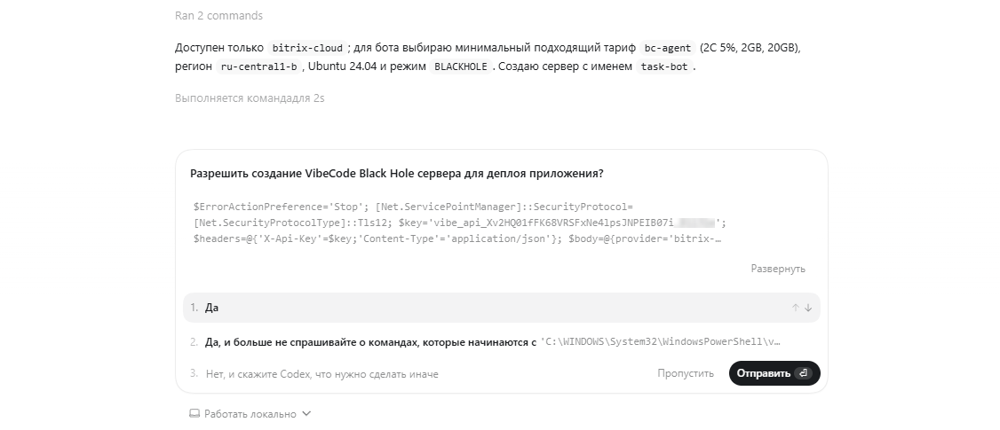
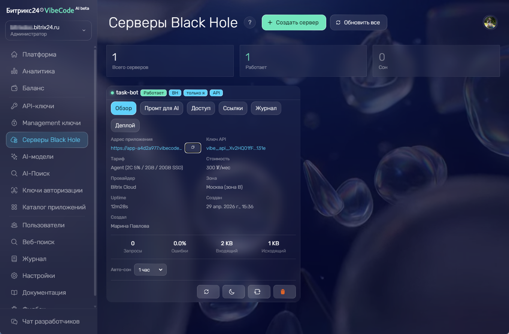

Вайбкод объединяет несколько инструментов для разработки и запуска приложений Битрикс24. Как начать разработку — в статье [Как создать первое приложение](vibecode-create-app.md).

## Личный кабинет Битрикс24 Вайбкод

[Личный кабинет](https://vibecode.bitrix24.tech/dashboard) — точка управления ключами, приложениями, серверами и диагностикой. Его можно использовать параллельно с AI-агентом: агент пишет код и выполняет деплой, а разработчик проверяет состояние ресурсов в интерфейсе.

В кабинете доступны:

-  API-ключи, ключи авторизации приложений и менеджмент-ключи,

-  список приложений и данные об установках,

-  серверы Black Hole и галактики, их состояние и параметры,

-  хранилище файлов и хранилище исходников приложений,

-  подписка Коворк/Код и AI-агенты,

-  аналитика по запросам и использованию приложений,

-  журнал действий пользователей, приложений и вызовов API,

-  настройки доступа, лимитов и бюджетов,

-  фидбэк для команды Битрикс24 Вайбкод.

Аналитика и журнал помогают проверить, какие запросы выполняет приложение, где возникают ошибки и какие события обрабатывает агент.

Список приложений работает как витрина: рядом со своими вы видите те, к которым вам открыли доступ, и общие для всего Битрикс24. То же самое отдает API — `GET /v1/applications` с параметром `scope`, который принимает значения `mine`, `shared` и `feed`. Карточку отдельного приложения возвращает `GET /v1/applications/{id}`.

В разделе Фидбэк можно вручную создать обращение для команды Битрикс24 Вайбкод. AI-агент тоже может отправить фидбэк через API: он может предложить отправку сам или сделать это по просьбе. Такой фидбэк появится в личном кабинете как тикет с контекстом ошибки, окружением и шагами воспроизведения.

## Серверы Black Hole {#black-hole}

[Black Hole](https://vibecode.bitrix24.tech/blackhole) — облачные Linux-серверы для приложений. Такой сервер можно использовать, когда приложению нужна серверная часть, база данных, обработчик события, cron-задача или бот.

Сервер Black Hole не открыт напрямую в интернет: внешние порты закрыты, сервер невидим из интернета, а доступ открывается через защищенный туннель Вайбкод. Права на просмотр приложения можно ограничить: только владелец, выбранные сотрудники, отдел, любой участник портала, любой авторизованный пользователь или публичный доступ.

Сервер можно создать вручную в интерфейсе Вайбкод или попросить AI-агента подготовить деплой.

```plaintext
Задеплой приложение на Вайбкод.
```

AI-агент может сам подобрать подходящий сервер под сценарий приложения.



После создания сервер появится в личном кабинете в разделе *Серверы Black Hole*.



Если сервер не используется, он переходит в спящий режим: во время простоя вычислительные ресурсы не тарифицируются, оплачивается только хранение диска. Спящий сервер можно будить по расписанию: задайте время, когда он должен автоматически просыпаться, например перед началом рабочего дня.

На одном сервере можно разместить несколько приложений. Стоимость считается за сервер и не зависит от числа приложений на нем. Как это устроено — в разделе [Galaxy-приложение](https://vibecode.bitrix24.tech/docs/infra/galaxy).

Над кодом приложения на сервере может работать несколько сотрудников: владелец собирает команду разработки и выдает участникам роли. Подробнее — в статье [Совместная работа над приложением](vibecode-collaboration.md).

## Бэкапы серверов {#backups}

Вайбкод может создавать резервные копии сервера Black Hole — полный зашифрованный образ диска сервера. Из бэкапа можно развернуть новый сервер, если нужно восстановить приложение или откатить окружение.

Бэкапы бывают ручные и автоматические. Ручной бэкап создается по запросу в личном кабинете. Автоматический работает по расписанию: вы задаете интервал, например раз в день или раз в неделю, и число копий, которые платформа хранит. Старые копии сверх заданного числа удаляются автоматически.

Восстановление создает новый сервер из выбранной копии — исходный сервер при этом не затрагивается.



Бэкапы серверов доступны не на всех Битрикс24 — функция включается постепенно. Если в личном кабинете нет управления бэкапами сервера, значит на вашем Битрикс24 она пока недоступна.



## Боты

[Бот-платформа Вайбкод](https://vibecode.bitrix24.tech/bot-platform) помогает создавать чат-ботов Битрикс24. Бот может отправлять сообщения, обрабатывать команды, использовать кнопки и получать события.

Бот можно описать в промпте так же, как обычное приложение. AI-агент использует документацию Вайбкод и готовит код под нужный сценарий: регистрацию бота, отправку сообщений, обработку команд, кнопок, файлов и событий.

Для серверов без публичного адреса бот может сам запрашивать новые события через API. Это подходит для приложений, которые работают на Black Hole и не принимают внешние вебхуки.

## Доставка событий Битрикс24

Приложению на сервере Black Hole не нужно самостоятельно опрашивать Битрикс24 о новых событиях. Вайбкод может подписать приложение на события Битрикс24, например создание задачи или сделки, и надежно доставлять их на сервер: платформа регистрирует обработчик события, повторяет доставку при сбоях и будит сервер, если он в спящем режиме.

AI-агент может настроить подписку без ручной работы: список операций и схема приходят в ответе `GET /v1/me`. Для управления подписками есть методы `GET`, `POST` и `DELETE` `/v1/infra/servers/{id}/event-subscriptions`, а для MCP-клиентов — инструмент `manage_server_events`.

Доставка событий работает на коммерческих тарифах Битрикс24, где доступна привязка обработчиков событий. Подробнее о подписках и форматах доставки — в документации Вайбкод [Подписки на события](https://vibecode.bitrix24.tech/docs/infra/event-subscriptions).

## AI-модели

[AI-модели Вайбкод](https://vibecode.bitrix24.tech/ai-models) можно подключать к приложениям и ботам через OpenAI-совместимый API. Это нужно, если приложение должно анализировать текст, формировать ответы, классифицировать обращения или генерировать сводки.

Бесплатные модели платформы доступны сразу и не требуют настройки. Основная из них — `bitrix/bitrixgpt-5.5`: контекст 262K токенов и встроенная обработка изображений. Рядом с ней работают версия с цепочкой рассуждений, открытые модели GPT-OSS и Gemma, агентская модель с длинным контекстом, Whisper для расшифровки аудио и модель эмбеддингов для векторного представления текста через `POST /v1/embeddings`.

Актуальный список моделей отдает `GET /v1/models`: у каждой модели приходят контекст, возможности и цена. Сверяйтесь с ним перед выбором — состав моделей и их условия меняются. Когда у модели появляется преемник, она продолжает работать, а в ответе приходят заголовки `Deprecation` и `X-Model-Replacement` с именем замены.

Через биллинг платформы также доступны платные внешние модели, например `openai/gpt-4o` и `anthropic/claude-sonnet-4.5` — оплата за них считается во внутренней валюте Vibes.

Если у пользователя есть ключ OpenAI, Anthropic, Google Gemini, Groq, DeepSeek или другого OpenAI-совместимого провайдера, его можно подключить по сценарию BYOK. В этом случае запросы идут через Вайбкод, а оплата остается на стороне выбранного провайдера.

Если не передать `model` или указать `model: "auto"`, Вайбкод выберет модель по умолчанию. API совместим с форматом OpenAI `chat/completions`, поэтому его можно подключать через привычные SDK.

## AI-поиск

[AI-поиск Вайбкод](https://vibecode.bitrix24.tech/ai-search) помогает приложениям и AI-агентам получать данные из интернета. Агент может выполнить поиск по запросу пользователя через `POST /v1/search`, получить ответ со ссылками на источники и использовать эти данные в приложении, боте или отчете. Для более глубоких запросов доступен режим deep research через `POST /v1/research`.

AI-поиск подходит для сценариев, где нужен внешний контекст:

-  подготовиться к звонку по свежим новостям о компании,

-  собрать краткое сравнение решений или конкурентов,

-  ответить клиенту в чат-боте с учетом актуальной информации,

-  найти упоминания бренда за день и отправить дайджест в чат.

В Вайбкод доступно девять поисковых провайдеров. По умолчанию используется Bitrix AI-поиск: он формирует ответ на русском языке, добавляет ссылки на источники и поддерживает потоковую выдачу ответа. Также можно подключить свои ключи Tavily, Brave Search, Exa, You.com, Linkup, Perplexity Sonar, Jina DeepSearch или Z.AI.

Право `vibe:search` добавляется к ключу автоматически. AI-агент может прочитать документацию через `GET /v1/me`, понять схему запроса и подключить поиск без ручной настройки. Запросы AI-поиска оплачиваются в валюте платформы Vibes.

## Хранилище файлов

[Хранилище Вайбкод](https://vibecode.bitrix24.tech/docs/storage) дает приложению место для файлов: аватаров и логотипов, вложений из форм, экспортов и отчетов, видеовложений в сделках, резервных копий конфигурации. Хранилище изолировано по ключу — приложение работает только со своими файлами и не видит чужие.

Файл можно загрузить напрямую, через предподписанную ссылку прямо из браузера или по частям для крупных файлов — до 5 ТБ. У каждого файла есть видимость: приватный доступ по временной ссылке, которая действует 10 минут, или публичный постоянный адрес.

AI-агент может подключить хранилище без ручной настройки: схема запросов и список операций приходят в ответе `GET /v1/me`, а для MCP-клиентов доступны инструменты `vibe_storage_*`. Хранилище оплачивается по факту использования во внутренней валюте Vibes — за объем хранения, исходящий трафик и операции записи.

## История версий приложения {#version-history}

Вайбкод сохраняет [исходный код приложения](https://vibecode.bitrix24.tech/docs/source-storage) при каждом деплое через платформу. Версии не привязаны к конкретному разработчику: если разработчик или AI-сессия меняется, новый участник скачивает последнюю версию и продолжает работу без потери кода.

Сохранение происходит автоматически в момент деплоя — отдельный вызов API не нужен. Версии можно посмотреть списком, скачать по подписанной ссылке, пометить тегом для бессрочного хранения или вернуться к нужной версии перед рискованным изменением: скачать ее и повторно задеплоить. Старые версии очищаются по расписанию, а помеченные и опубликованные версии хранятся бессрочно.

Автосохранение можно отключить в настройках Вайбкод, чтобы не платить за хранение исходников. После отключения новые версии при деплое не появляются, поэтому вернуться к предыдущему состоянию будет не из чего.

Версии исходников защищают от затирания чужой работы, когда над приложением работает команда: деплой сообщает, на какой версии он основан, и отклоняется, если в хранилище появилась более свежая. Как это устроено — в разделе [Защита от затирания чужой работы](vibecode-collaboration.md#base-version).

Для AI-агента сохранение и загрузка версий доступны через MCP-инструменты `save_sources` и `load_sources`. Состояние функции приходит в ответе `GET /v1/me`.

## AI-агенты

[AI-агенты Вайбкод](https://vibecode.bitrix24.tech/ai-agents) — готовые агенты для Битрикс24, которые работают как боты в чатах. Сотрудники пишут агенту как коллеге: найти сделку, создать задачу, подготовить сводку или проверить данные в CRM.

Собственный агент платформы — Hermes, AI-агент с открытым исходным кодом. Hermes работает с CRM, задачами, файлами, календарем и чатами, понимает голосовые сообщения и вложения, запоминает контекст диалога и осваивает новые навыки по ходу работы.

Возможности агента зависят от выданных прав: он действует только в рамках разрешенного доступа. Действия агента сохраняются в журнале, поэтому администратор может проверить, какие запросы выполнялись и какие данные использовались.

AI-запросы агента идут по квоте подписки Коворк/Код, пока она подключена и активна. Сервер Black Hole, на котором работает агент, оплачивается отдельно во внутренней валюте Vibes. По умолчанию агент запускается на вытесняемом сервере: он дешевле, но облако перезапускает его примерно раз в сутки. Для непрерывной работы при создании включают режим «Всегда онлайн».

Запустить Hermes можно через Вайбкод: платформа создаст сервер Black Hole, подключит AI-модель и бота в чатах. Пользователь выбирает имя агента и права доступа.

Агента можно расширять навыками и подключать к инструментам Вайбкод: AI-моделям, AI-поиску и API для работы с данными Битрикс24.

## Коворк/Код

[Коворк/Код](https://vibecode.bitrix24.tech/cowork-code) — десктопное приложение для macOS, Windows и Linux с автономным AI-агентом для работы с Битрикс24. Агент ведет сделки, ставит задачи и собирает аналитику прямо в Битрикс24, а в режиме Код пишет и публикует приложения. Перед изменением или удалением данных агент показывает действие и запрашивает подтверждение.

Приложение, режим Код и AI-агенты работают по единой подписке: одна квота на AI-запросы для трех инструментов и один баланс. Квота считается в трех окнах — пять часов, неделя и месяц — и показывается в процентах. Бесплатный тариф доступен сразу, под рост задач подключаются тарифы Pro, Max и Ultra. Множитель тарифа применяется к объему квоты, а не к цене.

В отдельные часы недели квота расходуется медленнее: один и тот же запрос забирает меньшую долю месячного лимита. Скидка применяется сама, включать ее не нужно, а то, действует ли она сейчас, приложение видит в состоянии подписки.

Подключение к Битрикс24 — по одному ключу. Ключ подписки можно выдать и стороннему клиенту, если администратор разрешил это в настройках Вайбкод. Текущее состояние подписки отдают два эндпоинта — `GET /v1/cowork/state` и `GET /v1/cowork/me` — по ключу со скоупом `vibe:cowork` они возвращают тариф и проценты расхода квоты.

## Публикация приложения в каталоге Битрикс24 {#catalog}

Готовое приложение можно опубликовать в каталоге приложений Битрикс24, чтобы его устанавливали другие сотрудники. Приложение проходит через три статуса:

-  приватное — доступно только вам

-  опубликованное — видно в каталоге приложений Битрикс24

-  снятое с публикации — скрыто из каталога

Публикация выполняется в личном кабинете. Вы указываете название и описание приложения, настраиваете места встраивания в интерфейс Битрикс24 и отправляете приложение в каталог. Места встраивания настраиваются в одном месте: вкладку в карточке сделки, страницу в левом меню и другие точки вы выбираете там же, отдельные мастера для этого не нужны.

Отдельный деплой для публикации не нужен: приложение становится доступным, когда вы переводите его в статус опубликованного. Карточку приложения в каталоге можно создать и независимо от развертывания — вызовом `POST /v1/infra/servers/:id/b24-catalog/publish`.

AI-агент может управлять приложениями и публикацией без ручной работы: через MCP-инструменты `create_app`, `update_app`, `publish_app`, `unpublish_app` и `manage_placements` или через методы `/v1/apps` и `/v1/placements`.
