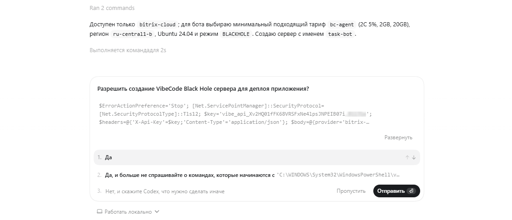
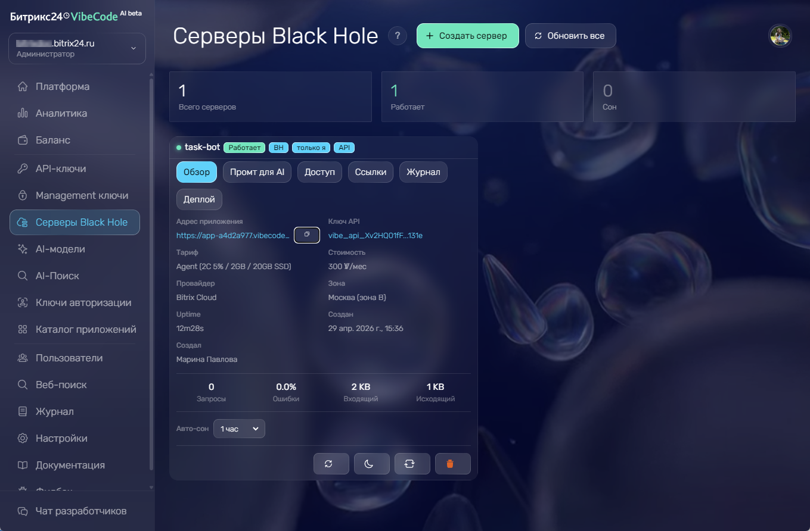

Вайбкод объединяет несколько инструментов для разработки и запуска приложений Битрикс24. Как начать разработку — в статье [Как создать первое приложение](vibecode-create-app.md).

#|
|| **Задача** | **Инструмент** ||
|| Управлять ключами, приложениями и серверами, смотреть журнал и расходы | [Личный кабинет](#dashboard) ||
|| Запустить серверную часть приложения, базу данных или бота | [Серверы Black Hole](#black-hole) ||
|| Сохранить копию сервера и восстановить его | [Бэкапы серверов](#backups) ||
|| Создать чат-бота Битрикс24 | [Боты](#bots) ||
|| Получать события Битрикс24 на сервере приложения | [Доставка событий](#events) ||
|| Анализировать текст, формировать ответы и сводки | [AI-модели](#ai-models) ||
|| Найти информацию в интернете | [AI-поиск](#ai-search) ||
|| Хранить файлы приложения | [Хранилище файлов](#storage) ||
|| Сохранять версии кода и возвращаться к ним | [История версий](#version-history) ||
|| Поручать задачи готовому AI-агенту в чате | [AI-агенты](#ai-agents) ||
|| Работать с Битрикс24 и писать приложения в десктопном приложении | [Коворк/Код](#cowork-code) ||
|| Открыть приложение сотрудникам Битрикс24 | [Публикация в каталоге](#catalog) ||
|#

## Личный кабинет Битрикс24 Вайбкод {#dashboard}

[Личный кабинет](https://vibecode.bitrix24.tech/dashboard) — точка управления ключами, приложениями, серверами и диагностикой. Его можно использовать параллельно с AI-агентом: агент пишет код и выполняет деплой, а разработчик проверяет состояние ресурсов в интерфейсе.

В кабинете доступны:

-  API-ключи, ключи авторизации приложений и менеджмент-ключи

-  список приложений и данные об установках

-  серверы Black Hole и галактики, их состояние и параметры

-  хранилище файлов и хранилище исходников приложений

-  подписка Коворк/Код и AI-агенты

-  аналитика по запросам и использованию приложений

-  журнал действий пользователей, приложений и вызовов API

-  настройки доступа, лимитов и бюджетов

-  фидбэк для команды Битрикс24 Вайбкод

Аналитика и журнал помогают проверить, какие запросы выполняет приложение, где возникают ошибки и какие события обрабатывает агент.

Список приложений работает как витрина: рядом со своими вы видите те, к которым вам открыли доступ, и общие для всего Битрикс24. То же самое отдает API — `GET /v1/applications` с параметром `scope`, который принимает значения `mine`, `shared` и `feed`. Карточку отдельного приложения возвращает `GET /v1/applications/{id}`.

В разделе *Фидбэк* можно вручную создать обращение для команды Битрикс24 Вайбкод. AI-агент тоже может отправить фидбэк через API: он может предложить отправку сам или сделать это по просьбе. Такой фидбэк появится в личном кабинете как тикет с контекстом ошибки, окружением и шагами воспроизведения.

## Серверы Black Hole {#black-hole}

[Black Hole](https://vibecode.bitrix24.tech/blackhole) — облачные Linux-серверы для приложений. Такой сервер можно использовать, когда приложению нужна серверная часть, база данных, обработчик события, cron-задача или бот.

Сервер Black Hole не открыт напрямую в интернет: внешние порты закрыты, сервер невидим из интернета, а доступ открывается через защищенный туннель Вайбкод. Права на просмотр приложения можно ограничить: только владелец, выбранные сотрудники, отдел, любой сотрудник Битрикс24, любой авторизованный пользователь или публичный доступ.

Сервер можно создать вручную в интерфейсе Вайбкод или попросить AI-агента подготовить деплой.

```plaintext
Задеплой приложение на Вайбкод.
```

AI-агент может сам подобрать подходящий сервер под сценарий приложения.



После создания сервер появится в личном кабинете в разделе *Серверы Black Hole*.



Если к серверу не обращаются, он переходит в спящий режим — по умолчанию через 60 минут простоя. Спящий сервер оплачивается по сниженному тарифу. Простой считается по входящим запросам к приложению: cron-задачи, фоновая работа и исходящие запросы сервер не будят и не держат. Для работы по времени задайте расписание пробуждения, например перед началом рабочего дня, а для непрерывной работы выберите невытесняемый тариф и отключите засыпание в настройках сервера.

Несколько приложений можно разместить на одном общем сервере — галактике. Каждое приложение работает в своем контейнере, а стоимость считается за галактику и не зависит от числа приложений на ней. Режим размещения выбирает администратор Битрикс24 в кабинете. Как это устроено — в разделе [Galaxy-приложение](https://vibecode.bitrix24.tech/docs/infra/galaxy).

Над кодом приложения на сервере может работать несколько сотрудников: владелец собирает команду разработки и выдает участникам роли. Подробнее — в статье [Совместная работа над приложением](vibecode-collaboration.md).

## Бэкапы серверов {#backups}

Вайбкод может создавать резервные копии сервера Black Hole — полный снимок диска: код приложения, база данных, файлы и настройки. Из бэкапа можно развернуть новый сервер, если нужно восстановить приложение или откатить окружение.

Бэкап можно снять вручную в личном кабинете или настроить расписание — каждый день, раз в два или три дня или раз в неделю. Копии сохраняются и после удаления сервера. Отдельной платы за бэкапы нет: оплачивается место, которое копии занимают в хранилище.

Восстановление создает новый сервер из выбранной копии — исходный сервер при этом не затрагивается.

## Боты {#bots}

[Бот-платформа Вайбкод](https://vibecode.bitrix24.tech/bot-platform) помогает создавать чат-ботов Битрикс24. Бот может отправлять сообщения, обрабатывать команды, использовать кнопки и получать события.

Бот можно описать в промпте так же, как обычное приложение. AI-агент использует документацию Вайбкод и готовит код под нужный сценарий: регистрацию бота, отправку сообщений, обработку команд, кнопок, файлов и событий.

Для серверов без публичного адреса бот может сам запрашивать новые события через API — для этого бота регистрируют в режиме событий `fetch`. Это подходит для приложений, которые работают на Black Hole и не принимают внешние вебхуки. Исходящие запросы не откладывают сон сервера, поэтому для постоянного опроса настройте сервер на непрерывную работу, как описано в разделе [Серверы Black Hole](#black-hole).

## Доставка событий Битрикс24 {#events}

Приложению на сервере Black Hole не нужно самостоятельно опрашивать Битрикс24 о новых событиях. Вайбкод может подписать приложение на события Битрикс24, например создание задачи или сделки, и надежно доставлять их на сервер: платформа регистрирует обработчик события, повторяет доставку при сбоях и будит сервер, если он в спящем режиме.

AI-агент может настроить подписку без ручной работы. Подписку создают и просматривают методами `POST` и `GET` `/v1/infra/servers/{id}/event-subscriptions`, удаляют — `DELETE /v1/infra/servers/{id}/event-subscriptions/{subId}`. Для MCP-клиентов есть инструмент `manage_server_events`.

Доставка событий работает при двух условиях. Сервер привязан к ключу авторизации приложения `vibe_app_`, и приложение прошло OAuth-авторизацию в Битрикс24. Сам Битрикс24 работает на коммерческом тарифе: на бесплатном обработчик события не зарегистрируется. Подробнее о подписках и форматах доставки — в документации Вайбкод [Подписки на события](https://vibecode.bitrix24.tech/docs/infra/event-subscriptions).

## AI-модели {#ai-models}

[AI-модели Вайбкод](https://vibecode.bitrix24.tech/ai-models) можно подключать к приложениям и ботам через OpenAI-совместимый API. Это нужно, если приложение должно анализировать текст, формировать ответы, классифицировать обращения или генерировать сводки.

Модели Битрикс24 доступны сразу и не требуют настройки, большинство из них бесплатны. Основная — `bitrix/bitrixgpt-5.5`: контекст 262K токенов и встроенная обработка изображений. Рядом с ней работают версия с цепочкой рассуждений, открытые модели GPT-OSS и Gemma, агентские модели с длинным контекстом, модели для расшифровки аудио и генерации изображений, модель эмбеддингов для векторного представления текста через `POST /v1/embeddings`.

Актуальный список моделей отдает `GET /v1/models`: у каждой модели приходят контекст, возможности и цена. Сверяйтесь с ним перед выбором — состав моделей и их условия меняются. Устаревшая модель работает до даты отключения, а в ответе приходит заголовок `Deprecation`. После отключения запрос обслуживает модель-преемник, если она назначена, — ее имя приходит в заголовке `X-Model-Replacement`.

Платные модели оплачиваются во внутренней валюте Vibes. Модели сторонних провайдеров появляются в ответе `GET /v1/models`, только если для них подключены учетные данные провайдера.

Если у пользователя есть ключ OpenAI, Anthropic, Google Gemini, Groq, DeepSeek или другого OpenAI-совместимого провайдера, его можно подключить по сценарию BYOK. В этом случае запросы идут через Вайбкод, а оплата остается на стороне выбранного провайдера.

Если не передать `model` или указать `model: "auto"`, Вайбкод выберет модель по умолчанию. API совместим с форматом OpenAI `chat/completions`, поэтому его можно подключать через привычные SDK.

## AI-поиск {#ai-search}

[AI-поиск Вайбкод](https://vibecode.bitrix24.tech/ai-search) помогает приложениям и AI-агентам получать данные из интернета. Агент может выполнить поиск по запросу пользователя через `POST /v1/search`, получить ответ со ссылками на источники и использовать эти данные в приложении, боте или отчете. Для более глубоких запросов доступен режим deep research через `POST /v1/research`.

AI-поиск подходит для сценариев, где нужен внешний контекст:

-  подготовиться к звонку по свежим новостям о компании

-  собрать краткое сравнение решений или конкурентов

-  ответить клиенту в чат-боте с учетом актуальной информации

-  найти упоминания бренда за день и отправить дайджест в чат

В Вайбкод доступно девять поисковых провайдеров. Встроенный — Bitrix AI-поиск: он формирует ответ на русском языке, добавляет ссылки на источники и поддерживает потоковую выдачу ответа. Также можно подключить свои ключи Tavily, Brave Search, Exa, You.com, Linkup, Perplexity Sonar, Jina DeepSearch или Z.AI. Если провайдер в запросе не указан, поиск сначала использует ваш ключ провайдера, затем ключ провайдера, подключенный для всего Битрикс24, и только потом встроенный Bitrix AI-поиск.

При создании ключа в кабинете право `vibe:search` отмечено заранее. AI-агент может прочитать описание поиска в ответе `GET /v1/me` и подключить поиск без ручной настройки. Запросы через Bitrix AI-поиск оплачиваются в валюте платформы Vibes. Поиск через свой ключ провайдера платформа не тарифицирует — оплата идет напрямую провайдеру.

## Хранилище файлов {#storage}

[Хранилище Вайбкод](https://vibecode.bitrix24.tech/docs/storage) дает приложению место для файлов: аватаров и логотипов, вложений из форм, экспортов и отчетов, видеовложений в сделках, резервных копий конфигурации. Файлы разделены по владельцам: личный ключ работает с файлами своего владельца, ключ приложения — с общими файлами приложения, а при работе от имени сотрудника — с его личными файлами.

Файлы до 10 МБ загружают напрямую, крупные — по частям, до 5 ТБ. У каждого файла есть видимость: приватный доступ по временной ссылке, которая действует 10 минут, или публичный постоянный адрес. Публичный адрес открывается без авторизации, только если анонимный доступ включен для вашего Битрикс24. По умолчанию он выключен.

AI-агент может подключить хранилище без ручной настройки: список операций приходит в ответе `GET /v1/me`, а для MCP-клиентов доступны инструменты `vibe_storage_*`. Хранилище оплачивается по факту использования во внутренней валюте Vibes — за объем хранения, исходящий трафик и операции записи.

## История версий приложения {#version-history}

Вайбкод сохраняет [исходный код приложения](https://vibecode.bitrix24.tech/docs/source-storage) при деплое через платформу. Версии не привязаны к конкретному разработчику: если разработчик или AI-сессия меняется, новый участник скачивает последнюю версию и продолжает работу без потери кода.

Сохранение происходит автоматически в момент деплоя — отдельный вызов API не нужен. Если сохранить версию не удалось, деплой все равно пройдет, а результат сохранения придет в ответе деплоя. Версии можно посмотреть списком, скачать по подписанной ссылке, пометить тегом `manual` для бессрочного хранения или вернуться к нужной версии перед рискованным изменением: скачать ее и повторно задеплоить. Старые версии удаляются автоматически раз в сутки, но пять последних версий и версии с тегами `manual` и `published` остаются.

Администратор Битрикс24 может отключить автосохранение в настройках Вайбкод. После этого новые версии при деплое не появляются, а сохраненные раньше остаются доступны.

Версии исходников защищают от затирания чужой работы, когда над приложением работает команда: деплой сообщает, на какой версии он основан, и отклоняется, если в хранилище появилась более свежая. Как это устроено — в разделе [Защита от затирания чужой работы](vibecode-collaboration.md#base-version).

Для AI-агента сохранение и загрузка версий доступны через MCP-инструменты `save_sources` и `load_sources`. Состояние функции приходит в ответе `GET /v1/me`.

## AI-агенты {#ai-agents}

[AI-агенты Вайбкод](https://vibecode.bitrix24.tech/ai-agents) — готовые агенты для Битрикс24, которые работают как боты в чатах. Агенту пишут как коллеге: найти сделку, создать задачу, подготовить сводку или проверить данные в CRM. По умолчанию агент отвечает только своему создателю.

Агенты работают на Hermes — AI-агенте с открытым исходным кодом. Hermes работает с CRM, задачами, файлами, календарем и чатами, понимает голосовые сообщения и вложения, запоминает контекст диалога и осваивает новые навыки по ходу работы.

Возможности агента зависят от выданных прав: он действует только в рамках разрешенного доступа. Действия агента сохраняются в журнале, поэтому администратор может проверить, какие запросы выполнялись.

AI-запросы агента идут по квоте подписки Коворк/Код, если подписка подключена и активна, а ключ агента переведен на нее. Собственный сервер Black Hole агента оплачивается отдельно во внутренней валюте Vibes. По умолчанию агент запускается на вытесняемом сервере: он дешевле, но облако перезапускает его примерно раз в сутки. Для непрерывной работы при создании включают режим «Всегда онлайн».

Запустить Hermes можно через Вайбкод: платформа создаст сервер Black Hole, подключит AI-модель и бота в чатах. Пользователь указывает имя агента, выбирает AI-модель и данные, к которым агент получит доступ.

Агента можно расширять навыками и подключать к инструментам Вайбкод: AI-моделям, AI-поиску и API для работы с данными Битрикс24.

## Коворк/Код {#cowork-code}

[Коворк/Код](https://vibecode.bitrix24.tech/cowork-code) — десктопное приложение для macOS, Windows и Linux с автономным AI-агентом для работы с Битрикс24. Агент ведет сделки, ставит задачи и собирает аналитику прямо в Битрикс24, а в режиме Код пишет и публикует приложения. Перед изменением или удалением данных агент показывает действие и запрашивает подтверждение.

Приложение, режим Код и AI-агенты работают по единой подписке: одна квота на AI-запросы для трех инструментов и один баланс. Квота считается в трех окнах — пять часов, неделя и месяц — и показывается в процентах. Бесплатный тариф доступен сразу, под рост задач подключаются тарифы Pro, Max и Ultra. Множитель тарифа применяется к объему квоты, а не к цене.

В отдельные часы недели квота расходуется медленнее: один и тот же запрос забирает меньшую долю месячного лимита. Скидка применяется сама, включать ее не нужно, а то, действует ли она сейчас, приложение видит в состоянии подписки.

Подключение к Битрикс24 — по одному ключу. Ключ подписки можно выдать и стороннему клиенту, если администратор разрешил это в настройках Вайбкод. Текущее состояние подписки отдают два эндпоинта — `GET /v1/cowork/state` и `GET /v1/cowork/me` — по ключу со скоупом `vibe:cowork` они возвращают тариф и проценты расхода квоты.

## Публикация приложения в каталоге Битрикс24 {#catalog}

Готовое приложение можно опубликовать в каталоге приложений Битрикс24, чтобы его устанавливали другие сотрудники. Приложение проходит через три статуса:

-  приватное — доступно только вам

-  опубликованное — видно всем сотрудникам Битрикс24, места встраивания подключены

-  снятое с публикации — места встраивания отключены, а карточка остается в каталоге неактивной

Публикация выполняется в личном кабинете. Вы указываете название и описание приложения, настраиваете места встраивания в интерфейс Битрикс24 и отправляете приложение в каталог. Места встраивания настраиваются в одном месте: вкладку в карточке сделки, страницу в левом меню и другие точки вы выбираете там же, отдельные мастера для этого не нужны.

Отдельный деплой для публикации не нужен: приложение становится доступным, когда вы переводите его в статус опубликованного. Для публикации нужны:

-  OAuth-авторизация приложения в Битрикс24

-  право `placement` у ключа приложения и права нужного раздела, например `crm` для карточки сделки

-  сохраненная версия кода, если в Битрикс24 включено сохранение исходников

-  подписка BitrixGPT + Маркетплейс или коммерческий тариф — точное условие для вашего Битрикс24 приходит в ответе `GET /v1/me`

Карточка серверного приложения в каталоге — отдельный механизм, не публикация приложения. Обычно она появляется после успешного деплоя через платформу. Если карточки нет, ее создает метод `POST /v1/infra/servers/:id/b24-catalog/publish`. Места встраивания этот метод не подключает.

AI-агент может управлять приложениями и публикацией без ручной работы: через MCP-инструменты `create_app`, `update_app`, `publish_app`, `unpublish_app` и `manage_placements` или через методы `/v1/apps` и `/v1/placements`.

## Что дальше

-  [Как создать первое приложение](vibecode-create-app.md) — создание ключа, промпт для AI-агента и проверка результата

-  [Совместная работа над приложением](vibecode-collaboration.md) — команда разработки сервера, роли участников и передача приложения другому владельцу

-  [Битрикс24 Вайбкод](vibecode.md) — обзор платформы

-  [Битрикс24 Вайбкод в коробочной версии](vibecode-onpremise.md) — подключение модуля `vibecodeconnector`

-  [Документация Битрикс24 Вайбкод](https://vibecode.bitrix24.tech/docs/quickstart) — ключи, API и подробное описание инструментов
