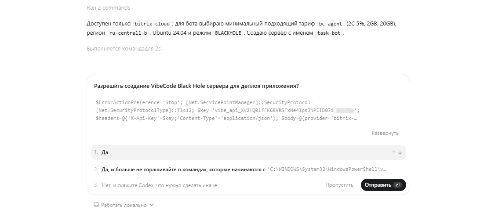
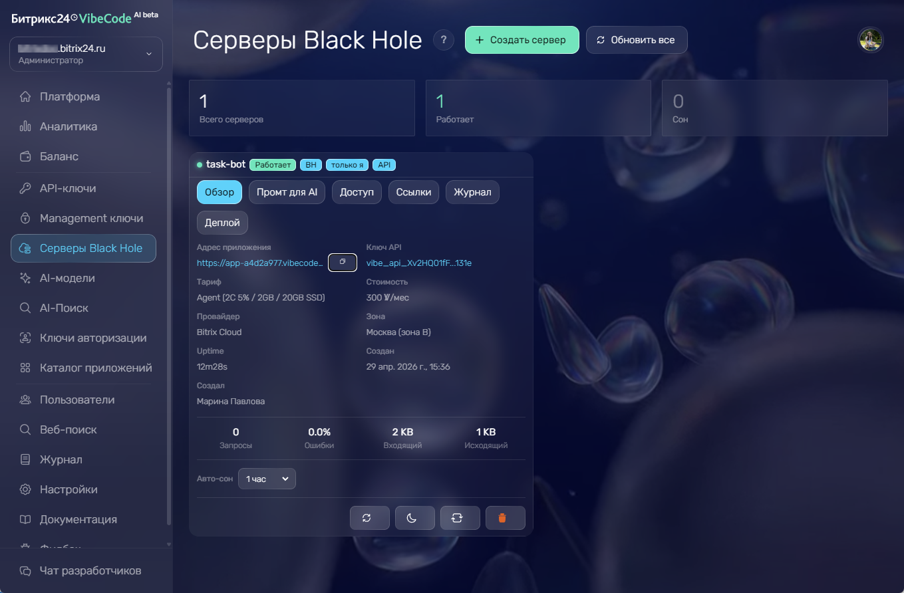

[Битрикс24 Вайбкод](https://vibecode.bitrix24.tech/) — платформа для разработки приложений Битрикс24 с помощью AI-агентов. Приложение можно создать всего за четыре шага без знаний языков программирования:

1. Получите ключ Вайбкод.

2. Передайте ключ AI-агенту.

3. Опишите задачу на естественном языке, как если вы объясняете ее коллеге.

4. Получите готовое приложение для Битрикс24.

Платформа работает с AI-агентами, которые умеют читать документацию, писать код и выполнять команды в проекте: Codex, Claude Code, Cursor и другими.

AI-агент обращается к документации Вайбкод, получает доступные возможности платформы и пишет код приложения. Если приложению нужна серверная часть, обработчики событий или фоновая логика, агент может создать сервер Black Hole и разместить приложение без ручной настройки хостинга.



[Быстрый старт в Вайбкод](https://vibecode.bitrix24.tech/docs/quickstart)



## Когда использовать Битрикс24 Вайбкод

Вайбкод подходит для сценариев, где нужно создать приложение для Битрикс24 и передать часть технической работы AI-агенту: поиск методов API, настройку авторизации, написание кода и подготовку запуска.

Платформа подходит для задач, где нужно:

-  создать приложение для работы с CRM, задачами, чатами, файлами или календарем,

-  подготовить внутренний дашборд по данным Битрикс24,

-  сделать чат-бота для сотрудников или клиентов,

-  автоматизировать повторяющийся процесс через приложение,

-  запустить серверное приложение без самостоятельной настройки сервера,

-  проверить идею приложения перед полноценной разработкой.

Агенту не нужно искать документацию по методам REST API. Он получает документацию, доступные объекты и правила работы в Вайбкод, а затем выбирает подходящий способ решить задачу пользователя.

## Чем API Битрикс24 Вайбкод отличается от REST API Битрикс24

REST API Битрикс24 — основной API для работы с Битрикс24. API Вайбкод — отдельное API для разработки приложений с AI-агентами. Часть методов API Вайбкод использует REST API Битрикс24, но упрощает и оптимизирует вызовы.

-  Приводит данные к нужному формату. Например, преобразует названия полей и фильтры перед вызовом REST API.

-  Получает больше данных одним запросом. Если REST API возвращает данные порциями по 50 элементов, API Вайбкод может сам разбить запрос на порции и собрать результат до 5000 элементов.

-  Выполняет массовые запросы и повторяет вызовы при временных ошибках.

Также Вайбкод использует собственные методы, которых нет в REST API Битрикс24, например для создания серверов Black Hole и подключения AI-моделей.

## Как создать первое приложение

Разработка приложения ведется в диалоге пользователя с AI-агентом. Вайбкод передает агенту документацию, доступные объекты, права ключа и инструкции по запуску приложения.

1. Откройте [Вайбкод](https://vibecode.bitrix24.tech/) и войдите через Битрикс24.

2. Создайте ключ с нужными правами. Например, для работы со сделками нужен доступ к CRM.

   

   Скопируйте ключ сразу — платформа показывает его один раз. Если закрыть страницу без копирования, нужно будет создать новый ключ.

   

3. Откройте AI-инструмент для разработки: Codex, Claude Code, Cursor или другой.

4. Создайте новый проект и вставьте промпт с ключом, ссылкой на документацию `https://vibecode.bitrix24.tech/v1/me` и описанием задачи.

5. Попросите агента создать сервер и запустить приложение на Вайбкод, если приложению нужна серверная часть или обработчики событий.

6. Откройте приложение в Битрикс24 и проверьте основной сценарий.

### Какие ключи использовать

В Битрикс24 Вайбкод есть два типа ключей.

-  `vibe_api_...` — личный ключ для сценариев от имени одного пользователя. Авторизация пользователя работает как вебхук с выданными правами.

-  `vibe_app_...` — ключ авторизации для приложения c OAuth. Пользователи входят в приложение через Битрикс24 и работают со своими данными.

Для первого теста можно использовать личный ключ. Для приложения, которым будет пользоваться команда, выбирайте ключ авторизации с OAuth.

### Примеры промптов для AI-агента

Скопируйте промпт в Codex, Claude Code, Cursor или другой AI-инструмент. Замените `vibe_api_xxx` или `vibe_app_xxx` на ключ Вайбкод.

Для первого теста используйте личный ключ `vibe_api_...`.

```plaintext
Создай скрипт, который каждое утро собирает данные из CRM Битрикс24 и отправляет дайджест в чат руководителю.

В дайджесте: все сделки в работе, просроченные сделки, сделки без активности 3+ дня. Сводка: общая сумма в воронке, топ-5 крупных сделок, список «забытых» сделок, конверсия за вчера.

API-ключ: vibe_api_xxx
Документация: https://vibecode.bitrix24.tech/v1/me
```

Для приложения, которым будут пользоваться несколько сотрудников, используйте ключ авторизации `vibe_app_...`.

```plaintext
Создай приложение для Битрикс24 с авторизацией.

Приложение должно показывать пользователю его открытые задачи, просроченные задачи и задачи без крайнего срока. Добавь фильтр по статусу и кнопку обновления списка.

Ключ авторизации приложения: vibe_app_xxx
Документация: https://vibecode.bitrix24.tech/v1/me
```

AI-агент обратится к `GET /v1/me`, получит доступные возможности ключа и выберет подходящие методы API. Если прав ключа недостаточно, агент сообщит, какие права нужно добавить.



Другие сценарии можно найти в разделе [Готовые решения](https://vibecode.bitrix24.tech/solutions) — это задачи, которые можно передать AI-агенту вместе с ключом и ссылкой на документацию Вайбкод.



### Что AI-агент сделает автоматически

После получения ключа и задачи AI-агент выполнит основной цикл разработки без ручной настройки интеграции.

1. Вызовет `GET /v1/me`, чтобы получить доступные объекты, права ключа и инструкции.

2. Выберет подходящие методы API Битрикс24 Вайбкод.

3. Напишет код приложения, бота, обработчика события или фоновой задачи.

4. Создаст сервер Black Hole через инфраструктурные инструкции Вайбкод, если приложению нужна серверная часть.

5. Задеплоит приложение и вернет ссылку для проверки.

AI-агент может исправить ошибки, которые возникают при выполнении задачи: определить причину и повторить действие с исправленными параметрами. При нехватке прав ключа, данных для задачи или доступа к инструменту агент сообщит, что нужно добавить или уточнить. Ошибку в работе Битрикс24 Вайбкод агент может отправить разработчикам платформы как фидбэк с контекстом проблемы.

### Где запускается приложение

AI-агент может запустить приложение в Битрикс24 или на сервере в зависимости от задачи.

-  Приложению не нужен серверный код и обработка событий — разместится как HTML/JS-приложение в Битрикс24.

-  Приложение с фоновой логикой или чат-бот — запустится на сервере Black Hole.

## Дополнительные инструменты Битрикс24 Вайбкод

Вайбкод объединяет несколько инструментов для разработки и запуска приложений Битрикс24.

### Серверы Black Hole

[Black Hole](https://vibecode.bitrix24.tech/blackhole) — облачные Linux-серверы для приложений. Такой сервер можно использовать, когда приложению нужна серверная часть, база данных, обработчик события, cron-задача или бот.

Сервер Black Hole не открыт напрямую в интернет: у него нет публичного IP-адреса, внешние порты закрыты, а доступ открывается через защищенный туннель Вайбкод. Права на просмотр приложения можно ограничить: только владелец, выбранные сотрудники, отдел, любой авторизованный пользователь или публичный доступ.

Сервер можно создать вручную в интерфейсе Вайбкод или попросить AI-агента подготовить деплой.

```plaintext
Задеплой приложение на Вайбкод.
```

AI-агент может сам подобрать подходящий сервер под сценарий приложения.



После создания сервер появится в личном кабинете в разделе *Серверы Black Hole*.



Если сервер не используется, он переходит в спящий режим, и вы платите только за фактическую работу сервера.

### Боты

[Бот-платформа Вайбкод](https://vibecode.bitrix24.tech/bot-platform) помогает создавать чат-ботов Битрикс24. Бот может отправлять сообщения, обрабатывать команды, использовать кнопки и получать события.

Бот можно описать в промпте так же, как обычное приложение. AI-агент использует документацию Вайбкод и готовит код под нужный сценарий: регистрацию бота, отправку сообщений, обработку команд, кнопок, файлов и событий.

Для серверов без публичного адреса бот может сам запрашивать новые события через API. Это подходит для приложений, которые работают на Black Hole и не принимают внешние вебхуки.

### AI-модели

[AI-модели Вайбкод](https://vibecode.bitrix24.tech/ai-models) можно подключать к приложениям и ботам через OpenAI-совместимый API. Это нужно, если приложение должно анализировать текст, формировать ответы, классифицировать обращения или генерировать сводки.

В Битрикс24 Вайбкод доступны бесплатные модели:

-  `bitrixgpt-5.5` — BitrixGPT 5.5, модель по умолчанию,

-  `bitrixgpt-5.5-thinking` — BitrixGPT 5.5 Thinking,

-  `openai/gpt-oss-120b` — GPT-OSS 120B,

-  `google/gemma-4-26B-A4B-it` — Gemma 4 26B,

-  `google/gemma-4-26B-A4B-thinking` — Gemma 4 26B Thinking,

-  `deepdml/faster-whisper-large-v3-turbo-ct2` — Whisper Large v3 Turbo для расшифровки аудио.

Доступна платная модель платформы:

-  `bitrixgpt-5.5-agent` — BitrixGPT 5.5 Agent, оплата считается по токенам.

Для других платных моделей можно использовать платформенный роутер Вайбкод: приложение обращается к единому API, а оплата считается по токенам.

Если у пользователя есть ключ OpenAI, Anthropic, DeepSeek или другого провайдера, его можно подключить по сценарию BYOK. В этом случае запросы идут через Вайбкод, а оплата остается на стороне выбранного провайдера.

Для выбора модели можно указать `model: "auto"`. Тогда Вайбкод подберет модель для запроса автоматически. API совместим с форматом OpenAI `chat/completions`, поэтому его можно подключать через привычные SDK.

### AI-поиск

[AI-поиск Вайбкод](https://vibecode.bitrix24.tech/ai-search) помогает приложениям и AI-агентам получать данные из интернета. Агент может выполнить поиск по запросу пользователя через `POST /v1/search`, получить ответ со ссылками на источники и использовать эти данные в приложении, боте или отчете.

AI-поиск подходит для сценариев, где нужен внешний контекст:

-  подготовиться к звонку по свежим новостям о компании,

-  собрать краткое сравнение решений или конкурентов,

-  ответить клиенту в чат-боте с учетом актуальной информации,

-  найти упоминания бренда за день и отправить дайджест в чат.

В Вайбкод доступно 9 поисковых провайдеров. По умолчанию используется Bitrix AI-поиск: он формирует ответ на русском языке, добавляет ссылки на источники и поддерживает потоковую выдачу ответа. Также можно подключить свои ключи Tavily, Brave Search, Exa, You.com, Linkup, Perplexity Sonar, Jina DeepSearch или Z.AI.

Право `vibe:search` добавляется к ключу автоматически. AI-агент может прочитать документацию через `GET /v1/me`, понять схему запроса и подключить поиск без ручной настройки. Запросы AI-поиска оплачиваются в валюте платформы Vibes.

### Хранилище файлов

[Хранилище Вайбкод](https://vibecode.bitrix24.tech/docs/storage) дает приложению место для файлов: аватаров и логотипов, вложений из форм, экспортов и отчетов, видеовложений в сделках, резервных копий конфигурации. Хранилище изолировано по ключу — приложение работает только со своими файлами и не видит чужие.

Файл можно загрузить напрямую, через предподписанную ссылку прямо из браузера или по частям для крупных файлов — до 5 ТБ. У каждого файла есть видимость: приватный доступ по временной ссылке, которая действует 10 минут, или публичный постоянный адрес.

AI-агент может подключить хранилище без ручной настройки: схема запросов и список операций приходят в ответе `GET /v1/me`, а для MCP-клиентов доступны инструменты `vibe_storage_*`. Хранилище оплачивается по факту использования во внутренней валюте Vibes — за объем хранения, исходящий трафик и операции записи.

### История версий приложения

Вайбкод сохраняет [исходный код приложения](https://vibecode.bitrix24.tech/docs/source-storage) при каждом деплое через платформу. Версия привязана к приложению, а не к разработчику: если разработчик или AI-сессия меняется, новый участник скачивает последнюю версию и продолжает работу без потери кода.

Сохранение происходит автоматически в момент деплоя — отдельный вызов API не нужен. Версии можно посмотреть списком, скачать по подписанной ссылке, пометить тегом для бессрочного хранения или вернуться к нужной версии перед рискованным изменением. Старые версии очищаются по расписанию, а помеченные и опубликованные версии хранятся бессрочно.

Для AI-агента сохранение и загрузка версий доступны через MCP-инструменты `save_sources` и `load_sources`. Состояние функции приходит в ответе `GET /v1/me`.

### AI-агенты

[AI-агенты Вайбкод](https://vibecode.bitrix24.tech/ai-agents) — готовые агенты для Битрикс24, которые работают как боты в чатах. Сотрудники пишут агенту как коллеге: найти сделку, создать задачу, подготовить сводку или проверить данные в CRM.

Собственный агент платформы — Hermes, AI-агент с открытым исходным кодом. Hermes работает с CRM, задачами, файлами, календарем и чатами, понимает голосовые сообщения и вложения, запоминает контекст диалога и осваивает новые навыки по ходу работы.

Возможности агента зависят от выданных прав: он действует только в рамках разрешенного доступа. Действия агента сохраняются в журнале, поэтому администратор может проверить, какие запросы выполнялись и какие данные использовались.

Для клиентов Битрикс24 AI-модель и подключение к Битрикс24 бесплатные. Агент работает на сервере Black Hole, который оплачивается отдельно во внутренней валюте Vibes. Есть два сценария:

1. Запустить Hermes через Вайбкод. Платформа создаст сервер Black Hole, подключит AI-модель и бота в чатах. Пользователь выбирает имя агента и права доступа. Подключить собственный сервер с Hermes пока нельзя — этот вариант доступен только для OpenClaw.

2. Подключить к Битрикс24 свой OpenClaw. Вариант подходит, если агент OpenClaw уже развернут на сервере пользователя. Для подключения используется npm-плагин `@ihazz/bitrix24`, который регистрирует бота в Битрикс24, передает сообщения из чатов агенту и дает доступ к API Вайбкод в рамках прав ключа. Подробнее в статье [Подключение Битрикс24 к OpenClaw](https://vibecode.bitrix24.tech/docs/openclaw).

Агента можно расширять навыками и подключать к инструментам Вайбкод: AI-моделям, AI-поиску и API для работы с данными Битрикс24.

## Личный кабинет Битрикс24 Вайбкод

Личный кабинет нужен для управления ключами, приложениями, серверами и диагностикой. Его можно использовать параллельно с AI-агентом: агент пишет код и выполняет деплой, а разработчик проверяет состояние ресурсов в интерфейсе.

В кабинете доступны:

-  API-ключи и ключи авторизации для приложений,

-  список приложений и данные об установках,

-  серверы Black Hole, их состояние и параметры,

-  аналитика по запросам и использованию приложений,

-  журнал действий пользователей, приложений и вызовов API,

-  настройки доступа и лимитов,

-  фидбэк для команды Битрикс24 Вайбкод.

Аналитика и журнал помогают проверить, какие запросы выполняет приложение, где возникают ошибки и какие события обрабатывает агент.

В разделе Фидбэк можно вручную создать обращение для команды Битрикс24 Вайбкод. AI-агент тоже может отправить фидбэк через API: он может предложить отправку сам или сделать это по просьбе. Такой фидбэк появится в личном кабинете как тикет с контекстом ошибки, окружением и шагами воспроизведения.

## Сколько стоит Битрикс24 Вайбкод

Вайбкод входит в подписку BitrixGPT + Маркетплейс. Платформа работает на Битрикс24 с активной подпиской или пробным периодом подписки.

Серверы Black Hole и AI-поиск оплачиваются отдельно во внутренней валюте Vibes. Стоимость сервера зависит от его мощности и времени фактической работы.

Стоимость AI-поиска зависит от режима поиска и выбранного провайдера.

При регистрации доступен приветственный бонус Vibes, которого хватит для первых тестов.

## Безопасность Битрикс24 Вайбкод

Вайбкод работает с доступами Битрикс24 через ключи. Ключ определяет, какие данные и действия доступны AI-агенту или приложению. Если приложению нужна только CRM, не добавляйте права доступа к задачам, чатам или другим разделам.

Ключ нужно передавать только в тот AI-инструмент и проект, где создается приложение. Не публикуйте ключ в репозитории, примерах кода, скриншотах и открытых чатах. Если ключ попал в чужой доступ, создайте новый ключ и отключите старый.

Приложения устанавливаются и работают только в рамках того Битрикс24, к которому у пользователя есть доступ. В приложениях с авторизацией через Битрикс24 каждый пользователь работает со своими правами.

Серверы Black Hole помогают ограничить внешний доступ к серверной части приложения. Такой сервер не нужно открывать как обычный публичный VPS: доступ к серверу и приложению управляется через Вайбкод, а подключение проходит через туннель.

## Что проверить после создания приложения

AI-агент готовит код приложения, но результат нужно проверить перед использованием на вашем Битрикс24. Проверьте:

-  какие права запрашивает ключ или приложение,

-  какие данные читает и изменяет приложение,

-  как приложение обрабатывает ошибки API,

-  где хранится ключ Вайбкод и другие секретные данные приложения,

-  кто получает доступ к приложению или серверу,

-  какой сервер Black Hole создал агент и кто может открыть приложение,

-  как приложение ведет себя на тестовых данных.

Если агент внес изменения в код, попросите его кратко описать архитектуру, точки входа, используемые методы API и способ деплоя. Так разработчик сможет проверить результат и продолжить работу с приложением.

## FAQ

**Можно создать приложение для Битрикс24 через Codex, Claude Code, Cursor или другой AI-инструмент?**

Да. Создайте ключ Вайбкод, передайте AI-агенту ссылку [`https://vibecode.bitrix24.tech/v1/me`](https://vibecode.bitrix24.tech/v1/me) и опишите приложение. В запросе можно прямо указать, что нужно использовать Вайбкод и документацию Вайбкод. Важно, чтобы агент мог читать документацию, писать код и выполнять команды в проекте. Если AI-инструмент поддерживает MCP, он также может использовать MCP-интеграции Вайбкод.

**Нужно заранее знать методы REST API Битрикс24?**

Нет. AI-агент получает документацию Вайбкод и методы API платформы под задачу. При этом разработчик должен проверить итоговый код, права доступа и работу приложения.

**Можно создать сервер вручную?**

Да. Сервер можно создать в интерфейсе Вайбкод в разделе Black Hole. Альтернативный вариант — попросить AI-агента создать сервер и выполнить деплой по инструкциям Вайбкод.

**Где выполняется код приложения?**

Статичное HTML/JS-приложение можно разместить без серверной части. Если приложению нужна серверная часть, база данных, обработчики событий или фоновые задачи, его можно запустить на сервере Black Hole.

**Можно использовать внешние библиотеки?**

Да. Для статичных HTML/JS-приложений используйте библиотеки, которые можно загрузить вместе с приложением или подключить по публичной ссылке. Для серверных приложений ограничения зависят от сервера Black Hole.

**Какие лимиты есть у API Вайбкод?**

По умолчанию для ключа действует лимит 300 запросов в минуту. Для отдельных методов лимит ниже: AI-поиск `POST /v1/search` — 60 запросов в минуту. У AI-роутера свои лимиты: 600 запросов в минуту на ключ и 1500 запросов в минуту на пользователя. Если приложение превысит лимит, Вайбкод вернет ошибку со статусом 429: в ответе будет лимит и время, через которое можно повторить запрос. В этом случае приложение должно подождать и повторить запрос позже.

**Можно использовать Битрикс24 Вайбкод без Битрикс24?**

Битрикс24 Вайбкод предназначен для создания приложений Битрикс24. Чтобы получить ключ, работать с данными портала, устанавливать приложения и запускать ботов, нужен доступ к Битрикс24. Отдельные инструменты Вайбкод, например AI-модели или AI-поиск, можно подключать к коду приложения, но основной сценарий платформы связан с Битрикс24.

**Как отлаживать приложение, если агент ошибся?**

Напишите агенту, что не работает: текст ошибки и действие, на котором произошел сбой. По этим данным агент может исправить параметры запроса, выбрать другой метод, добавить обработку ошибки или сообщить, каких прав не хватает ключу.

**Какие ограничения есть у серверов Black Hole?**

Параметры сервера зависят от выбранного тарифа: CPU, RAM, диск, регион и стоимость доступны при выборе сервера. По умолчанию действует лимит до 5 серверов на пользователя и до 3 серверов на API-ключ, если политика портала не задает другое значение. Если лимит превышен или создание серверов запрещено политикой портала, Вайбкод вернет ошибку.

**Как обновлять приложение?**

Опишите изменения AI-агенту. Агент может изменить код, проверить сценарий и повторно выполнить деплой через Вайбкод. После обновления проверьте права, данные, ошибки API и основной сценарий работы приложения. Вайбкод сохраняет версию исходного кода при каждом деплое, поэтому при ошибке можно вернуться к предыдущей версии.

## Что дальше

Вайбкод помогает связать задачу пользователя, AI-агента и документацию Битрикс24 в одном сценарии разработки. Чтобы создать приложение, получите ключ, передайте агенту ссылку `https://vibecode.bitrix24.tech/v1/me`, опишите задачу и проверьте результат на своем Битрикс24.

Чтобы изучить подробнее отдельные сценарии, используйте документацию Вайбкод:

-  [Быстрый старт](https://vibecode.bitrix24.tech/docs/quickstart) — создание ключа и первый промпт для AI-агента

-  [Ключи и авторизация](https://vibecode.bitrix24.tech/docs/keys-auth) — типы ключей, права доступа и безопасность

-  [Обзор API](https://vibecode.bitrix24.tech/docs/entity-api) — работа с данными Битрикс24 через Вайбкод

-  [Пакетные вызовы](https://vibecode.bitrix24.tech/docs/batch) — пакетные запросы для массовых операций

-  [Бот-платформа](https://vibecode.bitrix24.tech/docs/bots) — создание ботов для чатов Битрикс24

-  [Инфраструктура](https://vibecode.bitrix24.tech/docs/infra) — создание серверов и деплой приложений

-  [Хранилище файлов](https://vibecode.bitrix24.tech/docs/storage) — загрузка и хранение файлов приложения

-  [История версий](https://vibecode.bitrix24.tech/docs/source-storage) — сохранение исходного кода и возврат к нужной версии

-  [Коды ошибок](https://vibecode.bitrix24.tech/docs/errors) — диагностика ошибок API
