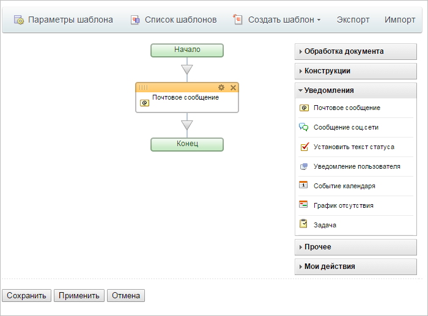
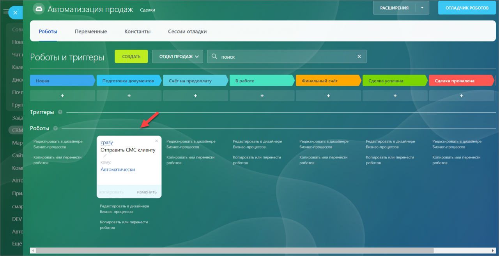

# Бизнес-процессы и роботы

> Быстрый переход: [все методы и события](#all-methods) 

Бизнес-процессы в Битрикс24 представляют собой low-code инструмент, который позволяет автоматизировать повседневные задачи без необходимости глубоких знаний в программировании. Пользователи могут легко настроить различные операции, используя уже готовые к использованию действия.

Вы найдете эти автоматизированные процессы и сможете запустить их прямо из таких разделов, как [Лента новостей](../log/index.md), [CRM](../crm/index.md), [Диск](../disk/index.md), [Смарт-процессы](../crm/universal/user-defined-object-types/index.md) и [Универсальные списки](../lists/index.md).

Чтобы глубже понять работу бизнес-процессов, смотрите [видео-курс](https://helpdesk.bitrix24.ru/open/3092117/), который подробно объясняет их функционал как для пользователей, так и для администраторов.

Бизнес-процессы могут автоматически запускаться при наступлении определенных событий (например, при добавлении новой сделки в CRM) или по инициативе пользователя (как процесс согласования отпуска через Ленту новостей).

Кроме бизнес-процессов, в Битрикс24 доступны [роботы](https://helpdesk.bitrix24.ru/open/16547618/) — это ещё более простой способ автоматизации, особенно удобный для обычных пользователей. Роботы активно применяют в CRM и управлении задачами.

## Востребованные сценарии с использованием REST API

С помощью соответствующих методов вы сможете:

- Добавлять в Битрикс24 готовые отраслевые [шаблоны бизнес-процессов](./template/bizproc-workflow-template-add.md), принятых в определенных сферах бизнеса или определенных типах компаний
- Предлагать свои сценарии автоматического [запуска бизнес-процессов](bizproc-workflow-start.md) (например, формирование объяснительной записки в случае серьёзного нарушения срока проекта и т.д.)
- Предлагать запуск бизнес-процессов в своих [виджетах](../widgets/index.md), если стандартные интерфейсы не предлагают пользователю такой возможности

Вы можете расширить возможности пользовательской автоматизации Битрикс24, добавив в Битрикс24 свои [действия бизнес-процессов](bizproc-activity/bizproc-activity-add.md) и [роботов](bizproc-robot/bizproc-robot-add.md), которые смогут:

- Отправлять документы во внешние системы
- Оформлять или модифицировать заказы во внешнем интернет-магазине
- Передавать в Битрикс24 данные из внешних систем
- Запускать готовые внешние процессы (например, подключать специального внешнего чатбота к диалогу с клиентом, когда сделка перешла в стадию согласования доставки)
- Передавать данные об оплате во внешнюю сквозную аналитику
- Выполнять законченный бизнес сценарий (например, формировать сложный счёт или собирать данные из всех сделок одного клиента и возвращать сумму для дальнейшего использования)



- Добавляйте именно роботов вместо действий бизнес-процессов, поскольку каждый зарегистрированный робот также может быть использован и в качестве действия бизнес-процесса. Кроме того, ваши роботы будут доступны в [Умных сценариях](https://helpdesk.bitrix24.ru/open/13281632/)
- Если вы хотите отправлять какие-то изменения во внешнюю систему при смене статусов сделок или лидов, лучше [зарегистрировать робота](bizproc-robot/bizproc-robot-add.md), которого пользователь сам разместит на нужной ему стадии, вместо перехвата события на [изменение сделки](../crm/deals/events/on-crm-deal-add.md) или [лида](../crm/leads/events/on-crm-lead-add.md). Это избавит вас от необходимости делать интерфейс настройки соответствия стадий лидов и сделок со статусами или событиями внешней системы и значительно упростит разработку



## Особенности функционала бизнес-процессов

Важно понимать терминологию и взаимосвязи между объектами, реализующими функционал бизнес-процессов.

### Шаблон бизнес-процесса

Это, собственно, логическая схема, алгоритм, реализующий нужную бизнес-логику с помощью отдельных действий и операций, доступных в дизайнере бизнес-процессов. 

[Шаблон](./template/bizproc-workflow-template-add.md) всегда привязан к некому **базовому объекту**, данными которого он будет оперировать. Например, шаблон может быть привязан к сделкам CRM. В этом случае, базовым объектом будет являться конкретная сделка, для которой будет запущен бизнес-процесс. 

Привязка к базовому объекту также определяет контекст запуска бизнес-процесса: скажем, нельзя запустить бизнес-процесс для лида, на основе шаблона, сделанного для сделки.

Объектами могут выступать лиды, контакты, компании, счета и коммерческие предложения в CRM, элементы пользовательских типов объектов (смарт-процессы), файлы Битрикс24 Диск и другие.

У шаблона бизнес-процесса могут быть входные параметры, которые должен будет заполнить пользователь (или ваш программный код) при запуске бизнес-процесса на основе выбранного шаблона.

Помимо входных параметров можно также использовать внутренние переменные. Разработчик шаблона должен добавить их в настройках шаблона.

Важно понимать, что, говоря о входных параметрых и переменных, мы говорим об «описаниях». Но реальные значения у параметров и переменных возникают только в случае запуска реального бизнес-процесса.

### Бизнес-процессы

Бизнес-процесс — это, фактически, «живой» экземпляр, создаваемый из шаблона в момент [запуска](./bizproc-workflow-start.md) для конкретного базового объекта. Очевидно, что несколько бизнес-процессов могут быть запущены параллельно для разных базовых объектов.

Когда бизнес-процесс запущен, то для него создаётся копия шаблона бизнес-процесса, которая остаётся неизменной до завершения бизнес-процесса. Если в течение выполнения бизнес-процесса пользователь будет вносить изменения в шаблон, это никак не отразится на логике уже запущенного бизнес-процесса.

Значения входных параметров и внутренних переменных точно также имеют свои конкретные значения для каждого отдельного бизнес-процесса и меняются только для него.

### Задания бизнес-процессов

Во время выполнения бизнес-процесс может использовать особые действия — задания для участников бизнес-процесса, когда для логики бизнес-процесса требуется получить от пользователя какую-то дополнительную информацию, например, согласовать документ, загрузить какой-то файл и так далее.

Такие действия порождают **задания бизнес-процессов**. Пользователи, которые получили задания, видят соответствующую информацию в Битрикс24, а также получают нотификации. [Текущие задания](bizproc-task/bizproc-task-list.md) для пользователя можно также получить с помощью соответствующего метода REST API для автоматической обработки.

### Действия бизнес-процессов

**Действия** бизнес-процесса, это «кубики», из которых строится шаблон бизнес-процесса. Как правило, такие они представляют собой обособленные атомарные операции вроде «Создать задачу», «Сформировать счет», «Изменить значение поля документа» и так далее.

Действия бизнес-процессов могут иметь входные параметры, которые пользователь сможет задать в дизайнере бизнес-процессов во время разработки нужного шаблона.

Кроме того, действия могут возвращать результирующие данные «обратно» в бизнес-процесс. Эти данные проектировщик бизнес-процесса сможет использовать в качестве входных параметров для последующих действий.

С помощью REST API можно [добавлять свои действия](bizproc-activity/bizproc-activity-add.md) бизнес-процессов в Битрикс24.

### Роботы

**Роботы** представляют собой объекты, аналогичные действиям бизнес-процессов с той лишь разницей, что в основном они используются не в дизайнере бизнес-процессов, а в специальных интерфейсах CRM и задач.

Роботы так же могут иметь входные параметры, значения которых будет задавать пользователь, настраивающих роботов в воронках лидов, сделок или в умных сценариях. И также могут возвращать значения для использования в качестве входных параметров последующих роботов.

С помощью REST API можно [добавлять своих роботов](bizproc-robot/bizproc-robot-add.md) в Битрикс24. Мы рекомендуем добавлять роботов вместо действий бизнес-процессов, поскольку роботы могут быть использованы внутри дизайнера бизнес-процессов, а значит, вы добавите свой функционал и в настройки роботов, и в дизайнер бизнес-процессов сразу.

## Рекомендуемая последовательность изучения

- Добавьте [своего робота](bizproc-robot/bizproc-robot-add.md) в Битрикс24
- Научитесь [запускать готовый бизнес-процесс](bizproc-workflow-start.md) или [останавливать](bizproc-workflow-kill.md) уже запущенный
- Узнайте, как [добавлять свой шаблон](./template/bizproc-workflow-template-add.md)
- Узнайте, как получить список текущих [заданий бизнес-процесса](bizproc-task/bizproc-task-list.md), автоматически их [завершать](bizproc-task/bizproc-task-complete.md) за пользователя и [делегировать](./bizproc-task/bizproc-task-delegate.md) другому пользователю

## Обзор методов {#all-methods}

#|
|| **Метод** | **Описание** ||
|| [bizproc.workflow.start](./bizproc-workflow-start.md) | Запускает новый бизнес-процесс ||
|| [bizproc.workflow.instances](./bizproc-workflow-instances.md) | Возвращает список запущенных бизнес-процессов ||
|| [bizproc.workflow.kill](./bizproc-workflow-kill.md) | Удаляет запущенный бизнес-процесс вместе со всеми данными процесса ||
|| [bizproc.workflow.terminate](./bizproc-workflow-terminate.md) | Прерывает выполнение бизнес-процесса ||
|#

### Шаблоны бизнес-процессов

#|
|| **Метод** | **Описание** ||
|| [bizproc.workflow.template.add](./template/bizproc-workflow-template-add.md) | Добавляет новый шаблон бизнес-процесса ||
|| [bizproc.workflow.template.update](./template/bizproc-workflow-template-update.md) | Обновляет существующий шаблон бизнес-процесса ||
|| [bizproc.workflow.template.delete](./template/bizproc-workflow-template-delete.md) | Удаляет шаблон бизнес-процесса ||
|| [bizproc.workflow.template.list](./template/bizproc-workflow-template-list.md) | Возвращает список шаблонов бизнес-процессов ||
|#

### Задания бизнес-процессов

#|
|| **Метод** | **Описание** ||
|| [bizproc.task.list](./bizproc-task/bizproc-task-list.md) | Получает список заданий бизнес-процессов ||
|| [bizproc.task.complete](./bizproc-task/bizproc-task-complete.md) | Выполняет задание бизнес-процесса ||
|| [bizproc.task.delegate](./bizproc-task/bizproc-task-delegate.md) | Делегирует задание бизнес-процесса ||
|#

### Роботы приложений

#|
|| **Метод** | **Описание** ||
|| [bizproc.robot.add](./bizproc-robot/bizproc-robot-add.md) | Регистрирует нового робота ||
|| [bizproc.robot.update](./bizproc-robot/bizproc-robot-update.md) | Обновляет поля уже добавленного робота ||
|| [bizproc.robot.list](./bizproc-robot/bizproc-robot-list.md) | Возвращает список роботов, зарегистрированных приложением ||
|| [bizproc.robot.delete](./bizproc-robot/bizproc-robot-delete.md) | Удаляет зарегистрированного робота ||
|| [bizproc.event.send](./bizproc-robot/bizproc-event-send.md) | Возвращает действию выходные параметры, заданные в описании действия ||
|#

### Действия приложений

#|
|| **Метод** | **Описание** ||
|| [bizproc.activity.add](./bizproc-activity/bizproc-activity-add.md) | Добавляет новое действие для использования в бизнес-процессах ||
|| [bizproc.activity.update](./bizproc-activity/bizproc-activity-update.md) | Обновляет поля уже добавленного действия ||
|| [bizproc.activity.list](./bizproc-activity/bizproc-activity-list.md) | Возвращает список установленных приложением действий ||
|| [bizproc.activity.log](./bizproc-activity/bizproc-activity-log.md) | Записывает информацию в лог бизнес-процесса ||
|| [bizproc.activity.delete](./bizproc-activity/bizproc-activity-delete.md) | Удаляет установленное приложением действие ||
|#