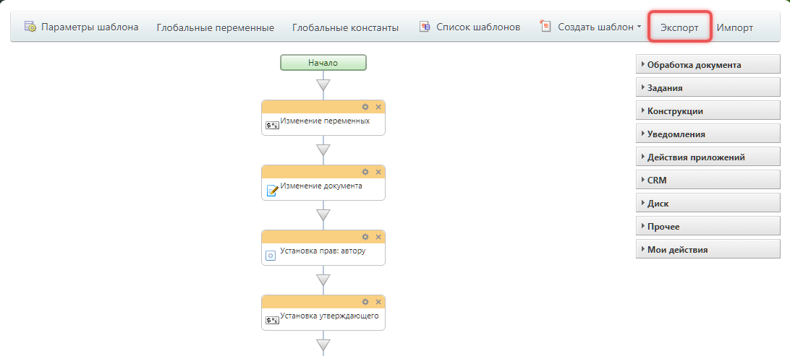

# Шаблоны бизнес-процессов: обзор методов

Шаблон бизнес-процесса — это логическая схема. Она реализует бизнес-логику с помощью действий и операций в дизайнере бизнес-процессов.

> Быстрый переход: [все методы и события](#all-methods) 
> 
> Пользовательская документация: 
> - [Как создать шаблон последовательного бизнес-процесса](https://helpdesk.bitrix24.ru/open/21918154/)
> - [Как настроить параметры шаблона](https://helpdesk.bitrix24.ru/open/22478438/)

## Добавить шаблон бизнес-процесса

Метод [bizproc.workflow.template.add](./bizproc-workflow-template-add.md) добавляет шаблон в Битрикс24 из файла с расширением `.bpt`. Чтобы получить файл, настройте шаблон бизнес-процесса и экспортируйте его.

Полученный файл можно использовать как шаблон в нужном Битрикс24.



-  [Дизайнер бизнес-процессов](https://helpdesk.bitrix24.ru/open/22955798/)
-  [Экспорт и импорт шаблонов бизнес-процессов](https://helpdesk.bitrix24.ru/open/5435897/)



## Контекст приложения

Система привязывает новый шаблон к [приложению](../../../settings/app-installation/index.md). Обновить или удалить шаблоны, созданные методом [bizproc.workflow.template.add](./bizproc-workflow-template-add.md), можно только в контексте того приложения, которым они были созданы.

## Связь шаблона с документом

Каждый шаблон связан с базовым объектом, данными которого он управляет. Например, шаблон может быть связан с CRM-сделками. В этом случае базовым объектом будет конкретная сделка, для которой запускается бизнес-процесс.

Связь с базовым объектом определяет контекст запуска: нельзя запустить процесс для лида, используя шаблон для сделки.

Шаблон связан с документом через параметр `DOCUMENT_TYPE`, который представляет собой массив из трех элементов:

-  идентификатор модуля
-  тип объекта
-  тип документа

Например, `['crm', 'CCrmDocumentLead', 'LEAD']`.

Значения в массиве взаимосвязаны. Если первый элемент — `'crm'`, остальные должны соответствовать CRM. Важно следить за правильностью значений.

### Возможные значения

**Идентификатор модуля.** Указывает область применения шаблона бизнес-процесса.

-  `crm` — CRM
-  `lists` — Универсальные списки
-  `disk` — Битрикс24 Диск

**Идентификатор объекта.** Объект в рамках указанного модуля. Например, для CRM объектом может быть лид или сделка.

CRM
-  `CCrmDocumentLead` — лиды
-  `CCrmDocumentContact` — контакты
-  `CCrmDocumentCompany` — компании
-  `CCrmDocumentDeal` — сделки
-  `Bitrix\Crm\Integration\BizProc\Document\Quote` — коммерческие предложения
-  `Bitrix\Crm\Integration\BizProc\Document\SmartInvoice` — счета
-  `Bitrix\Crm\Integration\BizProc\Document\Dynamic` — смарт-процессы

Списки
-  `BizprocDocument` — процессы в ленте новостей
-  `Bitrix\Lists\BizprocDocumentLists` — списки в группах

Диск
-  `Bitrix\Disk\BizProcDocument`

**Тип документа.** Привязка к конкретному документу указанного объекта.

CRM
-  `LEAD` — лиды
-  `CONTACT` — контакты
-  `COMPANY` — компании
-  `DEAL` — сделки
-  `QUOTE` — коммерческие предложения
-  `SMART_INVOICE` — счета
-  `DYNAMIC_XXX` — смарт-процессы, где XXX — идентификатор смарт-процесса

Универсальные списки
-  `iblock_XXX` — информационный блок, где XXX — идентификатор информационного блока

Диск
-  `STORAGE_XXX` — хранилище диска, где XXX — идентификатор хранилища

## Получить список шаблонов

Для получения списка всех шаблонов портала используется метод [bizproc.workflow.template.list](./bizproc-workflow-template-list.html). Чтобы получить список шаблонов приложения, укажите в параметре `FILTER` поле `SYSTEM_CODE` и символьный код приложения, например, `"SYSTEM_CODE": "rest_app_5"`.

## Обзор методов {#all-methods}

> Scope: [`bizproc`](../../scopes/permissions.md)
>
> Кто может выполнять метод: в зависимости от метода

#|
|| **Метод** | **Описание** ||
|| [bizproc.workflow.template.add](./bizproc-workflow-template-add.md) | Добавить шаблон бизнес-процесса из файла ||
|| [bizproc.workflow.template.update](./bizproc-workflow-template-update.md) | Обновить шаблон ||
|| [bizproc.workflow.template.list](./bizproc-workflow-template-list.md) | Получить список шаблонов ||
|| [bizproc.workflow.template.delete](./bizproc-workflow-template-delete.md) | Удалить шаблон ||
|#