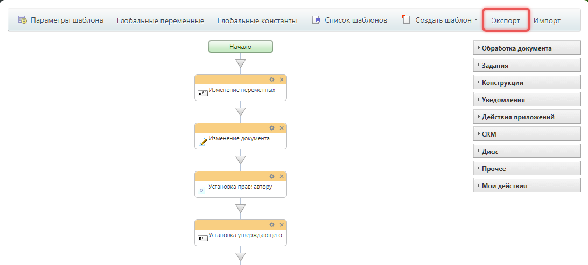

# Шаблоны бизнес-процессов: обзор методов



Выберите инструмент для разработки с AI-агентом:

- используйте [Битрикс24 Вайбкод](../../../ai-tools/vibecode.md), чтобы создать приложение для Битрикс24 по описанию задачи без знания языков программирования. Агент напишет код и разместит приложение на сервере без ручной настройки хостинга
- используйте [MCP-сервер](../../../ai-tools/mcp.md), чтобы разрабатывать интеграцию через REST API в своем проекте. Агент будет обращаться к официальной REST-документации



Шаблоны бизнес-процессов задают логику автоматизации через действия и операции в дизайнере бизнес-процессов. Методы позволяют добавить шаблон из файла `.bpt`, обновить его параметры, получить список шаблонов и удалить шаблон, созданный приложением.

Методы работают только с шаблонами из дизайнера бизнес-процессов. Шаблоны роботов, настроенных на стадиях элементов CRM, смарт-процессов или в задачах, недоступны в REST API: их нельзя получить, изменить или удалить.



Методы добавления, обновления и удаления шаблонов работают только в контексте [приложения](../../../settings/app-installation/index.md). Обновить или удалить шаблон может только приложение, которое его создало.



> Быстрый переход: [все методы](#all-methods)
>
> Пользовательская документация:
> - [Как создать шаблон последовательного бизнес-процесса](https://helpdesk.bitrix24.ru/open/21918154/)
> - [Как настроить параметры шаблона](https://helpdesk.bitrix24.ru/open/22478438/)

## Как начать работу

1. Добавьте шаблон методом [bizproc.workflow.template.add](./bizproc-workflow-template-add.md)
2. Получите список шаблонов методом [bizproc.workflow.template.list](./bizproc-workflow-template-list.md)
3. Обновите шаблон методом [bizproc.workflow.template.update](./bizproc-workflow-template-update.md)
4. Удалите неактуальный шаблон методом [bizproc.workflow.template.delete](./bizproc-workflow-template-delete.md)

## Как подготовить файл шаблона

Метод [bizproc.workflow.template.add](./bizproc-workflow-template-add.md) добавляет шаблон из файла с расширением `.bpt`. Чтобы получить файл, настройте шаблон бизнес-процесса в дизайнере и экспортируйте его.

Полученный файл можно использовать как шаблон в нужном Битрикс24.



- [Дизайнер бизнес-процессов](https://helpdesk.bitrix24.ru/open/22955798/)
- [Экспорт и импорт шаблонов бизнес-процессов](https://helpdesk.bitrix24.ru/open/5435897/)



## Идентификатор типа документа

`DOCUMENT_TYPE` указывается в параметрах метода [bizproc.workflow.template.add](./bizproc-workflow-template-add.md), когда приложение добавляет шаблон из файла. В методе [bizproc.workflow.template.list](./bizproc-workflow-template-list.md) значения `MODULE_ID`, `ENTITY` и `DOCUMENT_TYPE` возвращаются в полях шаблона и могут использоваться для фильтрации.

`DOCUMENT_TYPE` — массив из трех строк. Он связывает шаблон с типом документа, для которого будет запускаться бизнес-процесс:

- идентификатор модуля, например `crm`
- идентификатор объекта, например `CCrmDocumentDeal`
- тип документа, например `DEAL`

Значения в массиве взаимосвязаны: если первый элемент относится к CRM, остальные элементы тоже должны описывать CRM-объект.

### Возможные значения

#|
|| **Модуль** | **Идентификатор объекта** | **Тип документа** | **Описание** ||
|| `crm` | `CCrmDocumentLead` | `LEAD` | Лиды ||
|| `crm` | `CCrmDocumentContact` | `CONTACT` | Контакты ||
|| `crm` | `CCrmDocumentCompany` | `COMPANY` | Компании ||
|| `crm` | `CCrmDocumentDeal` | `DEAL` | Сделки ||
|| `crm` | `Bitrix\Crm\Integration\BizProc\Document\Quote` | `QUOTE` | Коммерческие предложения ||
|| `crm` | `Bitrix\Crm\Integration\BizProc\Document\SmartInvoice` | `SMART_INVOICE` | Счета ||
|| `crm` | `Bitrix\Crm\Integration\BizProc\Document\Dynamic` | `DYNAMIC_XXX` | Смарт-процессы, где XXX — идентификатор смарт-процесса ||
|| `lists` | `BizprocDocument` | `iblock_XXX` | Процессы в ленте новостей, где XXX — идентификатор информационного блока ||
|| `lists` | `Bitrix\Lists\BizprocDocumentLists` | `iblock_XXX` | Списки в группах, где XXX — идентификатор информационного блока ||
|| `disk` | `Bitrix\Disk\BizProcDocument` | `STORAGE_XXX` | Хранилище диска, где XXX — идентификатор хранилища ||
|#

## Что важно учитывать

- Методы [bizproc.workflow.template.add](./bizproc-workflow-template-add.md), [bizproc.workflow.template.update](./bizproc-workflow-template-update.md) и [bizproc.workflow.template.delete](./bizproc-workflow-template-delete.md) работают только в контексте установленного приложения
- Обновить или удалить можно только шаблон, который был создан этим же приложением
- Тип документа задается параметром `DOCUMENT_TYPE` и определяет, для каких объектов можно запускать бизнес-процесс
- Чтобы получить шаблоны приложения, передайте в фильтр метода [bizproc.workflow.template.list](./bizproc-workflow-template-list.md) поле `SYSTEM_CODE`, например `"SYSTEM_CODE": "rest_app_5"`

## Связь с другими объектами

**CRM.** Шаблон можно связать с лидами, контактами, компаниями, сделками, коммерческими предложениями, счетами и смарт-процессами. Связь задается через `DOCUMENT_TYPE`, например `['crm', 'CCrmDocumentDeal', 'DEAL']`.

Связь с базовым объектом определяет контекст запуска: нельзя запустить процесс для лида, используя шаблон для сделки.

**Универсальные списки.** Шаблон можно связать с процессами в ленте новостей или списками в группах. В `DOCUMENT_TYPE` укажите модуль `lists`, тип объекта и идентификатор информационного блока в формате `iblock_XXX`.

**Диск.** Шаблон можно связать с хранилищем Диска. В `DOCUMENT_TYPE` укажите модуль `disk`, объект `Bitrix\Disk\BizProcDocument` и идентификатор хранилища в формате `STORAGE_XXX`.

## Обзор методов {#all-methods}

> Scope: [`bizproc`](../../scopes/permissions.md)
>
> Кто может выполнять метод: зависит от метода

#|
|| **Метод** | **Описание** ||
|| [bizproc.workflow.template.add](./bizproc-workflow-template-add.md) | Добавляет шаблон бизнес-процесса из файла ||
|| [bizproc.workflow.template.update](./bizproc-workflow-template-update.md) | Обновляет шаблон ||
|| [bizproc.workflow.template.list](./bizproc-workflow-template-list.md) | Получает список шаблонов ||
|| [bizproc.workflow.template.delete](./bizproc-workflow-template-delete.md) | Удаляет шаблон ||
|#
