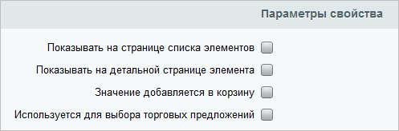

# Параметры свойств товаров и вариаций



Тут может не хватать некоторых данных — дополним в ближайшее время



> Scope: [`catalog`](../../scopes/permissions.md)
>
> Кто может выполнять метод: любой пользователь

Методы работы с [параметрами свойств](*ключ_параметрами) товаров и вариаций:

#|
|| **Метод** | **Описание** ||
|| [catalog.productPropertyFeature.add](./catalog-product-property-feature-add.md) | Метод добавляет параметр свойства товаров или вариаций ||
|| [catalog.productPropertyFeature.get](./catalog-product-property-feature-get.md) | Метод для доступа к значению параметра свойства товаров или вариаций ||
|| [catalog.productPropertyFeature.getFields](./catalog-product-property-feature-get-fields.md) | Метод возвращает поля параметра свойства товаров или вариаций ||
|| [catalog.productPropertyFeature.getAvailableFeaturesByProperty](./catalog-product-property-feature-get-available-features-by-property.md) | Метод получает доступные параметры свойства товаров или вариаций ||
|| [catalog.productPropertyFeature.update](./catalog-product-property-feature-update.md) | Метод для обновления значений списочных свойств ||
|#

[*ключ_параметрами]: Настройки, касаемые показа, сгруппированы в секции **Параметры свойств**   Подробнее в [уроке](https://dev.1c-bitrix.ru/learning/course/index.php?COURSE_ID=42&LESSON_ID=1986 "Настройка показа свойств инфоблоков").