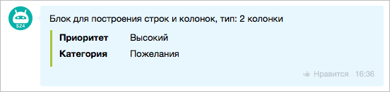

# Блок таблицы GRID

Блок `GRID` выводит данные в табличном формате пар «название-значение» с разными вариантами отображения.

## Варианты отображения

- `BLOCK` — каждый элемент `GRID` выводится отдельным блоком на новой строке, вертикальный список.
- `LINE` — элементы выводятся в одну строку как карточки, при нехватке ширины переносятся на следующую строку.
- `ROW` — классический двухколоночный формат «NAME | VALUE».
- `TABLE` — табличный режим с более плотной сеткой; поддержка зависит от версии приложения клиента. В некоторых клиентах может отображаться как `ROW`.

### Как это выглядит в интерфейсе

- `BLOCK`

  Поля идут друг под другом, каждое с новой строки.

  Пример:

  ```text
  Проект: BUGS
  Категория: im
  Сводка: Требуется реализовать...
  ```

- `LINE`

  Поля показываются как компактные карточки в одну строку. Если места не хватает, карточки переносятся на следующую строку.

  Пример:

  ```text
  [Проект: BUGS] [Категория: im] [Приоритет: Высокий]
  [Исполнитель: Иван Иванов]
  ```

- `ROW`

  Пары «название-значение» выводятся в две колонки: слева `NAME`, справа `VALUE`.

  Пример:

  ```text
  Проект      | BUGS
  Категория   | im
  Приоритет   | Высокий
  ```

- `TABLE`

  Табличный вариант с более плотной сеткой. В зависимости от клиента может выглядеть как `ROW`.

  Пример:

  ```text
  Проект    | BUGS
  Категория | im
  Дедлайн   | 04.11.2015 17:50:43
  ```



В рамках одной записи `GRID` не смешивайте разные форматы отображения. Если нужны разные типы представления, создавайте отдельные блоки `GRID`.



## Общие параметры элемента GRID

#|
|| **Название**
`тип` | **Описание** ||
|| **DISPLAY***
[`string`](../../../../../../data-types.md) | Формат отображения: `BLOCK`, `LINE`, `ROW`, `TABLE` ||
|| **NAME**
[`string`](../../../../../../data-types.md) | Название поля. В режиме `ROW` может отсутствовать, тогда `VALUE` занимает всю ширину строки ||
|| **VALUE**
[`string`](../../../../../../data-types.md) | Значение поля. Для `VALUE` поддерживаются BB-коды. В режиме `ROW` может отсутствовать, тогда `NAME` занимает всю ширину строки ||
|| **WIDTH**
[`integer`](../../../../../../data-types.md) | Ширина блока или колонки в пикселях ||
|| **HEIGHT**
[`integer`](../../../../../../data-types.md) | Высота блока в пикселях ||
|| **COLOR_TOKEN**
[`string`](../../../../../../data-types.md) | Токен цвета значения: `primary`, `secondary`, `alert`, `base` ||
|| **COLOR**
[`string`](../../../../../../data-types.md) | HEX-цвет значения (`#RGB` или `#RRGGBB`) ||
|| **LINK**
[`string`](../../../../../../data-types.md) | Внешняя ссылка для значения ||
|| **USER_ID**
[`integer`](../../../../../../data-types.md) | Внутренняя ссылка на пользователя ||
|| **CHAT_ID**
[`integer`](../../../../../../data-types.md) | Внутренняя ссылка на чат ||
|#

## Поддерживаемые BB-коды для VALUE

#|
|| **Код** | **Назначение** ||
|| `USER` | Упоминание пользователя со ссылкой на профиль в чате ||
|| `CHAT` | Ссылка на чат ||
|| `SEND` | Кликабельное действие «отправить текст в чат» ||
|| `PUT` | Кликабельное действие «подставить текст в поле ввода» ||
|| `CALL` | Кликабельное действие для звонка ||
|| `BR` | Перенос строки ||
|| `B` | Жирный текст ||
|| `U` | Подчеркнутый текст ||
|| `I` | Курсив ||
|| `S` | Зачеркнутый текст ||
|| `URL` | Ссылка ||
|#

## Примеры



### Блочное представление

`DISPLAY: 'BLOCK'` выводит элементы друг под другом.

{width=420}

#### Пример



- JS

    ```js
    {
        GRID: [
            {
                NAME: 'Описание',
                VALUE: 'Требуется реализовать возможность добавлять структурированные сущности в сообщения и уведомления мессенджера.',
                DISPLAY: 'BLOCK',
                WIDTH: 250
            },
            {
                NAME: 'Категория',
                VALUE: 'Пожелания',
                DISPLAY: 'BLOCK',
                WIDTH: 100
            }
        ]
    }
    ```

- PHP

    ```php
    [
        'GRID' => [
            [
                'NAME' => 'Описание',
                'VALUE' => 'Требуется реализовать возможность добавлять структурированные сущности в сообщения и уведомления мессенджера.',
                'DISPLAY' => 'BLOCK',
                'WIDTH' => 250
            ],
            [
                'NAME' => 'Категория',
                'VALUE' => 'Пожелания',
                'DISPLAY' => 'BLOCK',
                'WIDTH' => 100
            ]
        ]
    ]
    ```



### Строчное представление

`DISPLAY: 'LINE'` выводит элементы в строку с переносом на следующую строку при нехватке места.

{width=420}

В мобильной версии элементы выводятся друг под другом:

{width=300}

#### Пример



- JS

    ```js
    {
        GRID: [
            {
                NAME: 'Приоритет',
                VALUE: 'Высокий',
                COLOR_TOKEN: 'alert',
                COLOR: '#ff0000',
                DISPLAY: 'LINE',
                WIDTH: 250
            },
            {
                NAME: 'Категория',
                VALUE: 'Пожелания',
                DISPLAY: 'LINE'
            }
        ]
    }
    ```

- PHP

    ```php
    [
        'GRID' => [
            [
                'NAME' => 'Приоритет',
                'VALUE' => 'Высокий',
                'COLOR_TOKEN' => 'alert',
                'COLOR' => '#ff0000',
                'DISPLAY' => 'LINE',
                'WIDTH' => 250
            ],
            [
                'NAME' => 'Категория',
                'VALUE' => 'Пожелания',
                'DISPLAY' => 'LINE'
            ]
        ]
    ]
    ```



### Представление в виде двух колонок

`DISPLAY: 'ROW'` выводит данные в две колонки.



#### Пример



- JS

    ```js
    {
        GRID: [
            {
                NAME: 'Приоритет',
                VALUE: 'Высокий',
                DISPLAY: 'ROW'
            },
            {
                NAME: 'Категория',
                VALUE: 'Пожелания',
                DISPLAY: 'ROW'
            }
        ]
    }
    ```

- PHP

    ```php
    [
        'GRID' => [
            [
                'NAME' => 'Приоритет',
                'VALUE' => 'Высокий',
                'DISPLAY' => 'ROW',
                'WIDTH' => 250
            ],
            [
                'NAME' => 'Категория',
                'VALUE' => 'Пожелания',
                'DISPLAY' => 'ROW'
            ]
        ]
    ]
    ```



## Продолжите изучение

- [{#T}](./index.md)
- [{#T}](./text.md)
- [{#T}](./delimiter.md)


