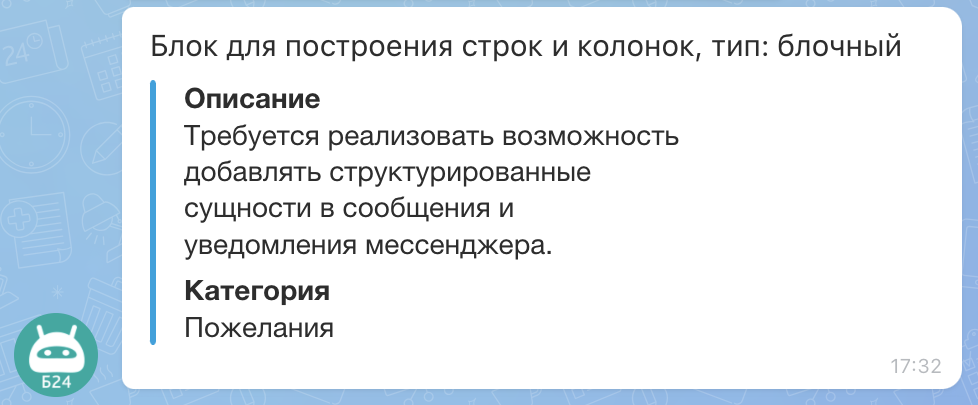
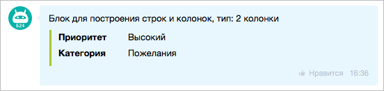

# Блок для построения строк и колонок GRID



Выберите инструмент для разработки с AI-агентом:

- используйте [Битрикс24 Вайбкод](../../../../../../../ai-tools/vibecode.md), чтобы создать приложение для Битрикс24 по описанию задачи без знания языков программирования. Агент напишет код и разместит приложение на сервере без ручной настройки хостинга
- используйте [MCP-сервер](../../../../../../../ai-tools/mcp.md), чтобы разрабатывать интеграцию через REST API в своем проекте. Агент будет обращаться к официальной REST-документации



Блок `GRID` выводит данные в табличном формате пар «название — значение» с разными вариантами отображения. Подходит для карточек со свойствами: статус заявки, приоритет, ответственный, срок. Для свободного текста используйте блок [MESSAGE](./text.md).

Блок передается элементом массива `BLOCKS` вложения, а значение ключа `GRID` — массив элементов. Общие правила и лимиты вложения описаны на странице [Вложения в сообщениях ATTACH](../index.md#limits).

## Варианты отображения

Режим задается полем `DISPLAY` у каждого элемента.

- `BLOCK` — каждый элемент выводится отдельным блоком на новой строке. Подходит для длинных значений и описаний
- `LINE` — элементы выводятся в одну строку как карточки и переносятся при нехватке ширины. Подходит для коротких меток и статусов
- `ROW` — две колонки: слева `NAME`, справа `VALUE`. Подходит для карточки свойств «поле — значение»
- `TABLE` — значение принимается API, но веб-клиент элемент с таким режимом не выводит, а мобильное приложение показывает его как `BLOCK`. Вместо `TABLE` используйте `ROW`

Если `DISPLAY` не передан или не распознан, элемент выводится как `BLOCK`. Для совместимости принимаются старые значения `CARD` (то же, что `LINE`) и `COLUMN` (то же, что `ROW`).



Задавайте всем элементам одного блока `GRID` одинаковый `DISPLAY`. Клиенты по-разному выводят смешанные режимы: например, устаревший веб-интерфейс берет режим всего блока из первого элемента. Если нужны разные режимы, создайте несколько блоков `GRID` подряд.



## Параметры элемента GRID

#|
|| **Название**
`тип` | **Описание** ||
|| **DISPLAY**
[`string`](../../../../../../data-types.md) | Формат отображения: `BLOCK`, `LINE`, `ROW`. По умолчанию `BLOCK` ||
|| **NAME**
[`string`](../../../../../../data-types.md) | Название поля. В режиме `ROW` может отсутствовать, тогда `VALUE` занимает всю ширину строки ||
|| **VALUE**
[`string`](../../../../../../data-types.md) | Значение поля, поддерживает [BB-коды](#bb-codes). В режиме `ROW` может отсутствовать, тогда `NAME` занимает всю ширину строки. Элемент, у которого пусты и `NAME`, и `VALUE`, пропускается, кроме режима `LINE` ||
|| **WIDTH**
[`integer`](../../../../../../data-types.md) | Ширина блока или колонки в пикселях ||
|| **HEIGHT**
[`integer`](../../../../../../data-types.md) | Высота блока в пикселях. Сохраняется во вложении, но веб-клиентом не учитывается ||
|| **COLOR_TOKEN**
[`string`](../../../../../../data-types.md) | Токен цвета значения: `primary`, `secondary`, `alert`, `base`. По умолчанию `base` ||
|| **COLOR**
[`string`](../../../../../../data-types.md) | HEX-цвет значения (`#RGB` или `#RRGGBB`). Учитывается только устаревшим веб-интерфейсом, актуальные клиенты используют `COLOR_TOKEN` ||
|| **LINK**
[`string`](../../../../../../data-types.md) | Ссылка для значения: абсолютный URL `http://` или `https://` или путь от корня Битрикс24. Делает кликабельным все значение целиком. Кликабельные фрагменты внутри значения задаются BB-кодами в `VALUE` ||
|| **USER_ID**
[`integer`](../../../../../../data-types.md) | ID пользователя. Сохраняется во вложении, но переход по нему в клиентах не реализован. Для ссылки на профиль передайте в `LINK` путь `/company/personal/user/1/` ||
|| **CHAT_ID**
[`integer`](../../../../../../data-types.md) | ID чата. Сохраняется во вложении, но переход по нему в клиентах не реализован ||
|#

## BB-коды в VALUE {#bb-codes}

`VALUE` поддерживает тот же набор BB-кодов, что блок [MESSAGE](./text.md#bb-codes), с теми же различиями между веб-клиентом и мобильным приложением.

Пример элемента со значением-упоминанием: `{"DISPLAY": "ROW", "NAME": "Исполнитель", "VALUE": "[USER=1]Иван Иванов[/USER]"}`.

## Примеры



Примеры показывают один элемент массива `BLOCKS`.

### Блочное представление {#block-view}

`DISPLAY: 'BLOCK'` выводит элементы друг под другом.

{width=420}



- JS

    ```js
    {
        GRID: [
            {
                NAME: 'Описание',
                VALUE: 'Требуется реализовать возможность добавлять структурированные объекты в сообщения и уведомления мессенджера.',
                DISPLAY: 'BLOCK',
                WIDTH: 250
            },
            {
                NAME: 'Категория',
                VALUE: 'Пожелания',
                DISPLAY: 'BLOCK',
                WIDTH: 100
            }
        ]
    }
    ```

- Python

    ```python
    block = {
        "GRID": [
            {
                "NAME": "Описание",
                "VALUE": "Требуется реализовать возможность добавлять структурированные объекты в сообщения и уведомления мессенджера.",
                "DISPLAY": "BLOCK",
                "WIDTH": 250,
            },
            {
                "NAME": "Категория",
                "VALUE": "Пожелания",
                "DISPLAY": "BLOCK",
                "WIDTH": 100,
            },
        ],
    }
    ```

- PHP

    ```php
    [
        'GRID' => [
            [
                'NAME' => 'Описание',
                'VALUE' => 'Требуется реализовать возможность добавлять структурированные объекты в сообщения и уведомления мессенджера.',
                'DISPLAY' => 'BLOCK',
                'WIDTH' => 250
            ],
            [
                'NAME' => 'Категория',
                'VALUE' => 'Пожелания',
                'DISPLAY' => 'BLOCK',
                'WIDTH' => 100
            ]
        ]
    ]
    ```



### Строчное представление {#inline-view}

`DISPLAY: 'LINE'` выводит элементы в строку с переносом на следующую строку при нехватке места.

{width=420}

В мобильной версии элементы выводятся друг под другом:

{width=300}



- JS

    ```js
    {
        GRID: [
            {
                NAME: 'Приоритет',
                VALUE: 'Высокий',
                COLOR_TOKEN: 'alert',
                DISPLAY: 'LINE',
                WIDTH: 250
            },
            {
                NAME: 'Категория',
                VALUE: 'Пожелания',
                DISPLAY: 'LINE'
            }
        ]
    }
    ```

- Python

    ```python
    block = {
        "GRID": [
            {
                "NAME": "Приоритет",
                "VALUE": "Высокий",
                "COLOR_TOKEN": "alert",
                "DISPLAY": "LINE",
                "WIDTH": 250,
            },
            {
                "NAME": "Категория",
                "VALUE": "Пожелания",
                "DISPLAY": "LINE",
            },
        ],
    }
    ```

- PHP

    ```php
    [
        'GRID' => [
            [
                'NAME' => 'Приоритет',
                'VALUE' => 'Высокий',
                'COLOR_TOKEN' => 'alert',
                'DISPLAY' => 'LINE',
                'WIDTH' => 250
            ],
            [
                'NAME' => 'Категория',
                'VALUE' => 'Пожелания',
                'DISPLAY' => 'LINE'
            ]
        ]
    ]
    ```



### Представление в виде двух колонок {#two-column-view}

`DISPLAY: 'ROW'` выводит данные в две колонки.

{width=420}



- JS

    ```js
    {
        GRID: [
            {
                NAME: 'Приоритет',
                VALUE: 'Высокий',
                DISPLAY: 'ROW'
            },
            {
                NAME: 'Категория',
                VALUE: 'Пожелания',
                DISPLAY: 'ROW'
            }
        ]
    }
    ```

- Python

    ```python
    block = {
        "GRID": [
            {
                "NAME": "Приоритет",
                "VALUE": "Высокий",
                "DISPLAY": "ROW",
            },
            {
                "NAME": "Категория",
                "VALUE": "Пожелания",
                "DISPLAY": "ROW",
            },
        ],
    }
    ```

- PHP

    ```php
    [
        'GRID' => [
            [
                'NAME' => 'Приоритет',
                'VALUE' => 'Высокий',
                'DISPLAY' => 'ROW'
            ],
            [
                'NAME' => 'Категория',
                'VALUE' => 'Пожелания',
                'DISPLAY' => 'ROW'
            ]
        ]
    ]
    ```



## Продолжите изучение

- [Журнал изменений API imbot.v2](../../../../change-log.md)
- [{#T}](./index.md)
- [{#T}](./text.md)
- [{#T}](./delimiter.md)
- [{#T}](../../message-formatting.md)
- [{#T}](../constructor.md)
- [{#T}](../../chat-message-send.md)
