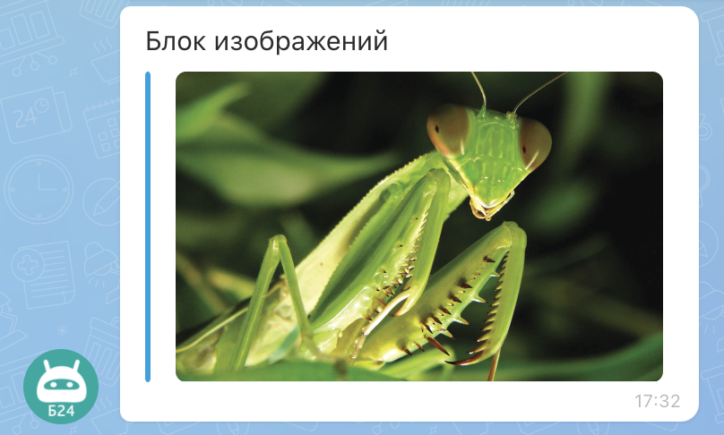

# Блок с изображениями IMAGE



Выберите инструмент для разработки с AI-агентом:

- используйте [Битрикс24 Вайбкод](../../../../../../../ai-tools/vibecode.md), чтобы создать приложение для Битрикс24 по описанию задачи без знания языков программирования. Агент напишет код и разместит приложение на сервере без ручной настройки хостинга
- используйте [MCP-сервер](../../../../../../../ai-tools/mcp.md), чтобы разрабатывать интеграцию через REST API в своем проекте. Агент будет обращаться к официальной REST-документации



Блок `IMAGE` выводит одно или несколько изображений внутри вложения: скриншот, фото товара, схему. Значение ключа `IMAGE` — массив объектов, по одному на изображение. Одиночный объект тоже принимается. Блок передается элементом массива `BLOCKS` вложения — общие правила и лимиты описаны на странице [Вложения в сообщениях ATTACH](../index.md#limits).

Чтобы приложить файл для скачивания, используйте блок [FILE](./files.md).

{width=420}

## Параметры элемента IMAGE

#|
|| **Название**
`тип` | **Описание** ||
|| **LINK***
[`string`](../../../../../../data-types.md) | URL исходного изображения: абсолютный `http://`/`https://` или путь от корня Битрикс24. Элемент без допустимого URL пропускается без ошибки ||
|| **NAME**
[`string`](../../../../../../data-types.md) | Название изображения ||
|| **PREVIEW**
[`string`](../../../../../../data-types.md) | URL уменьшенной версии изображения, в том же формате, что `LINK`. Если не задан, для предпросмотра используется `LINK`. Для стабильного отображения в разных клиентах рекомендуется указывать явно ||
|| **WIDTH**
[`integer`](../../../../../../data-types.md) | Ширина изображения в пикселях ||
|| **HEIGHT**
[`integer`](../../../../../../data-types.md) | Высота изображения в пикселях ||
|#

## Пример



Пример показывает один элемент массива `BLOCKS` с двумя изображениями. Для каждого изображения в сообщении выводится уменьшенная копия из `PREVIEW`, по клику открывается оригинал из `LINK`.



- JS

    ```js
    {
        IMAGE: [
            {
                NAME: 'Это Mantis',
                LINK: 'https://example.com/images/mantis.jpg',
                PREVIEW: 'https://example.com/images/mantis-preview.jpg',
                WIDTH: 1000,
                HEIGHT: 638
            },
            {
                NAME: 'Схема процесса',
                LINK: 'https://example.com/images/scheme.png',
                PREVIEW: 'https://example.com/images/scheme-preview.png',
                WIDTH: 800,
                HEIGHT: 600
            }
        ]
    }
    ```

- Python

    ```python
    block = {
        "IMAGE": [
            {
                "NAME": "Это Mantis",
                "LINK": "https://example.com/images/mantis.jpg",
                "PREVIEW": "https://example.com/images/mantis-preview.jpg",
                "WIDTH": 1000,
                "HEIGHT": 638,
            },
            {
                "NAME": "Схема процесса",
                "LINK": "https://example.com/images/scheme.png",
                "PREVIEW": "https://example.com/images/scheme-preview.png",
                "WIDTH": 800,
                "HEIGHT": 600,
            },
        ],
    }
    ```

- PHP

    ```php
    [
        'IMAGE' => [
            [
                'NAME' => 'Это Mantis',
                'LINK' => 'https://example.com/images/mantis.jpg',
                'PREVIEW' => 'https://example.com/images/mantis-preview.jpg',
                'WIDTH' => 1000,
                'HEIGHT' => 638
            ],
            [
                'NAME' => 'Схема процесса',
                'LINK' => 'https://example.com/images/scheme.png',
                'PREVIEW' => 'https://example.com/images/scheme-preview.png',
                'WIDTH' => 800,
                'HEIGHT' => 600
            ]
        ]
    ]
    ```



## Продолжите изучение

- [Журнал изменений API imbot.v2](../../../../change-log.md)
- [{#T}](./index.md)
- [{#T}](./files.md)
- [{#T}](../constructor.md)
- [{#T}](../../chat-message-send.md)
