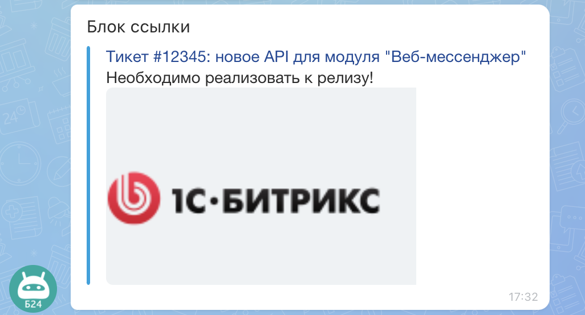
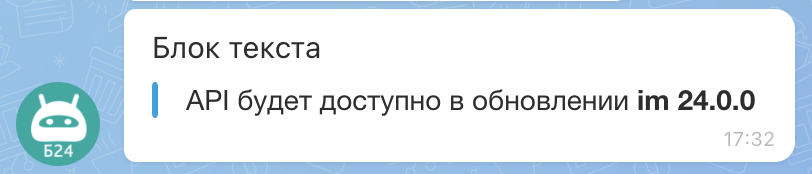
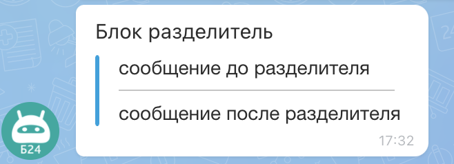

# Коллекция блоков ATTACH



Если вы разрабатываете интеграции для Битрикс24 с помощью AI-инструментов (Codex, Claude Code, Cursor), подключите [MCP-сервер](../../../../../../../sdk/mcp.md), чтобы ассистент использовал официальную REST-документацию.



Блоки определяют структуру и внешний вид вложения `ATTACH`.

## Типы блоков

### [Блок пользователя (USER)](./user.md)

Показывает карточку пользователя внутри вложения: имя, аватар и ссылку на профиль или внешний ресурс.

{width=420}

### [Блок со ссылками (LINK)](./links.md)

Добавляет кликабельную ссылку с подписью. Подходит для перехода к задаче, документу, сделке или внешней странице.

{width=420}

### [Блок с текстом (MESSAGE)](./text.md)

Выводит текстовый фрагмент вложения. Используется для заголовков, пояснений, комментариев и основного контента.

{width=420}

### [Блок с разделителем (DELIMITER)](./delimiter.md)

Добавляет визуальный разделитель между частями вложения. Помогает отделить смысловые блоки в длинной карточке.

{width=420}

### [Блок для построения строк и колонок (GRID)](./grid.md)

Формирует табличную структуру из пар «название-значение». Подходит для карточек со свойствами и параметрами.

1. [Блочное представление (BLOCK)](./grid.md#блочное-представление)

   {width=420}

2. [Строчное представление (LINE)](./grid.md#строчное-представление)

   {width=420}

   В мобильной версии блоки выводятся друг под другом:

   {width=300}

3. [Представление в виде двух колонок (ROW)](./grid.md#представление-в-виде-двух-колонок)

   {width=420}

### [Блок с изображениями (IMAGE)](./images.md)

Показывает одно или несколько изображений во вложении.

{width=420}

### [Блок с файлами (FILE)](./files.md)

Добавляет файл с названием и ссылкой на скачивание или открытие.

{width=420}

## Продолжите изучение

- [Журнал изменений API imbot.v2](../../../../change-log.md)
- [{#T}](../index.md)
- [{#T}](../constructor.md)
- [Работа с клавиатурами](../../message-keyboards.md) — кнопки под сообщением для команд, ссылок и действий
