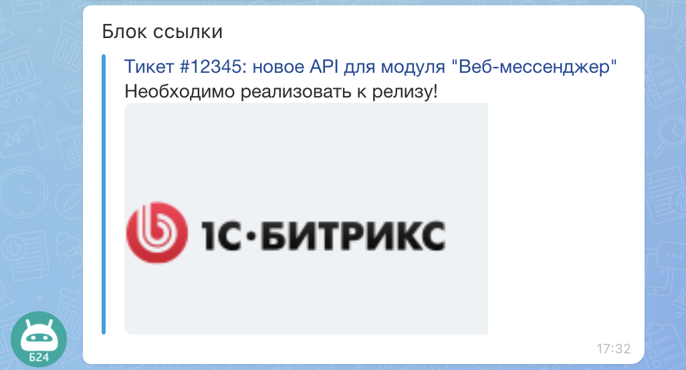
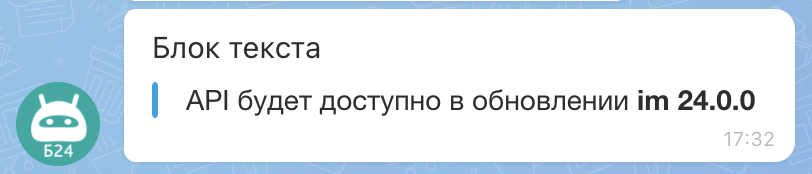
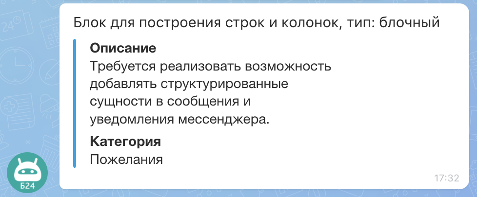
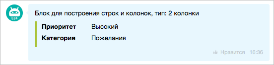

# Коллекция блоков ATTACH



Выберите инструмент для разработки с AI-агентом:

- используйте [Битрикс24 Вайбкод](../../../../../../../ai-tools/vibecode.md), чтобы создать приложение для Битрикс24 по описанию задачи без знания языков программирования. Агент напишет код и разместит приложение на сервере без ручной настройки хостинга
- используйте [MCP-сервер](../../../../../../../ai-tools/mcp.md), чтобы разрабатывать интеграцию через REST API в своем проекте. Агент будет обращаться к официальной REST-документации



Блоки определяют структуру и внешний вид вложения `ATTACH`. Каждый элемент массива `BLOCKS` — это объект с одним ключом верхнего уровня, и этот ключ задает тип блока.

## Все типы блоков {#all-blocks}

#|
|| **Ключ в BLOCKS** | **Блок** | **Для чего использовать** ||
|| `USER` | [Блок пользователя](./user.md) | Карточка пользователя: имя, аватар и ссылка на профиль или внешний ресурс ||
|| `LINK` | [Блок со ссылками](./links.md) | Кликабельная ссылка с подписью — переход к задаче, документу, сделке или внешней странице ||
|| `MESSAGE` | [Блок с текстом](./text.md) | Текстовый фрагмент вложения с поддержкой BB-кодов ||
|| `DELIMITER` | [Блок с разделителем](./delimiter.md) | Визуальный разделитель между смысловыми частями вложения ||
|| `GRID` | [Блок для построения строк и колонок](./grid.md) | Табличная структура из пар «название-значение» в одном из режимов: `BLOCK`, `LINE`, `ROW`, `TABLE` ||
|| `IMAGE` | [Блок с изображениями](./images.md) | Одно или несколько изображений во вложении ||
|| `FILE` | [Блок с файлами](./files.md) | Файл с названием, размером и ссылкой на скачивание ||
|#

Блоки разных типов комбинируются в одном массиве и выводятся в том порядке, в котором перечислены:

```json
"BLOCKS": [
    {"MESSAGE": "Заявка №142"},
    {"DELIMITER": {"SIZE": 200, "COLOR": "#c6c6c6"}},
    {"GRID": [{"DISPLAY": "ROW", "NAME": "Статус", "VALUE": "В работе"}]},
    {"LINK": {"NAME": "Открыть заявку", "LINK": "/crm/deal/details/142/"}}
]
```

Ограничения на вложение общие для всех блоков: сериализованный `ATTACH` не должен превышать 60 000 символов, а в ссылках блоков допустимы только абсолютные URL `http://` и `https://` или относительные пути от корня Битрикс24. При некорректной структуре метод отправки возвращает ошибку `ATTACH_ERROR`, при превышении лимита — `ATTACH_OVERSIZE`. Подробнее — [Вложения в сообщениях ATTACH](../index.md).

Блоки описывают только запрос. В ответе метод отправки возвращает лишь ID созданного сообщения, а собранное вложение приходит в поле `params` объекта Message при чтении сообщения или в событии — [Что возвращается в ответе](../index.md#response).

Все семь типов блоков актуальны, устаревших среди них нет. Учитывайте только различия в отображении: режим `TABLE` у блока `GRID` поддерживается не во всех версиях клиента и может выводиться как `ROW`, а в мобильной версии элементы режима `LINE` выводятся друг под другом.

## Как выглядит каждый блок

### [Блок пользователя (USER)](./user.md)

Показывает карточку пользователя внутри вложения: имя, аватар и ссылку на профиль или внешний ресурс.

{width=420}

### [Блок со ссылками (LINK)](./links.md)

Добавляет кликабельную ссылку с подписью. Подходит для перехода к задаче, документу, сделке или внешней странице.

{width=420}

### [Блок с текстом (MESSAGE)](./text.md)

Выводит текстовый фрагмент вложения. Используется для заголовков, пояснений, комментариев и основного контента.

{width=420}

### [Блок с разделителем (DELIMITER)](./delimiter.md)

Добавляет визуальный разделитель между частями вложения. Помогает отделить смысловые блоки в длинной карточке.

{width=420}

### [Блок для построения строк и колонок (GRID)](./grid.md)

Формирует табличную структуру из пар «название-значение». Подходит для карточек со свойствами и параметрами.

1. [Блочное представление (BLOCK)](./grid.md#блочное-представление)

   {width=420}

2. [Строчное представление (LINE)](./grid.md#строчное-представление)

   {width=420}

   В мобильной версии блоки выводятся друг под другом:

   {width=300}

3. [Представление в виде двух колонок (ROW)](./grid.md#представление-в-виде-двух-колонок)

   {width=420}

### [Блок с изображениями (IMAGE)](./images.md)

Показывает одно или несколько изображений во вложении.

{width=420}

### [Блок с файлами (FILE)](./files.md)

Добавляет файл с названием и ссылкой на скачивание или открытие.

{width=420}

## Продолжите изучение

- [Журнал изменений API imbot.v2](../../../../change-log.md)
- [{#T}](../index.md)
- [{#T}](../constructor.md)
- [Сообщения imbot.v2](../../index.md)
- [{#T}](../../chat-message-send.md)
- [Работа с клавиатурами](../../message-keyboards.md) — кнопки под сообщением для команд, ссылок и действий
