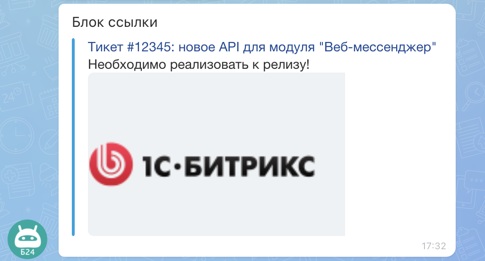
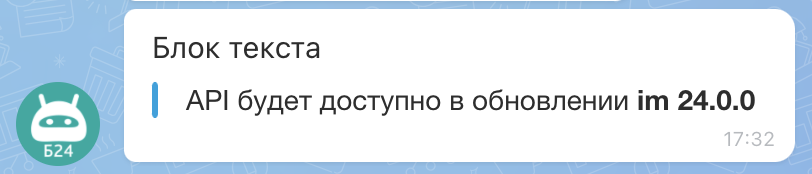
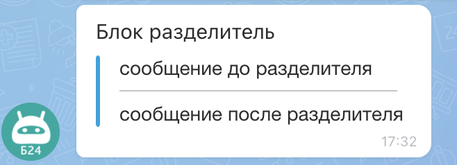

# Коллекция блоков ATTACH



Выберите инструмент для разработки с AI-агентом:

- используйте [Битрикс24 Вайбкод](../../../../../../../ai-tools/vibecode.md), чтобы создать приложение для Битрикс24 по описанию задачи без знания языков программирования. Агент напишет код и разместит приложение на сервере без ручной настройки хостинга
- используйте [MCP-сервер](../../../../../../../ai-tools/mcp.md), чтобы разрабатывать интеграцию через REST API в своем проекте. Агент будет обращаться к официальной REST-документации



Блоки определяют структуру и внешний вид вложения `ATTACH`. Блоки бывают семи типов: текст, ссылка, пользователь, свойства, изображения, файлы и разделитель. Блоки разных типов сочетаются в одном вложении. Формат самого объекта `ATTACH`, лимиты и ошибки описаны на странице [Вложения в сообщениях ATTACH](../index.md).

Каждый элемент массива `BLOCKS` — это объект с одним ключом верхнего уровня. Ключ задает тип блока. В краткой форме вложения то же правило действует для элементов массива `attach`.

## Все типы блоков {#all-blocks}

#|
|| **Ключ в BLOCKS** | **Блок** | **Для чего использовать** ||
|| `USER` | [Блок пользователя](./user.md) | Карточка пользователя: имя, аватар и ссылка на профиль или внешний ресурс ||
|| `LINK` | [Блок со ссылками](./links.md) | Кликабельная ссылка с подписью — переход к задаче, документу, сделке или внешней странице ||
|| `MESSAGE` | [Блок с текстом](./text.md) | Текстовый фрагмент вложения с поддержкой BB-кодов ||
|| `DELIMITER` | [Блок с разделителем](./delimiter.md) | Визуальный разделитель между смысловыми частями вложения ||
|| `GRID` | [Блок для построения строк и колонок](./grid.md) | Табличная структура из пар «название — значение» в одном из режимов: `BLOCK`, `LINE`, `ROW` ||
|| `IMAGE` | [Блок с изображениями](./images.md) | Одно или несколько изображений во вложении ||
|| `FILE` | [Блок с файлами](./files.md) | Файл с названием, размером и ссылкой на скачивание ||
|#

### Как выбрать блок {#choose}

- свойства объекта: статус, срок, ответственный — `GRID` в режиме `ROW`
- свободный текст с разметкой и кликабельными командами — `MESSAGE`
- ссылка отдельной карточкой с описанием и превью — `LINK`. Ссылка внутри текста — BB-код `[URL]` в `MESSAGE`
- сотрудник с аватаром — `USER`
- изображение, которое видно прямо в сообщении, — `IMAGE`. Документ для скачивания — `FILE`

## Как сочетать блоки {#combine}

Блоки разных типов комбинируются в одном массиве и выводятся в том порядке, в котором перечислены:

```json
{
    "BLOCKS": [
        {"MESSAGE": "Сделка №142"},
        {"DELIMITER": {"SIZE": 200, "COLOR": "#c6c6c6"}},
        {"GRID": [{"DISPLAY": "ROW", "NAME": "Статус", "VALUE": "В работе"}]},
        {"LINK": {"NAME": "Открыть сделку", "LINK": "/crm/deal/details/142/"}}
    ]
}
```

Допустимые ссылки, лимит размера и коды ошибок — в разделе [Ограничения и ошибки](../index.md#limits), формат ответа — в разделе [Что возвращается в ответе](../index.md#response).

## Как выглядит каждый блок {#screenshots}

### [Блок пользователя (USER)](./user.md)

{width=420}

### [Блок со ссылками (LINK)](./links.md)

{width=420}

### [Блок с текстом (MESSAGE)](./text.md)

{width=420}

### [Блок с разделителем (DELIMITER)](./delimiter.md)

{width=420}

### [Блок для построения строк и колонок (GRID)](./grid.md)

1. [Блочное представление (BLOCK)](./grid.md#block-view)

   {width=420}

2. [Строчное представление (LINE)](./grid.md#inline-view) — в мобильной версии элементы выводятся друг под другом

   {width=420}

   {width=300}

3. [Представление в виде двух колонок (ROW)](./grid.md#two-column-view)

   {width=420}

### [Блок с изображениями (IMAGE)](./images.md)

{width=420}

### [Блок с файлами (FILE)](./files.md)

{width=420}

## Продолжите изучение

- [Журнал изменений API imbot.v2](../../../../change-log.md)
- [{#T}](../index.md)
- [{#T}](../constructor.md)
- [Сообщения imbot.v2](../../index.md)
- [{#T}](../../chat-message-send.md)
- [Работа с клавиатурами](../../message-keyboards.md) — кнопки под сообщением для команд, ссылок и действий
