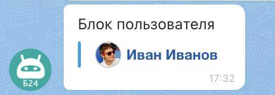

# Блок пользователя USER



Выберите инструмент для разработки с AI-агентом:

- используйте [Битрикс24 Вайбкод](../../../../../../../ai-tools/vibecode.md), чтобы создать приложение для Битрикс24 по описанию задачи без знания языков программирования. Агент напишет код и разместит приложение на сервере без ручной настройки хостинга
- используйте [MCP-сервер](../../../../../../../ai-tools/mcp.md), чтобы разрабатывать интеграцию через REST API в своем проекте. Агент будет обращаться к официальной REST-документации



Блок `USER` выводит карточку пользователя внутри вложения: имя, аватар и ссылку для перехода. Например, ответственного по заявке или автора комментария. Блок передается элементом массива `BLOCKS` вложения — общие правила и лимиты описаны на странице [Вложения в сообщениях ATTACH](../index.md#limits).

Кликабельным блок делает только поле `LINK`. Для сотрудника Битрикс24 передайте в `LINK` путь к профилю, например `/company/personal/user/1/`, для внешнего контакта — абсолютный URL.

Блок хранит одну цель перехода. Если передано несколько полей, остается первое по приоритету: `NETWORK_ID`, `USER_ID`, `CHAT_ID`, `BOT_ID`, `LINK`. Поэтому вместе с любым ID поле `LINK` отбрасывается, а переход по ID в веб-клиенте не реализован — блок получится некликабельным.

{width=420}

## Параметры блока

#|
|| **Название**
`тип` | **Описание** ||
|| **NAME***
[`string`](../../../../../../data-types.md) | Имя, которое отображается в блоке ||
|| **AVATAR**
[`string`](../../../../../../data-types.md) | URL аватара. Допускаются абсолютные URL (`http://`, `https://`) и относительные пути от корня Битрикс24 ||
|| **LINK**
[`string`](../../../../../../data-types.md) | URL перехода по клику на блок: абсолютный `http://` или `https://` или путь от корня Битрикс24. Игнорируется, если передан любой из ID ниже ||
|| **USER_ID**
[`integer`](../../../../../../data-types.md) | ID пользователя Битрикс24. Сохраняется во вложении, но переход по нему в веб-клиенте не реализован ||
|| **CHAT_ID**
[`integer`](../../../../../../data-types.md) | ID чата Битрикс24. Сохраняется во вложении, но переход по нему в веб-клиенте не реализован. Меняет заглушку аватара на `CHAT` ||
|| **BOT_ID**
[`integer`](../../../../../../data-types.md) | ID чат-бота Битрикс24. Сохраняется во вложении, но переход по нему в веб-клиенте не реализован. Меняет заглушку аватара на `BOT` ||
|| **NETWORK_ID**
[`string`](../../../../../../data-types.md) | Идентификатор сетевого пользователя Bitrix24 Network: буква и число. Перекрывает все остальные поля перехода ||
|| **AVATAR_TYPE**
[`string`](../../../../../../data-types.md) | Тип заглушки, которая выводится, если `AVATAR` не задан: `USER`, `CHAT`, `BOT`. По умолчанию `USER`, при `CHAT_ID` — `CHAT`, при `BOT_ID` — `BOT`. Явное значение перекрывает автоматическое ||
|#

## Примеры



Примеры показывают один элемент массива `BLOCKS`.

### Сотрудник Битрикс24 {#internal-user}

Клик по блоку открывает профиль пользователя с ID `1`.



- JS

    ```js
    {
        USER: {
            NAME: 'Иван Иванов',
            AVATAR: 'https://files.shelenkov.com/bitrix/images/avatar.png',
            LINK: '/company/personal/user/1/'
        }
    }
    ```

- Python

    ```python
    block = {
        "USER": {
            "NAME": "Иван Иванов",
            "AVATAR": "https://files.shelenkov.com/bitrix/images/avatar.png",
            "LINK": "/company/personal/user/1/",
        },
    }
    ```

- PHP

    ```php
    [
        'USER' => [
            'NAME' => 'Иван Иванов',
            'AVATAR' => 'https://files.shelenkov.com/bitrix/images/avatar.png',
            'LINK' => '/company/personal/user/1/'
        ]
    ]
    ```



### Внешний контакт {#external-link}

Клик по блоку открывает внешнюю страницу из `LINK`.



- JS

    ```js
    {
        USER: {
            NAME: 'Иван Иванов',
            AVATAR: 'https://files.shelenkov.com/bitrix/images/avatar.png',
            LINK: 'https://shelenkov.com'
        }
    }
    ```

- Python

    ```python
    block = {
        "USER": {
            "NAME": "Иван Иванов",
            "AVATAR": "https://files.shelenkov.com/bitrix/images/avatar.png",
            "LINK": "https://shelenkov.com",
        },
    }
    ```

- PHP

    ```php
    [
        'USER' => [
            'NAME' => 'Иван Иванов',
            'AVATAR' => 'https://files.shelenkov.com/bitrix/images/avatar.png',
            'LINK' => 'https://shelenkov.com'
        ]
    ]
    ```



## Продолжите изучение

- [Журнал изменений API imbot.v2](../../../../change-log.md)
- [{#T}](./index.md)
- [{#T}](./links.md)
- [{#T}](./grid.md)
- [{#T}](../constructor.md)
- [{#T}](../../chat-message-send.md)
