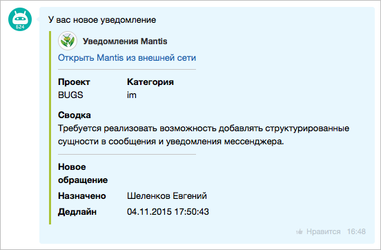
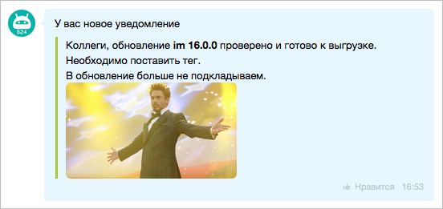

# Конструктор вложений ATTACH



Выберите инструмент для разработки с AI-агентом:

- используйте [Битрикс24 Вайбкод](../../../../../../ai-tools/vibecode.md), чтобы создать приложение для Битрикс24 по описанию задачи без знания языков программирования. Агент напишет код и разместит приложение на сервере без ручной настройки хостинга
- используйте [MCP-сервер](../../../../../../ai-tools/mcp.md), чтобы разрабатывать интеграцию через REST API в своем проекте. Агент будет обращаться к официальной REST-документации



Составное вложение собирают из блоков — например, из карточки пользователя, ссылки, разделителя, таблицы и изображения. Итоговый вид зависит от набора блоков и порядка, в котором они перечислены.

Ниже — два готовых вложения с кодом отправки и результатом в чате: карточка задачи из баг-трекера и информационное уведомление с изображением. Каждый пример можно скопировать целиком и заменить в нем данные своей задачи.

Параметры отдельных блоков описаны в разделе [Коллекция блоков ATTACH](./block-collections/index.md), форматы объекта и общие ограничения — на странице [Вложения в сообщениях ATTACH](./index.md).

## Как собирается составное вложение {#how-it-works}

Вложение передают в параметре `fields.attach` метода отправки сообщения. Правила сборки одинаковы для обоих примеров.

- Каждый элемент массива блоков — объект с одним ключом верхнего уровня. Ключ задает тип блока: `MESSAGE`, `LINK`, `USER`, `GRID`, `IMAGE`, `FILE`, `DELIMITER`.
- Значение зависит от типа блока: у `MESSAGE` — строка, у `USER`, `LINK` и `DELIMITER` — объект, у `GRID`, `IMAGE` и `FILE` — массив объектов.
- Блоки выводятся в том порядке, в котором перечислены в массиве. Чтобы изменить порядок частей карточки, поменяйте элементы местами.
- Текст параметра `message` показывается над вложением как обычное сообщение. Текст внутри вложения задают блоком `MESSAGE`.
- Режим отображения задают полем `DISPLAY` у каждого элемента блока `GRID` отдельно. Режимы в одном блоке не смешивают — иначе раскладка получается непредсказуемой; на каждый режим собирают отдельный блок, как в [Примере 1](#example-bugtracker).

В примерах не участвует только блок [`FILE`](./block-collections/files.md).

[Пример 1](#example-bugtracker) собран в краткой форме — массивом блоков без обертки. [Пример 2](#example-notification) — в полной: объектом с массивом `BLOCKS`. Полная форма позволяет добавить к блокам метаданные вложения — например, цветовую схему `COLOR_TOKEN` или HEX-цвет `COLOR`. В Примере 2 метаданные не задают, поэтому вложение выводится с оформлением по умолчанию. Поля полной формы описаны в разделе [Форматы объекта ATTACH](./index.md#full-form-fields).

## Что потребуется {#requirements}

Оба примера отправляют сообщение методом [imbot.v2.Chat.Message.send](../chat-message-send.md).

> Scope: [`imbot`](../../../../../scopes/permissions.md)
>
> Кто может выполнять метод: владелец зарегистрированного бота

Перед запуском примера подставьте свои значения:

- `botId` — идентификатор бота, от имени которого уходит сообщение. Его возвращает метод регистрации бота [imbot.v2.Bot.register](../../bots/bot-register.md) в поле `result.bot.id`
- `botToken` — токен, указанный при регистрации бота. Обязателен при авторизации через вебхук, при OAuth его не передают
- `dialogId` — идентификатор диалога: `chat{chatId}` для группового чата, `{userId}` для личного. Числовой `chatId` приходит в ответах методов работы с чатами и в данных событий — [Идентификаторы чата](../../chats/index.md#identifiers)
- ссылки на аватары, изображения и внешние страницы — в примерах стоят демонстрационные адреса, замените их на свои

Ограничения одинаковы для любого вложения: в ссылках блоков допустимы абсолютные адреса `http://` и `https://` или относительные пути от корня Битрикс24, а размер сериализованного `ATTACH` ограничен 60 000 символов. Полный список ограничений — [Ограничения и ошибки](./index.md#limits).

Вложение видят все участники чата, поэтому не передавайте в ссылках токены авторизации и другие секреты. Бот отправляет сообщение только в тот чат, к которому у него есть доступ.

## Пример 1 — карточка баг-трекера {#example-bugtracker}

Уведомление о новой заявке в баг-трекере: кто прислал, куда перейти, параметры заявки и срок. Такая карточка подходит для интеграций с внешними системами — трекерами задач, мониторингом, службой поддержки.

#|
|| **Порядок** | **Блок** | **Что выводит** ||
|| 1 | [`USER`](./block-collections/user.md) | Отправителя уведомления: имя и аватар со ссылкой на внешний трекер ||
|| 2 | [`LINK`](./block-collections/links.md) | Ссылку на заявку во внешней системе ||
|| 3 | [`DELIMITER`](./block-collections/delimiter.md) | Разделитель между блоками `USER`, `LINK` и параметрами заявки ||
|| 4 | [`GRID`](./block-collections/grid.md) | Проект и категорию компактными карточками в одну строку — режим `LINE` ||
|| 5 | [`GRID`](./block-collections/grid.md) | Сводку по заявке: название и значение под ним — режим `BLOCK` ||
|| 6 | [`DELIMITER`](./block-collections/delimiter.md) | Разделитель перед служебными полями ||
|| 7 | [`GRID`](./block-collections/grid.md) | Пометку о новом обращении, исполнителя и дедлайн в двух колонках — режим `ROW` ||
|#





- cURL (Webhook)

    ```bash
    curl -X POST \
      -H "Content-Type: application/json" \
      -H "Accept: application/json" \
      -d '{"botId":456,"botToken":"my_bot_token","dialogId":"chat20921","fields":{"message":"У вас новое уведомление","attach":[{"USER":{"NAME":"Уведомления Mantis","AVATAR":"https://files.shelenkov.com/bitrix/images/mantis2.jpg","LINK":"https://shelenkov.com/"}},{"LINK":{"NAME":"Открыть Mantis из внешней сети","LINK":"https://shelenkov.com/"}},{"DELIMITER":{"SIZE":200,"COLOR":"#c6c6c6"}},{"GRID":[{"NAME":"Проект","VALUE":"BUGS","DISPLAY":"LINE","WIDTH":100},{"NAME":"Категория","VALUE":"im","DISPLAY":"LINE","WIDTH":100}]},{"GRID":[{"NAME":"Сводка","VALUE":"Требуется реализовать возможность добавлять структурированные сущности в сообщения и уведомления мессенджера.","DISPLAY":"BLOCK"}]},{"DELIMITER":{"SIZE":200,"COLOR":"#c6c6c6"}},{"GRID":[{"NAME":"Новое обращение","VALUE":"","DISPLAY":"ROW","WIDTH":100},{"NAME":"Назначено","VALUE":"Шеленков Евгений","DISPLAY":"ROW","WIDTH":100},{"NAME":"Дедлайн","VALUE":"04.11.2015 17:50:43","DISPLAY":"ROW","WIDTH":100}]}]}}' \
      https://**put_your_bitrix24_address**/rest/**put_your_user_id_here**/**put_your_webhook_here**/imbot.v2.Chat.Message.send
    ```

- cURL (OAuth)

    ```bash
    curl -X POST \
      -H "Content-Type: application/json" \
      -H "Accept: application/json" \
      -d '{"botId":456,"dialogId":"chat20921","fields":{"message":"У вас новое уведомление","attach":[{"USER":{"NAME":"Уведомления Mantis","AVATAR":"https://files.shelenkov.com/bitrix/images/mantis2.jpg","LINK":"https://shelenkov.com/"}},{"LINK":{"NAME":"Открыть Mantis из внешней сети","LINK":"https://shelenkov.com/"}},{"DELIMITER":{"SIZE":200,"COLOR":"#c6c6c6"}},{"GRID":[{"NAME":"Проект","VALUE":"BUGS","DISPLAY":"LINE","WIDTH":100},{"NAME":"Категория","VALUE":"im","DISPLAY":"LINE","WIDTH":100}]},{"GRID":[{"NAME":"Сводка","VALUE":"Требуется реализовать возможность добавлять структурированные сущности в сообщения и уведомления мессенджера.","DISPLAY":"BLOCK"}]},{"DELIMITER":{"SIZE":200,"COLOR":"#c6c6c6"}},{"GRID":[{"NAME":"Новое обращение","VALUE":"","DISPLAY":"ROW","WIDTH":100},{"NAME":"Назначено","VALUE":"Шеленков Евгений","DISPLAY":"ROW","WIDTH":100},{"NAME":"Дедлайн","VALUE":"04.11.2015 17:50:43","DISPLAY":"ROW","WIDTH":100}]}]},"auth":"**put_access_token_here**"}' \
      https://**put_your_bitrix24_address**/rest/imbot.v2.Chat.Message.send
    ```

- JS

    ```js
    try {
        const response = await $b24.callMethod(
            'imbot.v2.Chat.Message.send',
            {
                botId: 456,
                dialogId: 'chat20921',
                fields: {
                    message: 'У вас новое уведомление',
                    attach: [
                    {
                        USER: {
                            NAME: 'Уведомления Mantis',
                            AVATAR: 'https://files.shelenkov.com/bitrix/images/mantis2.jpg',
                            LINK: 'https://shelenkov.com/'
                        }
                    },
                    {
                        LINK: {
                            NAME: 'Открыть Mantis из внешней сети',
                            LINK: 'https://shelenkov.com/'
                        }
                    },
                    {
                        DELIMITER: {
                            SIZE: 200,
                            COLOR: '#c6c6c6'
                        }
                    },
                    {
                        GRID: [
                            {
                                NAME: 'Проект',
                                VALUE: 'BUGS',
                                DISPLAY: 'LINE',
                                WIDTH: 100
                            },
                            {
                                NAME: 'Категория',
                                VALUE: 'im',
                                DISPLAY: 'LINE',
                                WIDTH: 100
                            }
                        ]
                    },
                    {
                        GRID: [
                            {
                                NAME: 'Сводка',
                                VALUE: 'Требуется реализовать возможность добавлять структурированные сущности в сообщения и уведомления мессенджера.',
                                DISPLAY: 'BLOCK'
                            }
                        ]
                    },
                    {
                        DELIMITER: {
                            SIZE: 200,
                            COLOR: '#c6c6c6'
                        }
                    },
                    {
                        GRID: [
                            {
                                NAME: 'Новое обращение',
                                VALUE: '',
                                DISPLAY: 'ROW',
                                WIDTH: 100
                            },
                            {
                                NAME: 'Назначено',
                                VALUE: 'Шеленков Евгений',
                                DISPLAY: 'ROW',
                                WIDTH: 100
                            },
                            {
                                NAME: 'Дедлайн',
                                VALUE: '04.11.2015 17:50:43',
                                DISPLAY: 'ROW',
                                WIDTH: 100
                            }
                        ]
                    }
                    ]
                }
            }
        );

        const result = response.getData().result.id;
        console.log('Created message ID:', result);
    } catch (error) {
        console.error(error);
    }
    ```

- Python

    ```python
    from b24pysdk.errors import BitrixAPIError, BitrixSDKException

    try:
        bitrix_response = client.imbot.v2.chat.message.send(
            bot_id=456,
            dialog_id="chat20921",
            fields={
                "message": "У вас новое уведомление",
                "attach": [
                    {
                        "USER": {
                            "NAME": "Уведомления Mantis",
                            "AVATAR": "https://files.shelenkov.com/bitrix/images/mantis2.jpg",
                            "LINK": "https://shelenkov.com/",
                        },
                    },
                    {
                        "LINK": {
                            "NAME": "Открыть Mantis из внешней сети",
                            "LINK": "https://shelenkov.com/",
                        },
                    },
                    {
                        "DELIMITER": {
                            "SIZE": 200,
                            "COLOR": "#c6c6c6",
                        },
                    },
                    {
                        "GRID": [
                            {
                                "NAME": "Проект",
                                "VALUE": "BUGS",
                                "DISPLAY": "LINE",
                                "WIDTH": 100,
                            },
                            {
                                "NAME": "Категория",
                                "VALUE": "im",
                                "DISPLAY": "LINE",
                                "WIDTH": 100,
                            },
                        ],
                    },
                    {
                        "GRID": [
                            {
                                "NAME": "Сводка",
                                "VALUE": "Требуется реализовать возможность добавлять структурированные сущности в сообщения и уведомления мессенджера.",
                                "DISPLAY": "BLOCK",
                            },
                        ],
                    },
                    {
                        "DELIMITER": {
                            "SIZE": 200,
                            "COLOR": "#c6c6c6",
                        },
                    },
                    {
                        "GRID": [
                            {
                                "NAME": "Новое обращение",
                                "VALUE": "",
                                "DISPLAY": "ROW",
                                "WIDTH": 100,
                            },
                            {
                                "NAME": "Назначено",
                                "VALUE": "Шеленков Евгений",
                                "DISPLAY": "ROW",
                                "WIDTH": 100,
                            },
                            {
                                "NAME": "Дедлайн",
                                "VALUE": "04.11.2015 17:50:43",
                                "DISPLAY": "ROW",
                                "WIDTH": 100,
                            },
                        ],
                    },
                ],
            },
        ).response
        result = bitrix_response.result["id"]
        print(result)
    except BitrixAPIError as error:
        print(
            "Ошибка Bitrix API",
            f"error: {error.error}",
            f"error_description: {error.error_description}",
            sep="\n",
        )
    except BitrixSDKException as error:
        print(f"Ошибка Bitrix SDK: {error.message}")
    except Exception as error:
        print(f"Непредвиденная ошибка: {error}")
    ```

- PHP

    ```php
    try {
        $response = $b24Service
            ->core
            ->call(
                'imbot.v2.Chat.Message.send',
                [
                    'botId' => 456,
                    'dialogId' => 'chat20921',
                    'fields' => [
                        'message' => 'У вас новое уведомление',
                        'attach' => [
                        [
                            'USER' => [
                                'NAME' => 'Уведомления Mantis',
                                'AVATAR' => 'https://files.shelenkov.com/bitrix/images/mantis2.jpg',
                                'LINK' => 'https://shelenkov.com/'
                            ]
                        ],
                        [
                            'LINK' => [
                                'NAME' => 'Открыть Mantis из внешней сети',
                                'LINK' => 'https://shelenkov.com/'
                            ]
                        ],
                        [
                            'DELIMITER' => [
                                'SIZE' => 200,
                                'COLOR' => '#c6c6c6'
                            ]
                        ],
                        [
                            'GRID' => [
                                [
                                    'NAME' => 'Проект',
                                    'VALUE' => 'BUGS',
                                    'DISPLAY' => 'LINE',
                                    'WIDTH' => 100
                                ],
                                [
                                    'NAME' => 'Категория',
                                    'VALUE' => 'im',
                                    'DISPLAY' => 'LINE',
                                    'WIDTH' => 100
                                ]
                            ]
                        ],
                        [
                            'GRID' => [
                                [
                                    'NAME' => 'Сводка',
                                    'VALUE' => 'Требуется реализовать возможность добавлять структурированные сущности в сообщения и уведомления мессенджера.',
                                    'DISPLAY' => 'BLOCK'
                                ]
                            ]
                        ],
                        [
                            'DELIMITER' => [
                                'SIZE' => 200,
                                'COLOR' => '#c6c6c6'
                            ]
                        ],
                        [
                            'GRID' => [
                                [
                                    'NAME' => 'Новое обращение',
                                    'VALUE' => '',
                                    'DISPLAY' => 'ROW',
                                    'WIDTH' => 100
                                ],
                                [
                                    'NAME' => 'Назначено',
                                    'VALUE' => 'Шеленков Евгений',
                                    'DISPLAY' => 'ROW',
                                    'WIDTH' => 100
                                ],
                                [
                                    'NAME' => 'Дедлайн',
                                    'VALUE' => '04.11.2015 17:50:43',
                                    'DISPLAY' => 'ROW',
                                    'WIDTH' => 100
                                ]
                            ]
                        ]
                        ]
                    ]
                ]
            );

        $result = $response->getResponseData()->getResult()['id'];
        echo 'Created message ID: ' . $result;
    } catch (Throwable $e) {
        error_log($e->getMessage());
        echo 'Error: ' . $e->getMessage();
    }
    ```

- BX24.js

    ```js
    BX24.callMethod(
        'imbot.v2.Chat.Message.send',
        {
            botId: 456,
            dialogId: 'chat20921',
            fields: {
                message: 'У вас новое уведомление',
                attach: [
                {
                    USER: {
                        NAME: 'Уведомления Mantis',
                        AVATAR: 'https://files.shelenkov.com/bitrix/images/mantis2.jpg',
                        LINK: 'https://shelenkov.com/'
                    }
                },
                {
                    LINK: {
                        NAME: 'Открыть Mantis из внешней сети',
                        LINK: 'https://shelenkov.com/'
                    }
                },
                {
                    DELIMITER: {
                        SIZE: 200,
                        COLOR: '#c6c6c6'
                    }
                },
                {
                    GRID: [
                        {
                            NAME: 'Проект',
                            VALUE: 'BUGS',
                            DISPLAY: 'LINE',
                            WIDTH: 100
                        },
                        {
                            NAME: 'Категория',
                            VALUE: 'im',
                            DISPLAY: 'LINE',
                            WIDTH: 100
                        }
                    ]
                },
                {
                    GRID: [
                        {
                            NAME: 'Сводка',
                            VALUE: 'Требуется реализовать возможность добавлять структурированные сущности в сообщения и уведомления мессенджера.',
                            DISPLAY: 'BLOCK'
                        }
                    ]
                },
                {
                    DELIMITER: {
                        SIZE: 200,
                        COLOR: '#c6c6c6'
                    }
                },
                {
                    GRID: [
                        {
                            NAME: 'Новое обращение',
                            VALUE: '',
                            DISPLAY: 'ROW',
                            WIDTH: 100
                        },
                        {
                            NAME: 'Назначено',
                            VALUE: 'Шеленков Евгений',
                            DISPLAY: 'ROW',
                            WIDTH: 100
                        },
                        {
                            NAME: 'Дедлайн',
                            VALUE: '04.11.2015 17:50:43',
                            DISPLAY: 'ROW',
                            WIDTH: 100
                        }
                    ]
                }
                ]
            }
        },
        function(result) {
            if (result.error()) {
                console.error(result.error().ex);
            } else {
                console.log('Message ID:', result.data().id);
            }
        }
    );
    ```

- PHP CRest

    ```php
    require_once('crest.php');

    $result = CRest::call(
        'imbot.v2.Chat.Message.send',
        [
            'botId' => 456,
            'dialogId' => 'chat20921',
            'fields' => [
                'message' => 'У вас новое уведомление',
                'attach' => [
                [
                    'USER' => [
                        'NAME' => 'Уведомления Mantis',
                        'AVATAR' => 'https://files.shelenkov.com/bitrix/images/mantis2.jpg',
                        'LINK' => 'https://shelenkov.com/'
                    ]
                ],
                [
                    'LINK' => [
                        'NAME' => 'Открыть Mantis из внешней сети',
                        'LINK' => 'https://shelenkov.com/'
                    ]
                ],
                [
                    'DELIMITER' => [
                        'SIZE' => 200,
                        'COLOR' => '#c6c6c6'
                    ]
                ],
                [
                    'GRID' => [
                        [
                            'NAME' => 'Проект',
                            'VALUE' => 'BUGS',
                            'DISPLAY' => 'LINE',
                            'WIDTH' => 100
                        ],
                        [
                            'NAME' => 'Категория',
                            'VALUE' => 'im',
                            'DISPLAY' => 'LINE',
                            'WIDTH' => 100
                        ]
                    ]
                ],
                [
                    'GRID' => [
                        [
                            'NAME' => 'Сводка',
                            'VALUE' => 'Требуется реализовать возможность добавлять структурированные сущности в сообщения и уведомления мессенджера.',
                            'DISPLAY' => 'BLOCK'
                        ]
                    ]
                ],
                [
                    'DELIMITER' => [
                        'SIZE' => 200,
                        'COLOR' => '#c6c6c6'
                    ]
                ],
                [
                    'GRID' => [
                        [
                            'NAME' => 'Новое обращение',
                            'VALUE' => '',
                            'DISPLAY' => 'ROW',
                            'WIDTH' => 100
                        ],
                        [
                            'NAME' => 'Назначено',
                            'VALUE' => 'Шеленков Евгений',
                            'DISPLAY' => 'ROW',
                            'WIDTH' => 100
                        ],
                        [
                            'NAME' => 'Дедлайн',
                            'VALUE' => '04.11.2015 17:50:43',
                            'DISPLAY' => 'ROW',
                            'WIDTH' => 100
                        ]
                    ]
                ]
                ]
            ]
        ]
    );

    if (!empty($result['error'])) {
        echo 'Error: ' . $result['error_description'];
    } else {
        echo 'Message ID: ' . $result['result']['id'];
    }
    ```



### Результат: карточка баг-трекера {#example-bugtracker-result}

{width=520}

Элемент `Новое обращение` передан с пустым `VALUE`, в карточке остается только его название.

Структуру вложения метод в ответе не повторяет — [Что возвращается в ответе](./index.md#response).

## Пример 2 — информационное уведомление {#example-notification}

Короткое сообщение с изображением: анонс релиза, статус выкладки, напоминание команде. Подходит, когда карточка с параметрами не нужна, а текст достаточно выделить вложением и дополнить изображением.

#|
|| **Порядок** | **Блок** | **Что выводит** ||
|| 1 | [`MESSAGE`](./block-collections/text.md) | Текст уведомления с поддержкой BB-кодов ||
|| 2 | [`IMAGE`](./block-collections/images.md) | Изображение под текстом ||
|#





- cURL (Webhook)

    ```bash
    curl -X POST \
      -H "Content-Type: application/json" \
      -H "Accept: application/json" \
      -d '{"botId":456,"botToken":"my_bot_token","dialogId":"chat20921","fields":{"message":"У вас новое уведомление","attach":{"BLOCKS":[{"MESSAGE":"Коллеги, обновление [B]im 16.0.0[/B] проверено и готово к выгрузке.[BR]Необходимо поставить тег.[BR]В обновление больше не подкладываем."},{"IMAGE":[{"LINK":"https://files.shelenkov.com/bitrix/images/win.jpg"}]}]}}}' \
      https://**put_your_bitrix24_address**/rest/**put_your_user_id_here**/**put_your_webhook_here**/imbot.v2.Chat.Message.send
    ```

- cURL (OAuth)

    ```bash
    curl -X POST \
      -H "Content-Type: application/json" \
      -H "Accept: application/json" \
      -d '{"botId":456,"dialogId":"chat20921","fields":{"message":"У вас новое уведомление","attach":{"BLOCKS":[{"MESSAGE":"Коллеги, обновление [B]im 16.0.0[/B] проверено и готово к выгрузке.[BR]Необходимо поставить тег.[BR]В обновление больше не подкладываем."},{"IMAGE":[{"LINK":"https://files.shelenkov.com/bitrix/images/win.jpg"}]}]}},"auth":"**put_access_token_here**"}' \
      https://**put_your_bitrix24_address**/rest/imbot.v2.Chat.Message.send
    ```

- JS

    ```js
    try {
        const response = await $b24.callMethod(
            'imbot.v2.Chat.Message.send',
            {
                botId: 456,
                dialogId: 'chat20921',
                fields: {
                    message: 'У вас новое уведомление',
                    attach: {
                        BLOCKS: [
                            { MESSAGE: 'Коллеги, обновление [B]im 16.0.0[/B] проверено и готово к выгрузке.[BR]Необходимо поставить тег.[BR]В обновление больше не подкладываем.' },
                            { IMAGE: [{ LINK: 'https://files.shelenkov.com/bitrix/images/win.jpg' }] }
                        ]
                    }
                }
            }
        );

        const result = response.getData().result.id;
        console.log('Created message ID:', result);
    } catch (error) {
        console.error(error);
    }
    ```

- Python

    ```python
    from b24pysdk.errors import BitrixAPIError, BitrixSDKException

    try:
        bitrix_response = client.imbot.v2.chat.message.send(
            bot_id=456,
            dialog_id="chat20921",
            fields={
                "message": "У вас новое уведомление",
                "attach": {
                    "BLOCKS": [
                        {
                            "MESSAGE": "Коллеги, обновление [B]im 16.0.0[/B] проверено и готово к выгрузке.[BR]Необходимо поставить тег.[BR]В обновление больше не подкладываем.",
                        },
                        {
                            "IMAGE": [
                                {
                                    "LINK": "https://files.shelenkov.com/bitrix/images/win.jpg",
                                },
                            ],
                        },
                    ],
                },
            },
        ).response
        result = bitrix_response.result["id"]
        print(result)
    except BitrixAPIError as error:
        print(
            "Ошибка Bitrix API",
            f"error: {error.error}",
            f"error_description: {error.error_description}",
            sep="\n",
        )
    except BitrixSDKException as error:
        print(f"Ошибка Bitrix SDK: {error.message}")
    except Exception as error:
        print(f"Непредвиденная ошибка: {error}")
    ```

- PHP

    ```php
    try {
        $response = $b24Service
            ->core
            ->call(
                'imbot.v2.Chat.Message.send',
                [
                    'botId' => 456,
                    'dialogId' => 'chat20921',
                    'fields' => [
                        'message' => 'У вас новое уведомление',
                        'attach' => [
                            'BLOCKS' => [
                                ['MESSAGE' => 'Коллеги, обновление [B]im 16.0.0[/B] проверено и готово к выгрузке.[BR]Необходимо поставить тег.[BR]В обновление больше не подкладываем.'],
                                ['IMAGE' => [['LINK' => 'https://files.shelenkov.com/bitrix/images/win.jpg']]]
                            ]
                        ]
                    ]
                ]
            );

        $result = $response->getResponseData()->getResult()['id'];
        echo 'Created message ID: ' . $result;
    } catch (Throwable $e) {
        error_log($e->getMessage());
        echo 'Error: ' . $e->getMessage();
    }
    ```

- BX24.js

    ```js
    BX24.callMethod(
        'imbot.v2.Chat.Message.send',
        {
            botId: 456,
            dialogId: 'chat20921',
            fields: {
                message: 'У вас новое уведомление',
                attach: {
                    BLOCKS: [
                        { MESSAGE: 'Коллеги, обновление [B]im 16.0.0[/B] проверено и готово к выгрузке.[BR]Необходимо поставить тег.[BR]В обновление больше не подкладываем.' },
                        { IMAGE: [{ LINK: 'https://files.shelenkov.com/bitrix/images/win.jpg' }] }
                    ]
                }
            }
        },
        function(result) {
            if (result.error()) {
                console.error(result.error().ex);
            } else {
                console.log('Message ID:', result.data().id);
            }
        }
    );
    ```

- PHP CRest

    ```php
    require_once('crest.php');

    $result = CRest::call(
        'imbot.v2.Chat.Message.send',
        [
            'botId' => 456,
            'dialogId' => 'chat20921',
            'fields' => [
                'message' => 'У вас новое уведомление',
                'attach' => [
                    'BLOCKS' => [
                        ['MESSAGE' => 'Коллеги, обновление [B]im 16.0.0[/B] проверено и готово к выгрузке.[BR]Необходимо поставить тег.[BR]В обновление больше не подкладываем.'],
                        ['IMAGE' => [['LINK' => 'https://files.shelenkov.com/bitrix/images/win.jpg']]]
                    ]
                ]
            ]
        ]
    );

    if (!empty($result['error'])) {
        echo 'Error: ' . $result['error_description'];
    } else {
        echo 'Message ID: ' . $result['result']['id'];
    }
    ```



### Результат: информационное уведомление {#example-notification-result}

{width=520}

Текст блока `MESSAGE` размечен BB-кодами: название версии выделено кодом `[B]`, предложения разбиты на строки кодом `[BR]`. Коды, которые поддерживает блок, перечислены на странице [Блок с текстом](./block-collections/text.md), полный список кодов сообщения — на странице [Форматирование текста](../message-formatting.md).

Кроме ссылки `LINK` блок изображения принимает `NAME`, `PREVIEW`, `WIDTH` и `HEIGHT` — [Блок с изображениями](./block-collections/images.md).

## Как адаптировать пример под свою задачу {#how-to-adapt}

Замените в примере данные и набор блоков — все типы блоков собраны в разделе [Коллекция блоков ATTACH](./block-collections/index.md). Отправленное вложение возвращает метод [imbot.v2.Chat.Message.get](../chat-message-get.md) в поле `params` объекта Message — [Объекты и поля](../../../entities.md#message).

Отправленное вложение заменяют целиком: новый набор блоков передают в `fields.attach` методу [imbot.v2.Chat.Message.update](../chat-message-update.md).

Кнопки под сообщением задают не вложением, а отдельным параметром `fields.keyboard` — [Работа с клавиатурами](../message-keyboards.md).

## Продолжите изучение

- [Журнал изменений API imbot.v2](../../../change-log.md)
- [{#T}](./index.md)
- [{#T}](./block-collections/index.md)
- [{#T}](../chat-message-send.md)
- [{#T}](../chat-message-update.md)
- [{#T}](../message-formatting.md)
- [{#T}](../message-keyboards.md)
