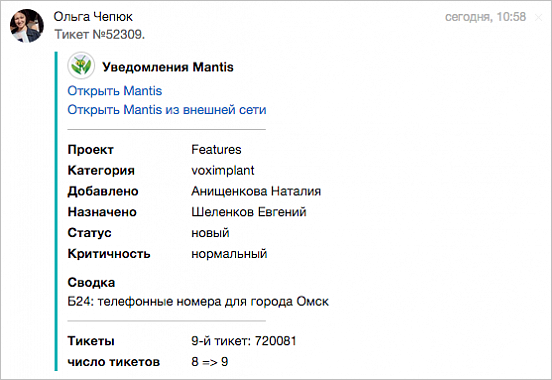
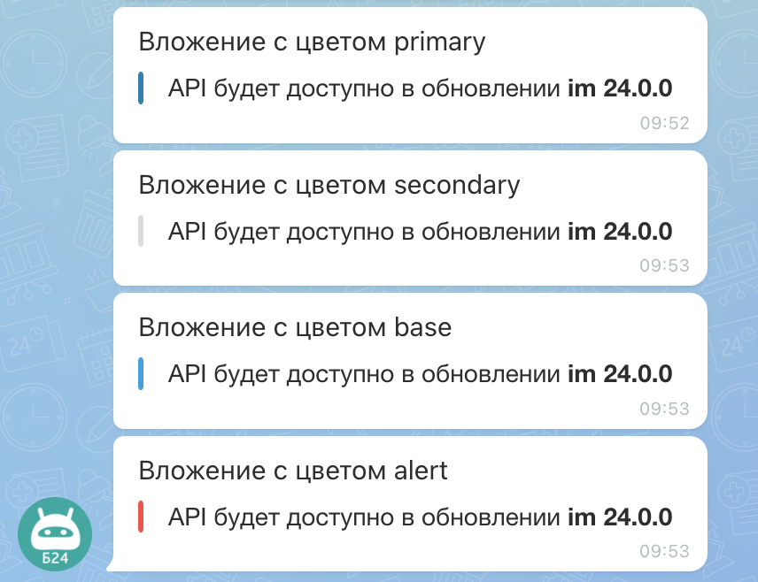
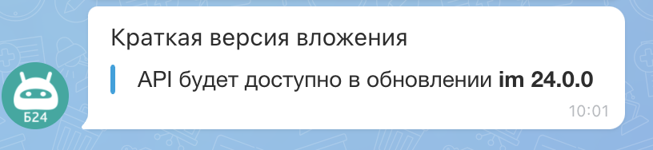

# Вложения в сообщениях ATTACH



Выберите инструмент для разработки с AI-агентом:

- используйте [Битрикс24 Вайбкод](../../../../../../ai-tools/vibecode.md), чтобы создать приложение для Битрикс24 по описанию задачи без знания языков программирования. Агент напишет код и разместит приложение на сервере без ручной настройки хостинга
- используйте [MCP-сервер](../../../../../../ai-tools/mcp.md), чтобы разрабатывать интеграцию через REST API в своем проекте. Агент будет обращаться к официальной REST-документации



Вложения `ATTACH` позволяют добавлять в сообщения структурированный контент: текстовые блоки, ссылки, изображения, файлы, разделители и таблицы. Формат вложения общий для сообщений чат-ботов `imbot.v2`, сообщений чатов `im.*` и уведомлений `im.notify*`.

Как выбрать способ оформления:

- текст с разметкой — BB-коды в тексте сообщения, синтаксис описан в статье [Форматирование текста (BB-коды)](../message-formatting.md)
- кнопки действий под сообщением — клавиатура, описана в статье [Работа с клавиатурами](../message-keyboards.md)
- карточка со свойствами, ссылками, изображениями или файлами — вложение `ATTACH`

{width=520}

> Быстрый переход: [все методы](#all-methods)

## Как собрать вложение {#how-to-start}

1. Выберите [форму объекта](#formats): полную или краткую.
2. Соберите массив блоков. Каждый элемент — объект с одним ключом верхнего уровня. Ключ задает тип блока и пишется в верхнем регистре — `message` вместо `MESSAGE` не распознается: [MESSAGE](./block-collections/text.md), [LINK](./block-collections/links.md), [USER](./block-collections/user.md), [GRID](./block-collections/grid.md), [IMAGE](./block-collections/images.md), [FILE](./block-collections/files.md), [DELIMITER](./block-collections/delimiter.md). Как выбрать и сочетать блоки — на странице [Коллекция блоков ATTACH](./block-collections/index.md).
3. Передайте объект в метод отправки. В методах `imbot.v2` (scope `imbot`) это параметр `fields.attach` — например, в [imbot.v2.Chat.Message.send](../chat-message-send.md). В методах `im.*` и `im.notify*` (scope `im`) это параметр `ATTACH` верхнего уровня, структура объекта та же.
4. Чтобы изменить уже отправленное вложение, вызовите [imbot.v2.Chat.Message.update](../chat-message-update.md) с новым значением `fields.attach` в полной форме, с массивом `BLOCKS`. Краткую форму этот метод не принимает: вложение удаляется, а метод возвращает `true`. Чтобы удалить вложение, передайте пустую строку.

Готовые карточки из нескольких блоков — в статье [Конструктор вложений ATTACH](./constructor.md).

## Форматы объекта ATTACH {#formats}

Вложение передается в полной форме — объектом с цветом и массивом `BLOCKS` — или в краткой — сразу массивом блоков.

### Полная форма ATTACH

```json
{
    "COLOR_TOKEN": "secondary",
    "BLOCKS": [
        {"MESSAGE": "..."},
        {"GRID": [...]}
    ]
}
```

### Параметры полной формы {#full-form-fields}

#|
|| **Название**
`тип` | **Описание** ||
|| **ID**
[`integer`](../../../../../data-types.md) | Передавать не нужно: значение игнорируется, идентификатор вложения назначается автоматически ||
|| **COLOR_TOKEN**
[`string`](../../../../../data-types.md) | Цветовая схема вложения. Допустимые значения: `primary`, `secondary`, `alert`, `base`. По умолчанию и при недопустимом значении — `base` ||
|| **COLOR**
[`string`](../../../../../data-types.md) | HEX-цвет полосы вложения (`#RGB` или `#RRGGBB`). Учитывается только устаревшим веб-интерфейсом, актуальные клиенты используют `COLOR_TOKEN`. Если не задан или некорректен, подставляется случайный цвет ||
|| **DESCRIPTION**
[`string`](../../../../../data-types.md) | Текст, который выводится вместо вложения там, где блоки не показываются: в списке чатов, push-уведомлениях и письмах. Если не задан, выводится подпись «Вложение» ||
|| **BLOCKS**
[`array`](../../../../../data-types.md) | Массив блоков содержимого вложения. Типы блоков описаны на странице [Коллекция блоков ATTACH](./block-collections/index.md) ||
|#

{width=520}

### Пример полной формы





- cURL (Webhook)

    ```bash
    curl -X POST \
      -H "Content-Type: application/json" \
      -H "Accept: application/json" \
      -d '{"botId":456,"botToken":"my_bot_token","dialogId":"chat20921","fields":{"message":"Вложение с цветом primary","attach":{"COLOR_TOKEN":"primary","BLOCKS":[{"MESSAGE":"API будет доступно в обновлении [B]im 24.0.0[/B]"}]}}}' \
      https://**put_your_bitrix24_address**/rest/**put_your_user_id_here**/**put_your_webhook_here**/imbot.v2.Chat.Message.send
    ```

- cURL (OAuth)

    ```bash
    curl -X POST \
      -H "Content-Type: application/json" \
      -H "Accept: application/json" \
      -d '{"botId":456,"dialogId":"chat20921","fields":{"message":"Вложение с цветом primary","attach":{"COLOR_TOKEN":"primary","BLOCKS":[{"MESSAGE":"API будет доступно в обновлении [B]im 24.0.0[/B]"}]}},"auth":"**put_access_token_here**"}' \
      https://**put_your_bitrix24_address**/rest/imbot.v2.Chat.Message.send
    ```

- JS

    ```js
    try {
      const response = await $b24.callMethod('imbot.v2.Chat.Message.send', {
        botId: 456,
        dialogId: 'chat20921',
        fields: {
          message: 'Вложение с цветом primary',
          attach: {
            COLOR_TOKEN: 'primary',
            BLOCKS: [
              {
                MESSAGE: 'API будет доступно в обновлении [B]im 24.0.0[/B]'
              }
            ]
          }
        }
      });

      const result = response.getData().result.id;
      console.log('Created message ID:', result);
    } catch (error) {
      console.error(error);
    }
    ```

- Python

    ```python
    from b24pysdk.errors import BitrixAPIError, BitrixSDKException

    try:
        bitrix_response = client.imbot.v2.chat.message.send(
            bot_id=456,
            dialog_id="chat20921",
            fields={
                "message": "Вложение с цветом primary",
                "attach": {
                    "COLOR_TOKEN": "primary",
                    "BLOCKS": [
                        {
                            "MESSAGE": "API будет доступно в обновлении [B]im 24.0.0[/B]",
                        },
                    ],
                },
            },
        ).response
        result = bitrix_response.result["id"]
        print(result)
    except BitrixAPIError as error:
        print(
            "Ошибка Bitrix API",
            f"error: {error.error}",
            f"error_description: {error.error_description}",
            sep="\n",
        )
    except BitrixSDKException as error:
        print(f"Ошибка Bitrix SDK: {error.message}")
    except Exception as error:
        print(f"Непредвиденная ошибка: {error}")
    ```

- PHP

    ```php
    try {
        $response = $b24Service
            ->core
            ->call(
                'imbot.v2.Chat.Message.send',
                [
                    'botId' => 456,
                    'dialogId' => 'chat20921',
                    'fields' => [
                        'message' => 'Вложение с цветом primary',
                        'attach' => [
                            'COLOR_TOKEN' => 'primary',
                            'BLOCKS' => [
                                [
                                    'MESSAGE' => 'API будет доступно в обновлении [B]im 24.0.0[/B]'
                                ]
                            ]
                        ]
                    ]
                ]
            );

        $result = $response->getResponseData()->getResult()['id'];
        echo 'Created message ID: ' . $result;
    } catch (Throwable $e) {
        error_log($e->getMessage());
        echo 'Error: ' . $e->getMessage();
    }
    ```

- BX24.js

    ```js
    BX24.callMethod(
        'imbot.v2.Chat.Message.send',
        {
            botId: 456,
            dialogId: 'chat20921',
            fields: {
                message: 'Вложение с цветом primary',
                attach: {
                    COLOR_TOKEN: 'primary',
                    BLOCKS: [
                        {
                            MESSAGE: 'API будет доступно в обновлении [B]im 24.0.0[/B]'
                        }
                    ]
                }
            }
        },
        function(result) {
            if (result.error()) {
                console.error(result.error().ex);
            } else {
                console.log('Message ID:', result.data().id);
            }
        }
    );
    ```

- PHP CRest

    ```php
    require_once('crest.php');

    $result = CRest::call(
        'imbot.v2.Chat.Message.send',
        [
            'botId' => 456,
            'dialogId' => 'chat20921',
            'fields' => [
                'message' => 'Вложение с цветом primary',
                'attach' => [
                    'COLOR_TOKEN' => 'primary',
                    'BLOCKS' => [
                        [
                            'MESSAGE' => 'API будет доступно в обновлении [B]im 24.0.0[/B]'
                        ]
                    ]
                ]
            ]
        ]
    );

    if (!empty($result['error'])) {
        echo 'Error: ' . $result['error_description'];
    } else {
        echo 'Message ID: ' . $result['result']['id'];
    }
    ```



### Краткая форма ATTACH

Если не нужны параметры вложения (`COLOR_TOKEN`, `DESCRIPTION`), можно передать сразу массив блоков. Вызов метода такой же, как в примере полной формы, меняется только значение `attach`. Краткую форму принимают методы отправки и `im.message.update`, но не `imbot.v2.Chat.Message.update`:

```json
[
    {"MESSAGE": "..."},
    {"GRID": [...]}
]
```

{width=520}

## Что возвращается в ответе {#response}

Методы отправки `imbot.v2` возвращают `id` созданного сообщения — структуру вложения в ответе они не повторяют.

Чтобы увидеть отправленное вложение, прочитайте сообщение методом [imbot.v2.Chat.Message.get](../chat-message-get.md) или получите его в событии [ONIMBOTV2MESSAGEADD](../../events/events.md#onimbotv2messageadd). Вложение приходит в поле `params` объекта Message вместе с клавиатурой и файлами — [Объекты и поля](../../../entities.md#message).

## Ограничения и ошибки {#limits}

#|
|| **Ограничение** | **Значение** ||
|| Максимальный размер сериализованного `ATTACH` | Меньше 60 000 символов ||
|| Допустимые ссылки в блоках | Абсолютные URL `http://` и `https://` или относительные пути от корня Битрикс24, например `/company/personal/user/1/`. Элементы `LINK`, `IMAGE` и `FILE` с другой ссылкой пропускаются без ошибки, в `USER` и `GRID` отбрасывается только поле ||
|| Внешние каналы | Блоки `ATTACH` не передаются в XMPP, email и push-уведомления. В email и push вместо вложения выводится `DESCRIPTION` или подпись «Вложение» ||
|#

Некорректные блоки и элементы отбрасываются без ошибки. Ошибка возникает, только если во вложении не осталось ни одного корректного блока или превышен лимит размера.

Коды ошибок, специфичные для вложений:

#|
|| **Код** | **Методы** | **Когда возвращается** ||
|| `PARAM_ATTACH_ERROR` | `imbot.v2.Chat.Message.send` | Во вложении нет ни одного корректного блока или превышен лимит 60 000 символов ||
|| `PARAM_ATTACH_ERROR` | `imbot.v2.Chat.Message.update` | Превышен лимит 60 000 символов, прежнее вложение сохраняется. Вложение без корректных блоков ошибки не вызывает — оно удаляется из сообщения ||
|| `ATTACH_ERROR` | `im.*`, `im.notify*` | Во вложении нет ни одного корректного блока ||
|| `ATTACH_OVERSIZE` | `im.*`, `im.notify*` | Превышен лимит 60 000 символов ||
|#

Остальные коды ошибок зависят от метода отправки — они перечислены в разделе «Возможные коды ошибок» на странице метода, например [imbot.v2.Chat.Message.send](../chat-message-send.md).

## Методы, поддерживающие ATTACH {#all-methods}

**Чат-боты 2.0 (`imbot.v2`)**, scope `imbot`, вложение в `fields.attach`

- [imbot.v2.Chat.Message.send](../chat-message-send.md) — отправить сообщение от имени чат-бота
- [imbot.v2.Chat.Message.update](../chat-message-update.md) — изменить сообщение чат-бота
- [imbot.v2.Command.answer](../../commands/command-answer.md) — отправить ответ чат-бота на команду

**Чаты (`im`)**, scope `im`, вложение в параметре `ATTACH`

- [im.message.add](../../../../../chats/messages/im-message-add.md) — отправить сообщение в чат
- [im.message.update](../../../../../chats/messages/im-message-update.md) — изменить отправленное сообщение

**Уведомления (`im.notify`)**, scope `im`, вложение в параметре `ATTACH`

- [im.notify](../../../../../chats/notifications/im-notify.md) — отправить уведомление
- [im.notify.personal.add](../../../../../chats/notifications/im-notify-personal-add.md) — отправить персональное уведомление
- [im.notify.system.add](../../../../../chats/notifications/im-notify-system-add.md) — отправить системное уведомление

## Продолжите изучение

- [Журнал изменений API imbot.v2](../../../change-log.md)
- [{#T}](./constructor.md)
- [{#T}](./block-collections/index.md)
- [Сообщения imbot.v2](../index.md)
- [{#T}](../message-keyboards.md)
- [{#T}](../message-formatting.md)
- [{#T}](../chat-message-send.md)
- [{#T}](../chat-message-update.md)
- [{#T}](../../../../../chats/notifications/im-notify.md)
