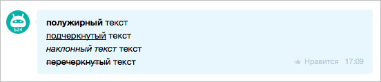
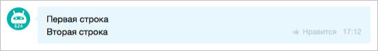
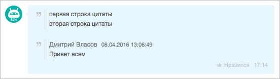
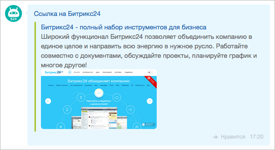
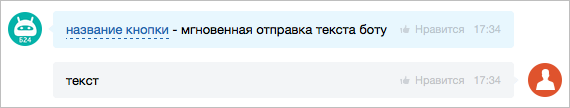

# Форматирование текста (BB-коды)

Сообщения чат-бота поддерживают BB-коды: выделение текста, цитаты, ссылки, переносы строк и управляющие теги для команд.



В данный момент платформа поддерживает только **BBCode**.  
Поддержка **Markdown** появится в будущих обновлениях.  
Сейчас **Markdown не поддерживается**.



Методы, которые поддерживают форматирование:

**Чат-боты 2.0 (`imbot.v2`)**

- [imbot.v2.Chat.Message.send](./chat-message-send.md) — отправить сообщение от имени бота
- [imbot.v2.Chat.Message.update](./chat-message-update.md) — обновить текст отправленного сообщения
- [imbot.v2.Command.answer](../commands/command-answer.md) — отправить ответ на команду

**Чаты (`im`)**

- [im.message.add](../../../../chats/messages/im-message-add.md) — отправить сообщение в чат
- [im.message.update](../../../../chats/messages/im-message-update.md) — обновить отправленное сообщение

**Уведомления (`im.notify`)**

- [im.notify](../../../../chats/notifications/im-notify.md) — отправить уведомление
- [im.notify.personal.add](../../../../chats/notifications/im-notify-personal-add.md) — отправить персональное уведомление
- [im.notify.system.add](../../../../chats/notifications/im-notify-system-add.md) — отправить системное уведомление

**Устаревшие чат-боты (`imbot`)**

- [imbot.message.add](../../../outdated/messages/imbot-message-add.md) — отправить сообщение от имени чат-бота
- [imbot.message.update](../../../outdated/messages/imbot-message-update.md) — обновить отправленное сообщение чат-бота
- [imbot.command.answer](../../../outdated/commands/imbot-command-answer.md) — отправить ответ на команду чат-бота

## Поддерживаемые BB-коды

### Форматирование текста

#|
|| **Код** | **Назначение** | **Пример** ||
|| `[b]...[/b]` | Жирный текст | `[b]жирный[/b]` ||
|| `[i]...[/i]` | Курсив | `[i]курсив[/i]` ||
|| `[u]...[/u]` | Подчеркивание | `[u]подчеркнутый[/u]` ||
|| `[s]...[/s]` | Зачеркивание | `[s]зачеркнутый[/s]` ||
|| `[size=N]...[/size]` | Размер шрифта | `[size=20]крупно[/size]` ||
|| `[color=#HEX]...[/color]` | Цвет текста | `[color=#ff0000]красный[/color]` ||
|#



Для `size` используется диапазон `8-30px`. Для `color` поддерживаются HEX-значения из 3 или 6 символов.



### Ссылки и навигация

#|
|| **Код** | **Назначение** | **Пример** ||
|| `[url]...[/url]` | Ссылка, где текст равен URL | `[url]https://example.com[/url]` ||
|| `[url=URL]...[/url]` | Ссылка с произвольным текстом | `[url=https://example.com]текст[/url]` ||
|| `[user=userId]...[/user]` | Упоминание пользователя | `[user=123]Иван[/user]` ||
|| `[user=all]...[/user]` | Упоминание всех участников чата | `[user=all]Все[/user]` ||
|| `[chat=chatId]...[/chat]` | Упоминание чата | `[chat=456]Группа[/chat]` ||
|| `[chat=imol\|ID]...[/chat]` | Упоминание открытой линии | `[chat=imol\|789]Линия[/chat]` ||
|| `[context=dialog/message]...[/context]` | Ссылка на сообщение в диалоге | `[context=chat123/456]ссылка[/context]` ||
|#

### Цитаты и код

#|
|| **Код** | **Назначение** | **Пример** ||
|| `>>текст` | Строка цитаты (в начале строки) | `>>это цитата` ||
|| `------ ... ------` | Полная цитата сообщения | `------ ... ------` ||
|| `[code]...[/code]` | Блок кода | `[code]console.log("hi")[/code]` ||
|#

### Изображения и иконки

#|
|| **Код** | **Назначение** | **Пример** ||
|| `[img size=SIZE]URL [/img]` | Вставка изображения | `[img size=medium]https://example.com/pic.jpg [/img]` ||
|| `[icon=URL ...]` | Инлайн-иконка | `[icon=https://example.com/i.png size=20 title=smile]` ||
|#



Для тега `img` параметр `size` обязателен: `small`, `medium`, `large`. После URL нужен пробел перед `[/img]`.



### Действия и звонки

#|
|| **Код** | **Назначение** | **Пример** ||
|| `[put=команда]текст[/put]` | Подставить команду в поле ввода | `[put=/help]Справка[/put]` ||
|| `[send=команда]текст[/send]` | Сразу отправить команду | `[send=/start]Старт[/send]` ||
|| `[call=номер]текст[/call]` | Ссылка на звонок | `[call=+79991234567]Позвонить[/call]` ||
|| `[call]номер[/call]` | Номер берется из текста | `[call]+79991234567[/call]` ||
|#

### Дата/время и файлы

#|
|| **Код** | **Назначение** | **Пример** ||
|| `[timestamp=UNIX format=FORMAT]` | Форматированная дата/время в таймзоне пользователя | `[timestamp=1645844720 format=SHORT_TIME_FORMAT]` ||
|| `[disk=ID]` | Ссылка на файл Битрикс24.Диска | `[disk=123]` ||
|#

## Служебные элементы

#|
|| **Элемент** | **Назначение** ||
|| `[br]` | Перенос строки ||
|| `\n` | Перенос строки ||
|| `4 пробела` | Табуляция ||
|#

## Примеры

### Базовое форматирование

```markdown
[b]полужирный[/b] текст
[u]подчеркнутый[/u] текст
[i]наклонный[/i] текст
[s]перечеркнутый[/s] текст
```



### Переносы и цитаты

```markdown
Первая строка[br]Вторая строка
>>первая строка цитаты
>>вторая строка цитаты
```




### Ссылки и команды

```markdown
[url=https://bitrix24.ru]Ссылка на Битрикс24[/url]
[send=/help]Показать помощь[/send]
[put=/search]Введите строку поиска[/put]
```




### Иконки

```markdown
[icon=http://files.shelenkov.com/images/unicorn.png size=30 title=Единорог]
```


## Пример отправки сообщения с форматированием





- cURL (Webhook)

  ```bash
  curl -X POST \
    -H "Content-Type: application/json" \
    -H "Accept: application/json" \
    -d '{"botId":456,"botToken":"my_bot_token","dialogId":"chat2725","fields":{"message":"[b]Важное сообщение[/b][br]Откройте [url=https://bitrix24.ru]сайт[/url][br][send=/help]Помощь[/send]"}}' \
    https://**put_your_bitrix24_address**/rest/**put_your_user_id_here**/**put_your_webhook_here**/imbot.v2.Chat.Message.send
  ```

- cURL (OAuth)

  ```bash
  curl -X POST \
    -H "Content-Type: application/json" \
    -H "Accept: application/json" \
    -d '{"botId":456,"dialogId":"chat2725","fields":{"message":"[b]Важное сообщение[/b][br]Откройте [url=https://bitrix24.ru]сайт[/url][br][send=/help]Помощь[/send]"},"auth":"**put_access_token_here**"}' \
    https://**put_your_bitrix24_address**/rest/imbot.v2.Chat.Message.send
  ```

- JS

  ```js
  try {
      const response = await $b24.callMethod('imbot.v2.Chat.Message.send', {
          botId: 456,
          dialogId: 'chat2725',
          fields: {
              message: '[b]Важное сообщение[/b][br]Откройте [url=https://bitrix24.ru]сайт[/url][br][send=/help]Помощь[/send]',
          },
      });

      const result = response.getData().result.id;
      console.log('Created message ID:', result);
  } catch (error) {
      console.error('Error:', error);
  }
  ```

- PHP

  ```php
  try {
      $response = $b24Service
          ->core
          ->call(
              'imbot.v2.Chat.Message.send',
              [
                  'botId' => 456,
                  'dialogId' => 'chat2725',
                  'fields' => [
                      'message' => '[b]Важное сообщение[/b][br]Откройте [url=https://bitrix24.ru]сайт[/url][br][send=/help]Помощь[/send]',
                  ],
              ]
          );

      $result = $response
          ->getResponseData()
          ->getResult()['id'];

      echo 'Created message ID: ' . $result;
  } catch (Throwable $e) {
      error_log($e->getMessage());
      echo 'Error: ' . $e->getMessage();
  }
  ```

- BX24.js

  ```js
  BX24.callMethod(
      'imbot.v2.Chat.Message.send',
      {
          botId: 456,
          dialogId: 'chat2725',
          fields: {
              message: '[b]Важное сообщение[/b][br]Откройте [url=https://bitrix24.ru]сайт[/url][br][send=/help]Помощь[/send]',
          },
      },
      function(result) {
          if (result.error()) {
              console.error(result.error().ex);
          } else {
              console.log('Message ID:', result.data().id);
          }
      }
  );
  ```

- PHP CRest

  ```php
  require_once('crest.php');

  $result = CRest::call(
      'imbot.v2.Chat.Message.send',
      [
          'botId' => 456,
          'dialogId' => 'chat2725',
          'fields' => [
              'message' => '[b]Важное сообщение[/b][br]Откройте [url=https://bitrix24.ru]сайт[/url][br][send=/help]Помощь[/send]',
          ],
      ]
  );

  if (!empty($result['error'])) {
      echo 'Error: ' . $result['error_description'];
  } else {
      echo 'Message ID: ' . $result['result']['id'];
  }
  ```



## Продолжите изучение

- [{#T}](./message-keyboards.md)
- [{#T}](./attachments/index.md)
- [{#T}](./chat-message-send.md)
- [{#T}](./chat-message-update.md)
