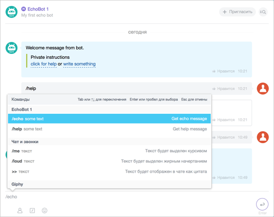

# О командах чат-ботов



Тут может не хватать некоторых данных — дополним в ближайшее время







- нужны правки под стандарт написания
- не прописаны ссылки на несозданные ещё страницы
- из файла Сергея: как выглядят, как применять





> Scope: [`imbot`](../../scopes/permissions.md)
>
> Кто может выполнять метод: любой пользователь

Команды бывают **общими** и **локальными**.

> Быстрый переход: [все методы и события](#all-methods) 



Обратите внимание! Для обработки команды нужно, чтобы в приложении была обработка события добавления команды [ONIMCOMMANDADD](./events/on-im-command-add.md).



## Общие

Работают в любом диалоге или любом чате. Пример такой команды (`COMMON = Y`):

```
/giphy картинка
```

Её вызов в любом чате сформирует ответ от чат-бота. Даже в чате, в котором чат-бот не состоит.



## Локальные

Работают только в личной переписке с чат-ботом и в групповых чатах, где он есть в участниках. Пример такой команды (`COMMON = N`):

```
/help
```

Её вызов в [ЭхоБоте](https://github.com/bitrix24com/bots) (**bot.php**) выведет список доступных команд.


## Пример «Команды и активные ссылки»

<iframe width="720" height="405" src="https://rutube.ru/play/embed/6df697f3139fdad5bfbf4953ef1f83a5/" frameBorder="0" allow="clipboard-write; autoplay" webkitAllowFullScreen mozallowfullscreen allowFullScreen></iframe>

## Обзор методов {#all-methods}



- Методы

    #|
    || **Метод** | **Описание** ||
    || [imbot.command.register](./imbot-command-register.md) | Регистрирует новую команду для чат-бота ||
    || [imbot.command.unregister](./imbot-command-unregister.md) | Удаляет зарегистрированную команду чат-бота ||
    || [imbot.command.update](./imbot-command-update.md) | Обновляет информацию о зарегистрированной команде чат-бота ||
    || [imbot.command.answer](./imbot-command-answer.md) | Публикует ответ на команду чат-бота ||
    |#

- События

    #|
    || **Событие** | **Вызывается** ||
    || [ONIMCOMMANDADD](./events/on-im-command-add.md) | При добавлении новой команды чат-ботом ||
    |#




