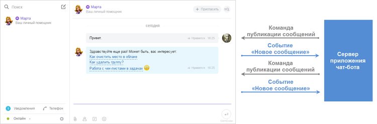

# Чат-боты Битрикс24



Тут может не хватать некоторых данных — дополним в ближайшее время







- нужны правки под стандарт написания
- не прописаны ссылки на ещё не созданные страницы
- из файла Сергея: это работает во внутреннем мессенджере, поддерживает открытые линии, вот такие полезные сценарии







Бот-платформа Битрикс24 — новый формат приложений, основанных на чатах в веб-мессенджере.



> Быстрый переход: [все методы и события](#all-methods) 

## Что такое чат-боты и что они могут делать?

Что такое чат-боты, зачем они нужны и зачем вообще заниматься их разработкой?



**Чат-бот** — это виртуальный собеседник, программа, которая создана для имитации поведения человека при общении с одним или несколькими собеседниками.



В большей степени, этот тренд формируется сейчас за рубежом — существует огромное количество ботов для Slack или Telegram, решающих самые разные задачи — от поиска авиабилетов до управления небольшими командами разработчиков. И чтобы получить все это богатство, пользователям даже не нужно выходить из предпочитаемого мессенджера.

**Что могут делать чат-боты?**

- **Замена рутины** — позволяет выполнять определенные функции, не привлекая людей, а работа будет выполнена моментально и безупречно;
- **Поиск и агрегация** новостей, аналитики, данных (Data-Driven Collaboration), данные доступны в месте принятия решений — мессенджерах и всем участникам, которым они нужны;
- **E-commerce** — для спонтанных покупок без долгого поиска, mobile ecommerce + visual search + chatbots, для общения с клиентами;
- **Первая линия** работы с клиентами, помощники, консультанты, типовые вопросы, телефония;
- **Just for Fun** — просто для развлечения.

## Бот-платформа Битрикс24

А в _Битрикс24_ чаты (как индивидуальные, так и групповые) — это часть намного более сложной экосистемы, один из основных каналов коммуникации пользователей, полностью интегрированный с другими бизнес-инструментами. И в этом контексте использование чат-ботов открывает значительно более интересные перспективы для бизнес-пользователей, поскольку _Битрикс24_ (в браузере, десктоп- и мобильном приложениях) уже сейчас — основное рабочее место для большого количества компаний.

Очень просто написать чат-бота, который, например, будет сообщать в чат нужным пользователям срочную информацию о показателях внутренней учетной системы, интегрированной с _Битрикс24_. Можно написать чат-бота, который будет помогать курьерам удобно обрабатывать заказы на основании сделок _CRM Битрикс24_ на мобильном устройстве прямо в мессенджере — и не придется писать для них отдельное мобильное приложение.

Разработка чат-бота в _Битрикс24_ — это очень перспективный вариант быстрой и удобной автоматизации специфических бизнес-процессов. Удобной, поскольку, как мы уже выяснили, получение информации и управление через мессенджер — это то, что сейчас предпочитает массовый пользователь. А быстрой — потому что разработка чат-бота для _Битрикс24_ это довольно простой процесс.



Для более четкого понимания, что могут делать чат-боты на платформе _Битрикс24_, можно посмотреть видео-примеры возможностей уже готовых чат-ботов [ниже](#opportunities).





Существует ограничение на создание чат-ботов в рамках rest-приложений: не более 5 на одно приложение.

 

## Возможности чат-бота {#opportunities}

Чат-бот:

- это специальный пользователь в системе, с которым можно коммуницировать в чате, но под ним никто не может авторизоваться;
- поддерживает обработку slash-команд;
- позволяет использовать свои клавиатуры для ответов, превратив простой чат в терминал.

### Slash-команды

Slash-команды позволяют быстро создавать запросы для вывода или получения какой-либо информации, форматировать сообщения.



Подробнее о работе с командами можно прочитать [здесь](./commands/index.md).



### Клавиатуры

Возможности [клавиатур](*keyboard) довольно широкие.

1. **EchoBot**

    Постраничная навигация, кнопки при вызове команды «Помощь»

    <iframe width="720" height="405" src="https://rutube.ru/play/embed/6df697f3139fdad5bfbf4953ef1f83a5/" frameBorder="0" allow="clipboard-write; autoplay" webkitAllowFullScreen mozallowfullscreen allowFullScreen></iframe>

2. **Марта**
   
    Просто напишите марте «Поиграй со мной!». Клавиатура используется как игровое поле:

    <iframe width="720" height="405" src="https://rutube.ru/play/embed/282c08597e37aaf9ad9828c935400c72/" frameBorder="0" allow="clipboard-write; autoplay" webkitAllowFullScreen mozallowfullscreen allowFullScreen></iframe>

3. **Giphy**
   
    Кнопка **Еще** позволяет без повторного введения поискового слова просматривать другие картинки на эту же тему:

    



Подробнее о работе с клавиатурами можно прочитать [здесь](../chats/messages/keyboards.md).



### Чаты

Чат-боты могут общаться в чате почти как живые люди. Также они могут напоминать о различных событиях (о текущих задачах, встречах) или давать справочную информацию. Кроме того, что чат-боты могут писать в чаты, они могут еще создавать такие чаты и автоматически приглашать туда людей, например для обсуждения какой либо задачи.



Подробнее о работе с чатами можно прочитать [здесь](../chats/index.md).



### Уведомления

Уведомления от чат-бота могут быть полезны и информативны. Они могут состоять из нескольких блоков различной информации из внешних систем.



Подробнее о работе с уведомлениями можно прочитать [здесь](../chats/notifications/index.md).



## Жизненный цикл чат-бота

Чат-бот публикует свои сообщения в чат через Rest API, получает ответы и команды пользователя через [События Rest API](../events/index.md) (POST запрос).

Схема жизни чат-бота выглядит так:

## Создание своего приложения

Основное, что нам надо понимать про чат-боты — это то, что их логика обычно строится на реагировании на некие действия пользователя и системы.

И у нас есть 6 событий, которые полностью покрывают необходимый спектр реакций:

- [ONAPPINSTALL](../common/events/on-app-install.md) — событие на установку приложения с чат-ботом.
- [ONAPPUPDATE](./events/on-app-update.md) — событие на обновление приложения.
- [ONIMJOINCHAT](./chats/events/on-imbot-join-chat.md) — событие после приглашения чат-бота «к разговору», т.е. либо при вызове его пользователем в индивидуальном чате, либо при подключении его к групповому чату.
- [ONIMBOTMESSAGEADD](./messages/events/on-imbot-message-add.md) — событие после отправки сообщения от пользователя к чат-боту (в групповом чате, при явном упоминании бота).
- [ONIMCOMMANDADD](./commands/events/on-im-command-add.md) — событие после отправки команды от пользователя к чат-боту (в персональной переписке с ним, или в групповом чате (если команда глобальная, то он может не участвовать в чате)).
- [ONIMBOTDELETE](./chats/events/on-imbot-delete.md) — событие после удаления приложения. Событие вызывается параллельно с [OnAppUninstall](../common/events/on-app-uninstall.md).

Иными словами, мы должны написать обработчики указанных событий, чтобы реализовать простую логику:

1. Зарегистрировать чат-бота на портале пользователя при установке.
2. Вывести приветствие-справку от имени чат-бота в момент приглашения его в чат.
3. Научиться анализировать текст сообщения от пользователя и что-то отправлять в ответ, причем под анализом подразумевается простой «разбор командной строки», а не лексический разбор естественного языка.

И для этого у нас есть набор простых методов, добавленных в REST API. Нам для старта потребуются только два:

- [imbot.register](./imbot-register.md) – регистрация чат-бота.
- [imbot.message.add](./messages/imbot-message-add.md) – отправка сообщения от чат-бота.

Очевидно, что в обработчике события [ONAPPINSTALL](../common/events/on-app-install.md) мы вызовем метод [imbot.register](./imbot-register.md) для того, чтобы добавить чат-бота на текущий портал, а затем в событии [ONIMJOINCHAT](./chats/events/on-imbot-join-chat.md) воспользуемся методом [imbot.message.add](./messages/imbot-message-add.md) для вывода справки о функционале чат-бота, и в обработчике [ONIMBOTMESSAGEADD](./messages/events/on-imbot-message-add.md) будем отвечать пользователю при помощи того же [imbot.message.add](./messages/imbot-message-add.md). Ничего сложного, согласитесь?

А также вам не придется реализовывать в приложении полноценный OAuth 2.0, поскольку параметры, необходимые для авторизации, приходят в обработчики в массиве **$_REQUEST**.



Полный список методов и событий **Bot API** можно посмотреть [ниже](#all-methods).



## Возможные типы чат-ботов Битрикс24

Для более четкого понимания, что могут делать чат-боты на платформе *Битрикс24*, приведем видео-примеры возможностей уже готовых чат-ботов. Типы чат-ботов приведены условно, вы можете создать чат-бота, который может сочетать 2 или 3 типа.

<iframe width="720" height="405" src="https://rutube.ru/play/embed/08ba27116ef2e6b1165341d470b4e384/" frameBorder="0" allow="clipboard-write; autoplay" webkitAllowFullScreen mozallowfullscreen allowFullScreen></iframe>

### Личный помощник

- **Марта** («1С-Битрикс») — ваш личный помощник. Она помогает искать ответы на вопросы, напоминает о встречах, с ней можно поиграть в «Крестики-нолики», и она готова просто поговорить.

### Справочная система

- **Реквизиты контрагента** («1С-Битрикс») — ищет по базе ФНС и выдает необходимую информацию.
- **Поиск24** (студия «G-Tech») — ваш личный поисковый робот. Ищет в Яндексе и выводит 5 самых точных ответов.

### Для специальных задач

- **Support Bot** («1С-Битрикс») — внутренний чат-бот для быстрого доступа к тикет-системе «Битрикс24».

### Работа с сервисами

- **OCR Bot** (First Open Systems) — распознает сканы любых документов и сохраняет их в RTF.
- **Переводчик** (PWEB) — помогает переводить тексты с одного языка на другой. Поддерживает перевод на 63 языка.
- **ЗаМКАДыш** (ИА «Инсайд») — осуществляет поиск расстояния от МКАД до необходимого адреса. Поиск расстояния рассчитывается как по прямой, так и по автодорогам.

### Работа с открытыми линиями

- **Чат-бот для Открытых линий** («1С-Битрикс») сможет выступить помощником при первом контакте с пользователем или помогать вам посреди диалога.

### Для развлечений

- **Андрейка** (PWEB) — мастер на анекдоты. Поддерживает диалог анекдотами и смешными цитатами.
- **Giphy** («1С-Битрикс») — поиск по большой библиотеке анимированных GIF-файлов, что позволяет легко найти необходимое изображение и поделиться им с коллегами.

## Смотрите также

Полный список чат-ботов для платформы *Битрикс24* можно увидеть в [одноименном разделе](https://www.bitrix24.ru/apps/?category=chat_bots) *Магазина приложений Битрикс24*.

## Обзор методов {#all-methods}



- Методы

    #|
    || **Метод** | **Описание** ||
    || [im.revision.get](./im-revision-get.md) | Возвращает информацию о ревизиях API ||
    || [imbot.register](./imbot-register.md) | Регистрирует нового чат-бота ||
    || [imbot.unregister](./imbot-unregister.md) | Удаляет зарегистрированного бота ||
    || [imbot.update](./imbot-update.md) | Обновляет данные чат-бота ||
    || [imbot.bot.list](./imbot-bot-list.md) | Возвращает список доступных чат-ботов ||
    |#

- События

    #|
    || **Событие** | **Вызывается** ||
    || [ONAPPINSTALL](./events/on-app-install.md) | При установке приложения ||
    || [ONAPPUPDATE](./events/on-app-update.md) | При обновлении приложения ||
    |#



### Чаты



- Методы

    #|
    || **Метод** | **Описание** ||
    || [imbot.chat.add](./chats/imbot-chat-add.md) | Создает новый чат ||
    || [imbot.chat.get](./chats/imbot-chat-get.md) | Возвращает информацию о чате ||
    || [imbot.chat.leave](./chats/imbot-chat-leave.md) | Выполняет выход чат-бота из указанного чата ||
    || [imbot.chat.setOwner](./chats/imbot-chat-set-owner.md) | Устанавливает нового владельца чата ||
    || [imbot.chat.updateAvatar](./chats/imbot-chat-update-avatar.md) | Обновляет аватар чата ||
    || [imbot.chat.updateColor](./chats/imbot-chat-update-color.md) | Обновляет цвет чата ||
    || [imbot.chat.updateTitle](./chats/imbot-chat-update-title.md) | Обновляет название чата ||
    || [imbot.chat.user.add](./chats/imbot-chat-user-add.md) | Добавляет пользователя в чат ||
    || [imbot.chat.user.list](./chats/imbot-chat-user-list.md) | Возвращает список пользователей в чате ||
    || [imbot.chat.user.delete](./chats/imbot-chat-user-delete.md) | Удаляет пользователя из чата ||
    || [imbot.dialog.get](./chats/imbot-dialog-get.md) | Возвращает информацию о диалоге ||
    |#

- События

    #|
    || **Событие** | **Вызывается** ||
    || [ONIMBOTDELETE](./chats/events/on-imbot-delete.md) | При удалении чат-бота ||
    || [ONIMBOTJOINCHAT](./chats/events/on-imbot-join-chat.md) | При получении информации чат-ботом о включении его в чат (или личную переписку) ||
    |#



### Команды



- Методы

    #|
    || **Метод** | **Описание** ||
    || [imbot.command.register](./commands/imbot-command-register.md) | Регистрирует новую команду для чат-бота ||
    || [imbot.command.unregister](./commands/imbot-command-unregister.md) | Удаляет зарегистрированную команду чат-бота ||
    || [imbot.command.update](./commands/imbot-command-update.md) | Обновляет информацию о зарегистрированной команде чат-бота ||
    || [imbot.command.answer](./commands/imbot-command-answer.md) | Отправляет ответ на команду чат-бота ||
    |#

- События

    #|
    || **Событие** | **Вызывается** ||
    || [ONIMCOMMANDADD](./commands/events/on-im-command-add.md) | При добавлении новой команды чат-ботом ||
    |#



### Сообщения



- Методы

    #|
    || **Метод** | **Описание** ||
    || [imbot.message.add](./messages/imbot-message-add.md) | Добавляет новое сообщение от чат-бота ||
    || [imbot.message.update](./messages/imbot-message-update.md) | Обновляет существующее сообщение от чат-бота ||
    || [imbot.message.delete](./messages/imbot-message-delete.md) | Удаляет сообщение от чат-бота ||
    || [imbot.message.like](./messages/imbot-message-like.md) | Ставит "лайк" на сообщение от чат-бота ||
    || [imbot.chat.sendTyping](./messages/imbot-chat-send-typing.md) | Отправляет индикатор набора текста в чат ||
    |#

- События

    #|
    || **Событие** | **Вызывается** ||
    || [ONIMBOTMESSAGEADD](./messages/events/on-imbot-message-add.md) | При отправке сообщения||
    || [ONIMBOTMESSAGEUPDATE](./messages/events/on-imbot-message-update.md) | При обновлении сообщения чат-бота ||
    || [ONIMBOTMESSAGEDELETE](./messages/events/on-imbot-message-delete.md) | При удалении сообщения чат-бота ||
    |#



[*keyboard]: [Клавиатура](../chats/messages/keyboards.md) — это набор кнопок, каждая кнопка может состоять из определённых ключей.