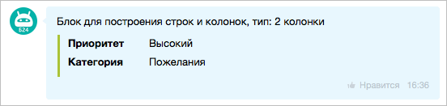

# О коллекции блоков



Тут может не хватать некоторых данных — дополним в ближайшее время



Ниже показаны все виды блоков.

## [Блок пользователя (USER)](./user.md)

## [Блок со ссылками (LINK)](./links.md)

## [Блок с текстом (MESSAGE)](./text.md)

## [Блок c разделителем (DELIMITER)](./delimiter.md)

## [Блок для построения строк и колонок (GRID)](./grid.md)

1. [Блочное построение (BLOCK)](./grid.md#блочное-представление)

    

2. [Строчное построение (LINE)](./grid.md#строчное-представление)

    

    В мобильной версии блоки находятся друг под другом:

    

3. [Построение в виде двух колонок (COLUMN)](./grid.md#представление-в-виде-двух-колонок)

    

## [Блок c изображениями (IMAGE)](./images.md)

## [Блок с файлами (FILE)](./files.md)

