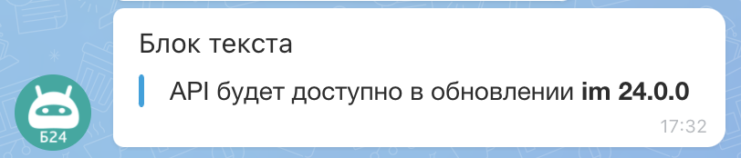

# Блок с текстом MESSAGE



Тут может не хватать некоторых данных — дополним в ближайшее время







- нужны правки под стандарт написания







`MESSAGE` - вывод простого текста без форматирования.

## Пример



- JS

    ```js
    {
        MESSAGE: "API будет доступно в обновлении im 24.0.0"
    },
    ```

- PHP

    ```php
    Array(
        "MESSAGE" => "API будет доступно в обновлении im 24.0.0"
    ),
    ```





В тексте доступны bb-коды: `USER`, `CHAT`, `SEND`, `PUT`, `CALL`, `BR`, `B`, `U`, `I`, `S`, `URL`.