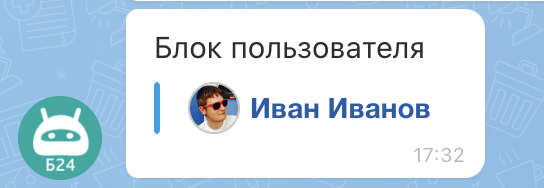

# Блок пользователя USER



Тут может не хватать некоторых данных — дополним в ближайшее время







- нужны правки под стандарт написания







`USER` - вывод блока с аватаром и именем пользователя.

Поля **AVATAR** (аватар) и **LINK** (ссылка) не являются обязательными.

## Пример



- JS

    ```js
    {
        USER: {
            NAME: "Иван Иванов",
            AVATAR: "https://files.shelenkov.com/bitrix/images/avatar.png",
            LINK: "https://shelenkov.com"
        }
    },
    ```

- PHP

    ```php
    Array(
        "USER" => Array(
            "NAME" => "Иван Иванов",
            "AVATAR" => "https://files.shelenkov.com/bitrix/images/avatar.png",
            "LINK" => "https://shelenkov.com/",
        )
    ),
    ```





Вместо ключа **LINK** можно использовать и ссылки на сущности:
- `CHAT_ID` - для указания ссылки на чат;
- `BOT_ID` - для указания ссылки на бота;
- `USER_ID` - для указания ссылки на пользователя.