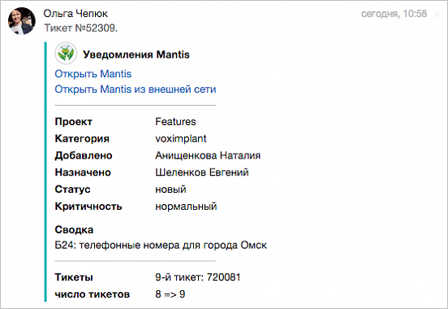
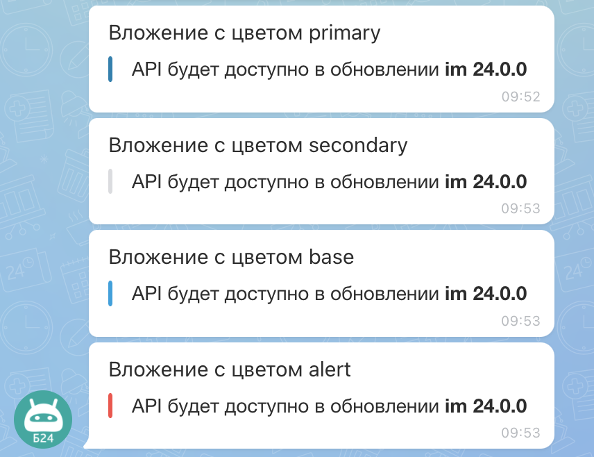

# Вложения в сообщениях ATTACH

Вложения `ATTACH` позволяют добавлять в сообщения структурированный контент: текстовые блоки, ссылки, изображения, файлы, разделители и таблицы.



Методы, которые поддерживают работу с `ATTACH`:

- [im.message.add](../im-message-add.md) — отправить сообщение в чат
- [im.message.update](../im-message-update.md) — изменить отправленное сообщение
- [im.notify](../../notifications/im-notify.md) — отправить уведомление
- [im.notify.personal.add](../../notifications/im-notify-personal-add.md) — отправить персональное уведомление
- [im.notify.system.add](../../notifications/im-notify-system-add.md) — отправить системное уведомление
- [imbot.message.add](../../../chat-bots/messages/imbot-message-add.md) — отправить сообщение от имени чат-бота
- [imbot.message.update](../../../chat-bots/messages/imbot-message-update.md) — изменить сообщение чат-бота
- [imbot.command.answer](../../../chat-bots/commands/imbot-command-answer.md) — отправить ответ чат-бота на команду

## Форматы объекта ATTACH

Вы можете передать `ATTACH` в одном из двух форматов:

1. Полная форма: объект с метаданными вложения и массивом `BLOCKS`
2. Краткая форма: массив блоков без обертки

### Полная форма ATTACH



- JS

    ```js
    ATTACH: {
        ID: 1,
        COLOR_TOKEN: 'secondary',
        COLOR: '#29619b',
        BLOCKS: [
            {...},
            {...}
        ]
    }
    ```

- PHP

    ```php
    'ATTACH' => [
        'ID' => 1,
        'COLOR_TOKEN' => 'secondary',
        'COLOR' => '#29619b',
        'BLOCKS' => [
            [...],
            [...]
        ]
    ]
    ```



### Поля полной формы

#|
|| **Поле**
`тип` | **Описание** ||
|| **ID**
[`integer`](../../../data-types.md) | Идентификатор вложения внутри сообщения ||
|| **COLOR_TOKEN**
[`string`](../../../data-types.md) | Цветовая схема вложения. Допустимые значения: `primary`, `secondary`, `alert`, `base`. По умолчанию: `base` ||
|| **COLOR**
[`string`](../../../data-types.md) | Явный HEX-цвет вложения. Используется для совместимости со старыми сценариями и в некоторых типах уведомлений ||
|| **BLOCKS**
[`array`](../../../data-types.md) | Массив блоков содержимого вложения. Типы блоков описаны в разделе [Коллекции блоков](./block-collections/index.md) ||
|#



### Пример полной формы





- cURL (Webhook)

    ```bash
    curl -X POST \
      -H "Content-Type: application/json" \
      -H "Accept: application/json" \
      -d '{"DIALOG_ID":"chat20921","MESSAGE":"Вложение с цветом primary","ATTACH":{"ID":1,"COLOR_TOKEN":"primary","COLOR":"#29619b","BLOCKS":[{"MESSAGE":"API будет доступно в обновлении [B]im 24.0.0[/B]"}]}}' \
      https://**put_your_bitrix24_address**/rest/**put_your_user_id_here**/**put_your_webhook_here**/im.message.add
    ```

- cURL (OAuth)

    ```bash
    curl -X POST \
      -H "Content-Type: application/json" \
      -H "Accept: application/json" \
      -d '{"DIALOG_ID":"chat20921","MESSAGE":"Вложение с цветом primary","ATTACH":{"ID":1,"COLOR_TOKEN":"primary","COLOR":"#29619b","BLOCKS":[{"MESSAGE":"API будет доступно в обновлении [B]im 24.0.0[/B]"}]},"auth":"**put_access_token_here**"}' \
      https://**put_your_bitrix24_address**/rest/im.message.add
    ```

- JS

    ```js
    try {
      const response = await $b24.callMethod('im.message.add', {
        DIALOG_ID: 'chat20921',
        MESSAGE: 'Вложение с цветом primary',
        ATTACH: {
          ID: 1,
          COLOR_TOKEN: 'primary',
          COLOR: '#29619b',
          BLOCKS: [
            {
              MESSAGE: 'API будет доступно в обновлении [B]im 24.0.0[/B]'
            }
          ]
        }
      });

      const { result } = response.getData();
      console.log(result);
    } catch (error) {
      console.error(error);
    }
    ```

- PHP

    ```php
    try {
        $response = $b24Service
            ->core
            ->call(
                'im.message.add',
                [
                    'DIALOG_ID' => 'chat20921',
                    'MESSAGE' => 'Вложение с цветом primary',
                    'ATTACH' => [
                        'ID' => 1,
                        'COLOR_TOKEN' => 'primary',
                        'COLOR' => '#29619b',
                        'BLOCKS' => [
                            [
                                'MESSAGE' => 'API будет доступно в обновлении [B]im 24.0.0[/B]'
                            ]
                        ]
                    ]
                ]
            );

        $result = $response
            ->getResponseData()
            ->getResult();

        print_r($result);
    } catch (Throwable $e) {
        error_log($e->getMessage());
    }
    ```

- BX24.js

    ```js
    BX24.callMethod(
        'im.message.add',
        {
            DIALOG_ID: 'chat20921',
            MESSAGE: 'Вложение с цветом primary',
            ATTACH: {
                ID: 1,
                COLOR_TOKEN: 'primary',
                COLOR: '#29619b',
                BLOCKS: [
                    {
                        MESSAGE: 'API будет доступно в обновлении [B]im 24.0.0[/B]'
                    }
                ]
            }
        },
        function(result) {
            if (result.error()) {
                console.error(result.error().ex);
            } else {
                console.log(result.data());
            }
        }
    );
    ```

- PHP CRest

    ```php
    require_once('crest.php');

    $result = CRest::call(
        'im.message.add',
        [
            'DIALOG_ID' => 'chat20921',
            'MESSAGE' => 'Вложение с цветом primary',
            'ATTACH' => [
                'ID' => 1,
                'COLOR_TOKEN' => 'primary',
                'COLOR' => '#29619b',
                'BLOCKS' => [
                    [
                        'MESSAGE' => 'API будет доступно в обновлении [B]im 24.0.0[/B]'
                    ]
                ]
            ]
        ]
    );

    print_r($result);
    ```



### Краткая форма ATTACH

Если не нужны метаданные вложения (`ID`, `COLOR_TOKEN`, `COLOR`), можно передать сразу массив блоков:



- JS

    ```js
    ATTACH: [
        {...},
        {...}
    ]
    ```

- PHP

    ```php
    'ATTACH' => [
        [...],
        [...]
    ]
    ```




### Пример краткой формы





- cURL (Webhook)

    ```bash
    curl -X POST \
      -H "Content-Type: application/json" \
      -H "Accept: application/json" \
      -d '{"DIALOG_ID":"chat20921","MESSAGE":"Блок текста","ATTACH":[{"MESSAGE":"API будет доступно в обновлении [B]im 24.0.0[/B]"}]}' \
      https://**put_your_bitrix24_address**/rest/**put_your_user_id_here**/**put_your_webhook_here**/im.message.add
    ```

- cURL (OAuth)

    ```bash
    curl -X POST \
      -H "Content-Type: application/json" \
      -H "Accept: application/json" \
      -d '{"DIALOG_ID":"chat20921","MESSAGE":"Блок текста","ATTACH":[{"MESSAGE":"API будет доступно в обновлении [B]im 24.0.0[/B]"}],"auth":"**put_access_token_here**"}' \
      https://**put_your_bitrix24_address**/rest/im.message.add
    ```

- JS

    ```js
    try {
      const response = await $b24.callMethod('im.message.add', {
        DIALOG_ID: 'chat20921',
        MESSAGE: 'Блок текста',
        ATTACH: [
          {
            MESSAGE: 'API будет доступно в обновлении [B]im 24.0.0[/B]'
          }
        ]
      });

      const { result } = response.getData();
      console.log(result);
    } catch (error) {
      console.error(error);
    }
    ```

- PHP

    ```php
    try {
        $response = $b24Service
            ->core
            ->call(
                'im.message.add',
                [
                    'DIALOG_ID' => 'chat20921',
                    'MESSAGE' => 'Блок текста',
                    'ATTACH' => [
                        [
                            'MESSAGE' => 'API будет доступно в обновлении [B]im 24.0.0[/B]'
                        ]
                    ]
                ]
            );

        $result = $response
            ->getResponseData()
            ->getResult();

        print_r($result);
    } catch (Throwable $e) {
        error_log($e->getMessage());
    }
    ```

- BX24.js

    ```js
    BX24.callMethod(
        'im.message.add',
        {
            DIALOG_ID: 'chat20921',
            MESSAGE: 'Блок текста',
            ATTACH: [
                {
                    MESSAGE: 'API будет доступно в обновлении [B]im 24.0.0[/B]'
                }
            ]
        },
        function(result) {
            if (result.error()) {
                console.error(result.error().ex);
            } else {
                console.log(result.data());
            }
        }
    );
    ```

- PHP CRest

    ```php
    require_once('crest.php');

    $result = CRest::call(
        'im.message.add',
        [
            'DIALOG_ID' => 'chat20921',
            'MESSAGE' => 'Блок текста',
            'ATTACH' => [
                [
                    'MESSAGE' => 'API будет доступно в обновлении [B]im 24.0.0[/B]'
                ]
            ]
        ]
    );

    print_r($result);
    ```



## Ограничения и ошибки

- Максимальный размер сериализованного `ATTACH`: `60000` символов
- При некорректной структуре возвращается ошибка `ATTACH_ERROR`
- При превышении лимита возвращается ошибка `ATTACH_OVERSIZE`

## Валидация ссылок

В блоках вложения поддерживаются:

- абсолютные URL: `http://` и `https://`
- относительные URL от корня Битрикс: `/company/personal/user/1/`



Содержимое `ATTACH` не транслируется автоматически в XMPP, email и push-уведомления.



## Продолжите изучение

- [{#T}](./constructor.md)
- [{#T}](./block-collections/index.md)
- [{#T}](../im-message-add.md)
- [{#T}](../im-message-update.md)
- [{#T}](../../notifications/im-notify.md)
