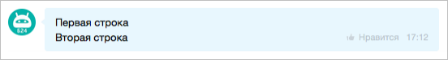
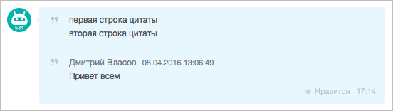
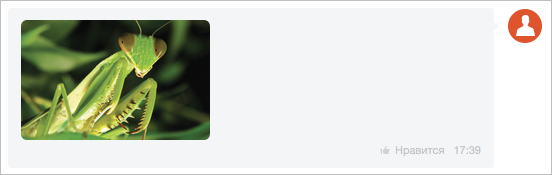
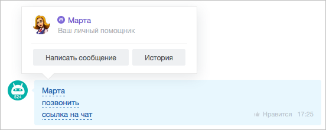

# Форматирование



Тут может не хватать некоторых данных — дополним в ближайшее время







- нужны правки под стандарт написания





Сообщение можно форматировать, добавлять полужирный шрифт, перечеркивать и вставлять цитаты. В уроке приводятся команды пользователя, внешний вид и REST API для форматирования сообщений чата.

> Быстрый переход: [все методы](#all-methods) 

## Коды форматирования

Если в чат отправить данное сообщение:

```markdown
[B]полужирный[/B] текст
[U]подчеркнутый[/U] текст
[I]наклонный[/I] текст
[S]перечеркнутый[/S] текст
```

То оно отобразится таким образом:


Форматирование с помощью rest-api:



```php
restCommand(
    'imbot.message.add',
    Array(
        "DIALOG_ID" => $_REQUEST['data']['PARAMS']['DIALOG_ID'],
        "MESSAGE" => "полужирный текст
            подчеркнутый текст
            наклонный текст текст
            перечеркнутый текст",
    ),
    $_REQUEST["auth"]
);
```

## Перенос строки

Перенос строки осуществляется добавлением в текст символов:

```markdown
[BR]
\# BR \# (без пробелов)
\n
```

Любой из этих кодов, сформирует перенос строки:



Перенос строки с помощью rest-api:

```php
restCommand(
    'imbot.message.add',
    Array(
        "DIALOG_ID" => $_REQUEST['data']['PARAMS']['DIALOG_ID'],
        "MESSAGE" => "Первая строка
            Вторая строка",
    ),
    $_REQUEST["auth"]
);
```

## Цитирование

Цитирование текста можно сделать двумя способами:

```markdown
>>первая строка цитаты
>>вторая строка цитаты
------------------------------------------------------
Дмитрий Власов08.04.2016 13:06:49
Привет всем
------------------------------------------------------
```

Вид цитирования будет немного отличаться - во втором случае будет указан автор и время написания цитаты:



Цитирование с помощью rest-api:

```php
restCommand(
    'imbot.message.add',
    Array(
        "DIALOG_ID" => $_REQUEST['data']['PARAMS']['DIALOG_ID'],
        "MESSAGE" => ">>первая строка цитаты
            >>вторая строка цитаты
            ------------------------------------------------------
            Дмитрий Власов08.04.2016 13:06:49
            Привет всем
            ------------------------------------------------------",
    ),
    $_REQUEST["auth"]
);
```

## Ссылки

Любая ссылка в тексте автоматически станет кликабельной. Если по адресу ссылки есть «богатое форматирование», то ссылка автоматически его подхватит:


Ссылки с помощью rest-api:

```php
restCommand(
    'imbot.message.add',
    Array(
        "DIALOG_ID" => $_REQUEST['data']['PARAMS']['DIALOG_ID'],
        "MESSAGE" => "http://bitrix24.ru",
    ),
    $_REQUEST["auth"]
);
```


«Богатое форматирование» можно отключить, передав ключ `'URL_PREVIEW' => 'N'` при создании сообщения:

```php
restCommand(
    'imbot.message.add',
    Array(
        "DIALOG_ID" => $_REQUEST['data']['PARAMS']['DIALOG_ID'],
        "MESSAGE" => "http://bitrix24.ru",
        "URL_PREVIEW" => "N"
    ),
    $_REQUEST["auth"]
);
```



Если вы отправите ссылку на картинку `https://files.shelenkov.com/bitrix/images/mantis.jpg` (окончание ссылки должно быть .png, .jpg, .gif), то она автоматически преобразуется в изображение:



Вы можете сформировать ссылку самостоятельно через код **URL** - `[URL=http://bitrix24.ru]Ссылка на Битрикс24[/URL]`:


Формирование ссылки с помощью rest-api:
```php
restCommand(
    'imbot.message.add',
    Array(
        "DIALOG_ID" => $_REQUEST['data']['PARAMS']['DIALOG_ID'],
        "MESSAGE" => "[URL=http://bitrix24.ru]Ссылка на Битрикс24[/URL]",
    ),
    $_REQUEST["auth"]
);
```

По аналогии с кодом **URL**, есть специальные коды на ссылки внутри мессенджера.

- `[USER=5]Марта[/USER]` - ссылка на пользователя.
- `[CALL=84012334455]позвонить[/CALL]` - кнопка для осуществления звонка через *Битрикс24*.
- `[CHAT=12]ссылка на чат[/CHAT]` - ссылка на чат.



Форматирование специальных кодов с помощью rest-api:

```php
restCommand(
    'imbot.message.add',
    Array(
        "DIALOG_ID" => $_REQUEST['data']['PARAMS']['DIALOG_ID'],
        "MESSAGE" => "[USER=5]Марта[/USER]
            [CALL=84012334455]позвонить[/CALL]
            [CHAT=12]ссылка на чат[/CHAT]",
    ),
    $_REQUEST["auth"]
);
```

## Отступы

Чтобы сделать отступы в сообщении, укажите символ табуляции:

[send=текст]название кнопки[/send] - мгновенная отправка текста боту.

Отступы с помощью rest-api:
```php
restCommand(
    'imbot.message.add',
    Array(
        "DIALOG_ID" => $_REQUEST['data']['PARAMS']['DIALOG_ID'],
        "MESSAGE" => "
            Отступ
                Отступ
                    Отступ",
    ),
    $_REQUEST["auth"]
);
```

## Активные ссылки (команды)

Если вы хотите, чтобы по клику на ссылку пользователь отправил какой-то текст, используйте тег **SEND**:
```markdown
[send=текст]название кнопки[/send] - мгновенная отправка текста боту.
```

С помощью такого тега, вы сможете заставить пользователя отправить команду вашего бота, но существует более предпочтительный способ - [Набираемые клавиатуры](.)


Активные ссылки (команды) с помощью rest-api:

```php
restCommand(
    'imbot.message.add',
    Array(
        "DIALOG_ID" => $_REQUEST['data']['PARAMS']['DIALOG_ID'],
        "MESSAGE" => "[send=текст]название кнопки[/send] - мгновенная отправка текста боту",
    ),
    $_REQUEST["auth"]
);
```

Если необходимо, чтобы пользователь что-то дописал к команде, используйте код **PUT**:

```markdown
[put=/search]Введите строку поиска[/put]
```

Отправка команды бота с помощью rest-api:

```php
restCommand(
    'imbot.message.add',
    Array(
        "DIALOG_ID" => $_REQUEST['data']['PARAMS']['DIALOG_ID'],
        "MESSAGE" => "Введите строку поиска",
    ),
    $_REQUEST["auth"]
);
```

## Иконки

Добавление своей иконки в сообщение производится отправкой кода:

```markdown
[icon=http://files.shelenkov.com/images/unicorn.png size=30 title=Единорог]
```

Иконка отобразится таким образом:


Также после этого иконка будет добавлена в набор смайлов Бизнес-чата. Удалить иконку из набора можно, нажав правой кнопкой мыши на иконке в наборе и выбрав **Удалить**.

Обязательным свойством является указание пути до картинки (без пробелов).

Доступны дополнительные атрибуты:
- **title** - заголовок;
- **height** - высота;
- **width** - ширина;
- **size** - высота и ширина.

Для наилучшего отображения на всех устройствах, размер иконки должен быть в два раза больше, чем указан в параметрах отображения.

Добавление своей иконки с помощью rest-api:

```php
restCommand(
    'imbot.message.add',
    Array(
        "DIALOG_ID" => $_REQUEST['data']['PARAMS']['DIALOG_ID'],
        "MESSAGE" => "[icon=http://files.shelenkov.com/images/unicorn.png size=30 title=Единорог]",
    ),
    $_REQUEST["auth"]
);
```



Как использовать вложения расширенного формата внутри сообщения подробнее читайте [здесь](./attachments/index.md).



## Обзор методов {#all-methods}

#|
|| **Метод** | **Описание** ||
|| [im.dialog.messages.get](./im-dialog-messages-get.md) | Получает список последних сообщений ||
|| [im.dialog.read](./im-dialog-read.md) | Устанавливает признак «прочитано» у сообщений ||
|| [im.dialog.unread](./im-dialog-unread.md) | Устанавливает признак «не прочитано» у сообщений ||
|| [im.dialog.writing](./im-dialog-writing.md) | Отправляет признак «вам пишут...» ||
|| [im.message.add](./im-message-add.md) | Добавляет сообщение ||
|| [im.message.command](./im-message-command.md) | Использует команду бота ||
|| [im.message.delete](./im-message-delete.md) | Удаляет сообщение чат-бота ||
|| [im.message.like](./im-message-like.md) | Изменяет статус «Мне нравится» у сообщения ||
|| [im.message.share](./im-message-share.md) | Создает объект на основании сообщения ||
|| [im.message.update](./im-message-update.md) | Изменяет отправленное сообщение ||
|#
