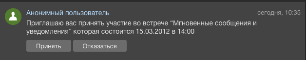

# Как взаимодействовать с кнопками нотификаций



Тут может не хватать некоторых данных — дополним в ближайшее время







- нужны правки под стандарт написания
- не указаны типы параметров
- отсутствуют примеры







**Scope**: [`im`](../../scopes/permissions.md) | **Кто может выполнять метод**: `любой пользователь`



Метод `im.notify.confirm` взаимодействует с кнопками нотификаций.

#|
|| **Параметр** | **Пример** | **Описание** | **Ревизия** ||
|| **ID^*^**
[`unknown`](../../data-types.md) | `288` | Идентификатор уведомления, поддерживающего выбор ответа посредством нажатия на кнопки | `30` ||
|| **NOTIFY_VALUE^*^**
[`unknown`](../../data-types.md) | `'Y'` | Значение выбранного ответа (значение кнопки) | `30` ||
|#



Для примера рассмотрим уведомление:



- у кнопки **Принять** значение `'Y'`
- у кнопки **Отказаться** значение `'N'`

## Примеры

```js
B24.callMethod(
    'im.notify.confirm',
    {
        ID: 288,
        NOTIFY_VALUE: 'Y'
    },
    res => {
        if (res.error())
        {
        console.error(result.error().ex);
        }
        else
        {
        console.log(res.data())
        }
    }
);
```



## Ответ в случае успеха

```json
{
    "result_message": [
        "Приглашение принято"
    ]
}
```

## Ответ в случае ошибки

```json
{
    "error":"NOTIFY_VALUE_ERROR",
    "error_description":"Notification Value can't be empty"
}
```

### Описание ключей

- `error` – код возникшей ошибки
- `error_description` – краткое описание возникшей ошибки

### Возможные коды ошибок

#|
|| **Код** | **Описание** ||
|| **ID_ERROR** | Не передан параметр `ID` или он не является числом ||
|| **NOTIFY_VALUE_ERROR** | Не указан параметр `NOTIFY_VALUE` или он пуст ||
|#