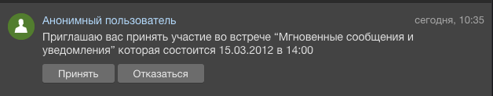

# Взаимодействовать с кнопками уведомлений im.notify.confirm



Если вы разрабатываете интеграции для Битрикс24 с помощью AI-инструментов (Codex, Claude Code, Cursor), подключите [MCP-сервер](../../../sdk/mcp.md), чтобы ассистент использовал официальную REST-документацию.



> Scope: [`im`](../../scopes/permissions.md)
>
> Кто может выполнять метод: любой пользователь

Метод `im.notify.confirm` отправляет выбранное значение кнопки уведомления.

## Параметры метода



#|
|| **Название**
`Тип` | **Описание** ||
|| **NOTIFY_ID***
[`integer`](../../data-types.md) | Идентификатор уведомления с кнопками. 

Получить идентификатор уведомления можно методом [im.notify.get](./im-notify-get.md) ||
|| **NOTIFY_VALUE***
[`string`](../../data-types.md) | Значение выбранной кнопки ||
|#

Для примера рассмотрим уведомление, которое поддерживает кнопки:
- Принять — значение `'Y'`
- Отказаться — значение `'N'`



## Примеры кода





- cURL (Webhook)

    ```bash
    curl -X POST \
      -H "Content-Type: application/json" \
      -H "Accept: application/json" \
      -d '{"NOTIFY_ID":288,"NOTIFY_VALUE":"Y"}' \
      https://**put_your_bitrix24_address**/rest/**put_your_user_id_here**/**put_your_webhook_here**/im.notify.confirm
    ```

- cURL (OAuth)

    ```bash
    curl -X POST \
      -H "Content-Type: application/json" \
      -H "Accept: application/json" \
      -d '{"NOTIFY_ID":288,"NOTIFY_VALUE":"Y","auth":"**put_access_token_here**"}' \
      https://**put_your_bitrix24_address**/rest/im.notify.confirm
    ```

- JS

    ```js
    try {
      const response = await $b24.callMethod('im.notify.confirm', {
        NOTIFY_ID: 288,
        NOTIFY_VALUE: 'Y',
      });

      const { result } = response.getData();
      console.log(result);
    } catch (error) {
      console.error(error);
    }
    ```

- PHP

    ```php
    try {
        $response = $b24Service->core->call(
            'im.notify.confirm',
            [
                'NOTIFY_ID' => 288,
                'NOTIFY_VALUE' => 'Y',
            ]
        );

        $result = $response->getResponseData()->getResult();

        if ($result->error()) {
            echo 'Error: ' . $result->error();
        } else {
            var_dump($result->data());
        }
    } catch (Throwable $exception) {
        echo $exception->getMessage();
    }
    ```

- BX24.js

    ```js
    BX24.callMethod(
        'im.notify.confirm',
        {
            NOTIFY_ID: 288,
            NOTIFY_VALUE: 'Y',
        },
        function(result) {
            if (result.error()) {
                console.error(result.error().ex);
            } else {
                console.log(result.data());
            }
        }
    );
    ```

- PHP CRest

    ```php
    require_once('crest.php');

    $result = CRest::call(
        'im.notify.confirm',
        [
            'NOTIFY_ID' => 288,
            'NOTIFY_VALUE' => 'Y',
        ]
    );

    if (!empty($result['error'])) {
        echo 'Error: ' . $result['error_description'];
    } else {
        var_dump($result['result']);
    }
    ```


## Обработка ответа

HTTP-код: **200**

```json
{
    "result": {
        "result_message": [
            "Приглашение принято"
        ]
    },
    "time": {
        "start": 1760000000.0,
        "finish": 1760000000.1,
        "duration": 0.1,
        "processing": 0.04,
        "date_start": "2026-03-02T09:30:00+03:00",
        "date_finish": "2026-03-02T09:30:00+03:00",
        "operating_reset_at": 1760030000,
        "operating": 0
    }
}
```

## Возвращаемые данные

#|
|| **Название**
`Тип` | **Описание** ||
|| **result**
[`object`](../../data-types.md) | Объект с результатом нажатия кнопки. 

Структура объекта подробно описана [ниже](#result-object) ||
|| **time**
[`time`](../../data-types.md#time) | Информация о времени выполнения запроса ||
|#

### Объект result {#result-object}

#|
|| **Название**
`Тип` | **Описание** ||
|| **result_message**
[`array`](../../data-types.md) 
[`boolean`](../../data-types.md) | Ответ обработчика кнопки уведомления. Может содержать массив строк или `false` ||
|#

## Обработка ошибок

HTTP-статус: **400**

```json
{
    "error": "NOTIFY_VALUE_ERROR",
    "error_description": "Notification Value can't be empty"
}
```



### Возможные коды ошибок

#|
|| **Код** | **Описание** | **Значение** ||
|| `ID_ERROR` | Notification ID can't be empty | Параметр `NOTIFY_ID` не передан, либо `<= 0` ||
|| `NOTIFY_VALUE_ERROR` | Notification Value  can't be empty | Пустой параметр `NOTIFY_VALUE` ||
|#



## Продолжите изучение

- [{#T}](./im-notify.md)
- [{#T}](./im-notify-personal-add.md)
- [{#T}](./im-notify-system-add.md)
- [{#T}](./im-notify-get.md)
- [{#T}](./im-notify-schema-get.md)
- [{#T}](./im-notify-read-list.md)
- [{#T}](./im-notify-read.md)
- [{#T}](./im-notify-read-all.md)
- [{#T}](./im-notify-answer.md)
- [{#T}](./im-notify-delete.md)
- [{#T}](./im-notify-history-search.md)
