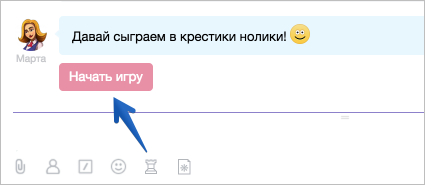
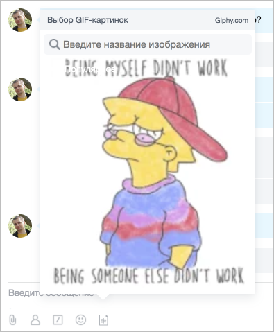
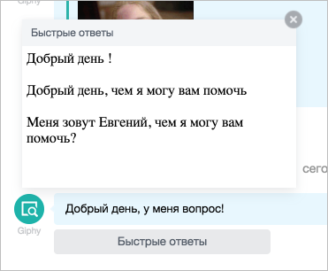

# О приложениях для чата



Описанный в данной главе формат встраивания в чат приложений на текущий момент работает корректно, однако для Нового чата нужно встраивать приложения в формате [Rest Placement](../widgets/index.md).



## Типы приложений

Разработчики имеют возможность встраиваться в Мессенджер, добавив свою иконку в панель ввода текста:

Если приложение не загрузит картинку, будет выведена служебная иконка **Приложения для чата**. По клику на иконку будет показан ее текстовый вариант.

Приложение для чата бывает двух типов — **JS команда** или **IFRAME приложение**.

### JS команда

При нажатии на иконку вставляется команда для чат-бота в поле ввода либо отправяется команда в чат, либо начинается телефонный звонок, либо открывается открытая линия поддержки.

С помощью этого формата разработчики в своих чат-ботах могут сделать кнопку для связи с ними.

Пример такой команды для чат-бота Марта — иконка для игры в крестики нолики:

### IFRAME-приложение

Это улучшенный формат. При нажатии на иконку будет открыто IFRAME-приложение, в котором разработчик сможет реализовать любые функции. Приложение может взаимодействовать с чатом c помощью JS-команд:

- для вставки сообщения в поле ввода
- для отправки сообщения от лица пользователя
- для закрытия диалога
- открытия чата технической поддержки (консультант ОЛ)
- совершения звонка

Пример такой реализации вы можете увидеть на примере чат-бота GIphy:

Прочувствуйте разницу — раньше вы писали команду в виде сообщения, и Giphy выдавал вам случайную картинку по теме. Теперь вы видите то, что отправляете.



Обратите внимание, иконки умеют понимать контекст, а это значит, что приложение может отображаться только в тех чатах, в которых вам это требуется.

Например, для связи с техподдержкой приложение правильнее будет разместить в контексте вашего чат-бота, ведь в других чатах она будет лишней. Либо вы можете сделать специальное приложение для открытых линий — оно должно показываться только в контексте открытых линий.

Доступные контексты: `all`, `chat`, `bot`, `lines`, `user`, `call`.

К каждому контексту можно добавить постфикс `-admin` — тогда иконка будет показана в нужном контексте только администраторам.



## Контекстные приложения

Контекстные приложения созданы для того, чтобы помогать взаимодействовать пользователю с чат-ботом в рамках конкретного диалога (сообщения).

Например, клиент пишет в открытую линию, чат-бот для открытых линий анализирует сообщение и подготавливает варианты ответа. Чтобы не мешать операторам работать и не показывать ему весь поток информации, мы аккуратно формируем кнопку, по нажатию на которую откроется IFRAME-приложение.

