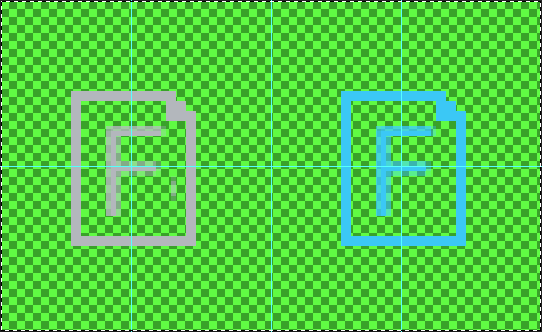
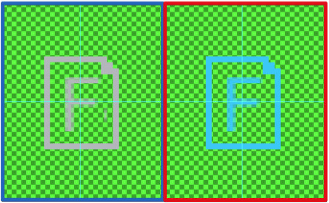
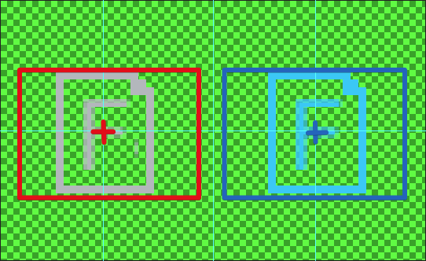
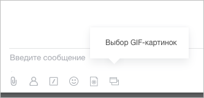

# Создать иконку Приложения для чата

При создании иконки **Приложения для чата** следуйте следующим правилам:

1. Иконка должна быть в формате .PNG и иметь прозрачный фон
    
    

2. Размер холста: 108х66 px, левая часть используется для неактивной иконки, вторая — для отображения активной
    
    

3. Основная часть иконки должна быть не более 45х32 px и обязательно отцентрирована по середине каждой части
    
    

4. Основной цвет неактивной иконки — `#b3b7bc`, активной — `#2fc7f7`
    
    

    Чтобы упростить процесс создания иконок, мы предоставляем несколько шаблонов. Вы можете скачать их и использовать в своей работе.

    #|
    ||  |  |  ||
    || [textarea_icon_f.psd](https://dev.1c-bitrix.ru/images/chat_bot/im_app/textarea_icon_f.psd) | [marta_icon.psd](https://dev.1c-bitrix.ru/images/chat_bot/im_app/marta_icon.psd) | [textarea_icon.psd](https://dev.1c-bitrix.ru/images/chat_bot/im_app/textarea_icon.psd) ||
    |#

5. Для загрузки картинки при регистрации или обновлении приложения необходимо передавать ключ `ICON_FILE`. Значение этого ключа должно быть base64 от вашей картинки

    ```php
    'ICON_FILE' => base64_encode(
        file_get_contents(
            __DIR__.'/icon_button.png'
        )
    ),
    ```



Если вы не создадите иконку для приложения, оно будет сгруппировано в служебную кнопку:





