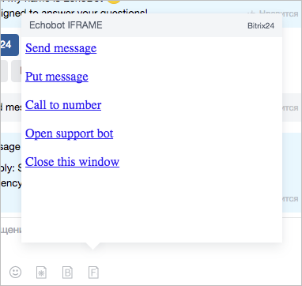

# Cоздать IFRAME-обработчик

После регистрации приложения для чата необходимо сделать **IFRAME-обработчик**.



Несмотря на то, что при регистрации вы задаете размеры окна, приложение может уменьшить их в соответствии с фактически доступными размерами. Рекомендуется разрабатывать приложение так, чтобы оно вписывалось в минимальные размеры и могло адаптироваться к увеличению и уменьшению. Это особенно важно для мобильных устройств.



## Данные на странице

Страница будет открыта со следующими данными:

```php
Array
(
    [BOT_ID] => 17
    [BOT_CODE] => echoBot
    [APP_ID] => 11
    [APP_CODE] => echoFrame
    [DOMAIN] => https://test.bitrix24.ru
    [DOMAIN_HASH] => 0e9c40cee01d6f182e9261b38b30b5c3
    [USER_ID] => 2
    [USER_HASH] => 7e23ac8b6f6c7044076301c7f81cd745
    [DIALOG_ID] => 950
    [CONTEXT] => textarea
    [LANG] => ru
    [IS_CHROME] => Y
    [MESSAGE_ID] => 12333
    [BUTTON_PARAMS] => test
    [DIALOG_ENTITY_ID] => telegrambot|8|173633217|569
    [DIALOG_ENTITY_DATA_1] => Y|LEAD|56|N|N|1765
    [DIALOG_CONTEXT] => lines

)
```

### Параметры

- `BOT_ID` и `BOT_CODE` — данные о чат-боте, под которым запущено приложение
- `APP_ID` и `APP_CODE` — данные приложении для чата запущенного приложения
- `DOMAIN` — адрес портала, с которого запустили приложение
- `DOMAIN_HASH` — это поле `HASH`, переданное при регистрации иконки. Используются для отсечения неавторизованных запросов
- `USER_ID` — идентификатор пользователя
- `USER_HASH` — хеш-строка для валидации корректности запросов на портале клиента
- `DIALOG_ID` — идентификатор запущенного диалога у пользователя в момент открытия фрейма
- `CONTEXT` — это контекст вызова диалога, может быть `textarea` или `button`
- `LANG` — текущий язык интерфейса клиента
- `IS_CHROME` — запущен ли данный фрейм в браузере Google Chrome или нет
- `DIALOG_CONTEXT` — **данный параметр пока недоступен**. Может быть `all`, `chat`, `bot`, `lines`, `user`, `call`
- `DIALOG_ENTITY_ID` — дополнительные данные о чате (**данный параметр пока недоступен**). Для Открытых линий данные разделены |. Значение полей для Открытых линий: 1 — канал, через который пользователь написал, 2 — идентификатор ОЛ, 3 и 4 — служебные данные (параметр пока недоступен)
- `DIALOG_ENTITY_DATA_1` — дополнительные данные о чате (**данный параметр пока недоступен**). Для Открытых линий данные разделены |. Значение полей для Открытых линий: 1 — сохранен в CRM, 2 — тип сущности CRM, 3 — идентификатор сущности CRM, 4 и 5 — служебные данные, 6 — идентификатор сессии открытой линии

Если фрейм запущен в режиме контекста:

- `MESSAGE_ID` — идентификатор сообщения
- `BUTTON_PARAMS` — параметр кнопки, заданный при отправке

## Взаимодействие с родительским окном (с мессенджером)

Необходимо сделать функции взаимодействия с основным окном, инициализацией и отправкой данных.

### Примеры реализации

```js
<script type="text/javascript">
// функция инициализации коммуникации с основным окном
function frameCommunicationInit()
{
     if (!window.frameCommunication)
     {
         window.frameCommunication = {timeout: {}};
     }
     if(typeof window.postMessage === 'function')
     {
         window.addEventListener('message', function(event){
            var data = {};
            try { data = JSON.parse(event.data); } catch (err){}

            if (data.action == 'init')
            {
             frameCommunication.uniqueLoadId = data.uniqueLoadId;
             frameCommunication.postMessageSource = event.source;
             frameCommunication.postMessageOrigin = event.origin;
            }
         });
     }
}

// функция отправки данных в основное окно
function frameCommunicationSend(data)
{
     data['uniqueLoadId'] = frameCommunication.uniqueLoadId;
     var encodedData = JSON.stringify(data);
     if (!frameCommunication.postMessageOrigin)
     {
         clearTimeout(frameCommunication.timeout[encodedData]);
         frameCommunication.timeout[encodedData] = setTimeout(function(){
            frameCommunicationSend(data);
         }, 10);
         return true;
     }
    
     if(typeof window.postMessage === 'function')
     {
         if(frameCommunication.postMessageSource)
         {
            frameCommunication.postMessageSource.postMessage(
             encodedData,
             frameCommunication.postMessageOrigin
            );
         }
     }
}
frameCommunicationInit();
</script>
```

После этого доступны следующие функции:

- Команда отправки текста от лица пользователя:
`frameCommunicationSend({'action': 'send', 'message': 'Send message'})`

- Команда вставки текста в поле ввода:
`frameCommunicationSend({'action': 'put', 'message': 'Put message'})`

- Команда начала звонка:
`frameCommunicationSend({'action': 'call', 'number': '123456'})`

- Команда открытия диалога с вашей открытой линией:
`frameCommunicationSend({'action': 'support', 'code': '6a4cdbcf753addac1a573ea64be826ca'})`

- Команда закрытия фрейма:
`frameCommunicationSend({'action': 'close'})`



## Регистрация и безопасность

Вы можете не проверять входящие запросы, но мы **настоятельно рекомендуем это делать**.

На основе входящих данных вы можете реализовать **необходимые проверки**:

1. Рекомендуем проверять REFERER на совпадение с указанным доменом
2. Рекомендуем проверять домен и хеш от него
3. Рекомендуем проверять пользователя и хеш от него
4. Используйте уникальный HASH для каждой новой регистрации

В сочетании всех этих факторов вы сможете сделать достаточно безопасное приложение.

При регистрации команды, вы должны указать HASH-строку, которой будут подписываться домен и пользователь:

```php
$hash = '0e9c40cee01d6f182e9261b38b30b5c3'; // hash, указанный при регистрации приложения

$check = parse_url($_GET['DOMAIN']);

// проверка на валидность указанного домена
if ($_GET['DOMAIN_HASH'] == md5($check['host'].$hash))
{
echo 'OK';
}

// проверка на валидность указанного пользователя
if ($_GET['USER_HASH'] == md5($_GET['USER_ID'].$hash))
{
echo 'OK';
}

// проверка на REFERER
if (strpos($_SERVER['HTTP_REFERER'], $_GET['DOMAIN'])!== 0)
{
echo 'OK';
}
```

Работа в таком режиме подробно рассмотрена в демо-примере, который вы можете скачать [здесь](https://dev.1c-bitrix.ru/images/chat_bot/im_app/iframe.zip).