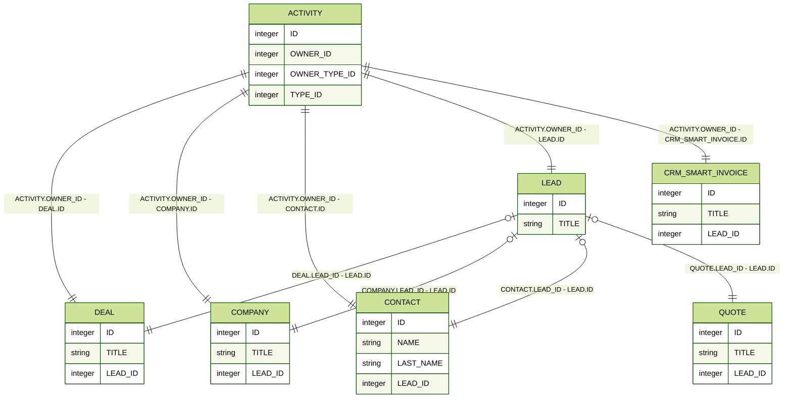
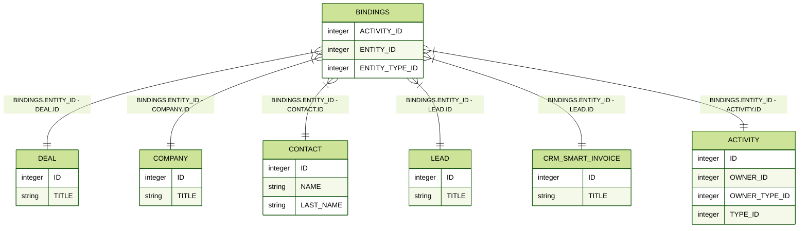

# Структура связей объектов CRM



Тут может не хватать некоторых данных — дополним в ближайшее время







- вот тут прямо нужен очень вдумчивый материал, который поможет разобраться в сложностях CRM
- Первый раздел про базовые объекты. Рассказываем про связи между ними, связанные с конвертацией из лида, а также связь между ними и делами 1 ко многим. Отмечаем, что это лишь базовая привязка дел, на самом деле, она сложнее и будет рассмотрена ниже
- Второй раздел про связи делами и объектами с помощью таблицы BINDINGS много-ко-многим
- Третий раздел про реквизиты. Сначала общая картина, потом на примере компании более подробная схема





## Базовые объекты CRM

## Множественный связи с делами

