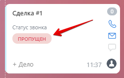
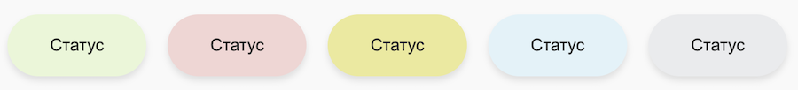

# Бейджи конфигурируемых дел: обзор методов



Выберите инструмент для разработки с AI-агентом:

- используйте [Битрикс24 Вайбкод](../../../../../../ai-tools/vibecode.md), чтобы создать приложение для Битрикс24 по описанию задачи без знания языков программирования. Агент напишет код и разместит приложение на сервере без ручной настройки хостинга
- используйте [MCP-сервер](../../../../../../ai-tools/mcp.md), чтобы разрабатывать интеграцию через REST API в своем проекте. Агент будет обращаться к официальной REST-документации



Бейдж — это значок на карточке элемента в канбане. Бейдж помогает выделить элементы, которые требуют внимания. Если к элементу добавлено несколько бейджей, будет показан последний добавленный.



> Быстрый переход: [все методы](#all-methods)

## Связь с конфигурируемым делом

Бейдж не привязывается к элементу CRM напрямую. Сначала приложение регистрирует бейдж методом [crm.activity.badge.add](./crm-activity-badge-add.md), а затем указывает его код в поле `badgeCode` [конфигурируемого дела](../index.md) при вызове [crm.activity.configurable.add](../crm-activity-configurable-add.md) или [crm.activity.configurable.update](../crm-activity-configurable-update.md).

Бейдж показывается на канбане того объекта, к которому привязано дело, до тех пор, пока дело не будет закрыто.

## Что учитывать перед вызовом методов

- Методами [crm.activity.badge.add](./crm-activity-badge-add.md) и [crm.activity.badge.delete](./crm-activity-badge-delete.md) управляет только пользователь с административным доступом к разделу CRM.
- Методы [crm.activity.badge.get](./crm-activity-badge-get.md) и [crm.activity.badge.list](./crm-activity-badge-list.md) доступны любому пользователю.
- Код бейджа `code` должен быть уникальным. Бейдж с уже занятым кодом добавить не получится.
- Бейдж находят и удаляют по коду, а не по идентификатору.

## Как работать с бейджами

1. Проверьте занятые коды методом [crm.activity.badge.list](./crm-activity-badge-list.md).
2. Зарегистрируйте бейдж методом [crm.activity.badge.add](./crm-activity-badge-add.md).
3. Проверьте бейдж по коду методом [crm.activity.badge.get](./crm-activity-badge-get.md).
4. Укажите код бейджа в поле `badgeCode` конфигурируемого дела.
5. Удалите ненужный бейдж методом [crm.activity.badge.delete](./crm-activity-badge-delete.md).

## Поля записи о бейдже

#|
|| **Поле** | **Описание** ||
|| **code**
[`string`](../../../../../data-types.md) | Код бейджа, например `missedCall`. По коду бейдж указывают в деле, получают и удаляют ||
|| **title**
[`string`\|`array`](../../../../data-types.md) | Название бейджа. Может быть строкой или массивом строк для разных языков ||
|| **value**
[`string`\|`array`](../../../../data-types.md) | Текст, который выводится в самом значке. Показывается в верхнем регистре. Может быть строкой или массивом строк для разных языков ||
|| **type**
[`string`](../../../../../data-types.md) | [Тип бейджа](#tip-bejdzha), определяет цвет значка ||
|#

Если **title** или **value** содержит массив, то ключами в них должны быть коды языков, а значениями текст на этих языках, например:

```json
{
    "ru": "Внимание",
    "en": "Alarm"
}
```

Если перевод для текущего языка не найден, то будет использован английский. Если английский перевод не найден, то будет использован первый элемент массива.

## Тип бейджа

В Битрикс24 есть несколько стандартных бейджей для разных сценариев. Тип бейджа может принимать следующие значения:

- **success** — зеленый фон
- **failure** — красный фон
- **warning** — желтый фон
- **primary** — голубой фон
- **secondary** — серый фон



## Обзор методов {#all-methods}

> Scope: [`crm`](../../../../../scopes/permissions.md)
>
> Кто может выполнять метод: пользователи с административным доступом к разделу crm — для [crm.activity.badge.add](./crm-activity-badge-add.md) и [crm.activity.badge.delete](./crm-activity-badge-delete.md), любой пользователь — для [crm.activity.badge.get](./crm-activity-badge-get.md) и [crm.activity.badge.list](./crm-activity-badge-list.md)

#|
|| **Метод** | **Описание** ||
|| [crm.activity.badge.add](./crm-activity-badge-add.md) | Добавляет новый бейдж ||
|| [crm.activity.badge.get](./crm-activity-badge-get.md) | Получает информацию о бейдже ||
|| [crm.activity.badge.list](./crm-activity-badge-list.md) | Получает список бейджей ||
|| [crm.activity.badge.delete](./crm-activity-badge-delete.md) | Удаляет бейдж по коду ||
|#

## Дополнительно

- [{#T}](../crm-activity-configurable-add.md)
- [{#T}](../crm-activity-configurable-update.md)
- [{#T}](../crm-activity-configurable-get.md)
