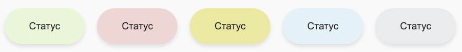

# О бейджах конфигурируемых дел

> Быстрый переход: [все методы](#all-methods) 

`Бейдж` — это значок на карточке элемента в канбане. Бейдж помогает выделить элементы, которые требуют внимания. Если к элементу добавлено несколько бейджей, будет показан последний добавленный.


Бейджи можно добавить для [конфигурируемого дела](../index.md) в поле `badgeCode`. Бейдж будет показываться на канбане объекта, к которому привязано дело, до тех пор, пока дело не будет закрыто.

## Поля записи о бейдже

#|
|| **Поле** | **Описание** ||
|| **code**
[`string`](../../../../data-types.md) | Код бейджа, например `missedCall` ||
|| **title**
[`string`\|`array`](../../../../data-types.md) | Заголовок бейджа. Может быть строкой или массивом строк для разных языков ||
|| **value**
[`string`\|`array`](../../../../data-types.md) | Заголовок бейджа. Может быть строкой или массивом строк для разных языков ||
|| **type**
[`string`](../../../../data-types.md) | [Тип бейджа](#tip-bejdzha) ||
|#

Если **title** или **value** содержит массив, то ключами в них должны быть коды языков, а значениями текст на этих языках, например:

```json
{
    "ru": "Внимание",
    "en": "Alarm"
}
```

Если перевод для текущего языка не найден, то будет использован английский. Если английский перевод не найден, то будет использован первый элемент массива.

## Тип бейджа

В Битрикс24 есть несколько стандартных бейджей для разных сценариев. Тип бейджа может принимать следующие значения:

- **success** — Зеленый фон
- **failure** — Красный фон
- **warning** — Желтый фон
- **primary** — Голубой фон
- **secondary** — Серый фон



# Обзор методов {#all-methods}

> Scope: [`crm`](../../../../../scopes/permissions.md)
>
> Кто может выполнять метод: любой пользователь

#|
|| **Метод** | **Описание** ||
|| [crm.activity.badge.add](./crm-activity-badge-add.md) | Добавляет новый бейдж ||
|| [crm.activity.badge.get](./crm-activity-badge-get.md) | Получает информацию о бейдже ||
|| [crm.activity.badge.list](./crm-activity-badge-list.md) | Получает список бейджей ||
|| [crm.activity.badge.delete](./crm-activity-badge-delete.md) | Удаляет бейдж по коду ||
|#

## Дополнительно

- [{#T}](../crm-activity-configurable-add.md)
- [{#T}](../crm-activity-configurable-update.md)
- [{#T}](../crm-activity-configurable-get.md)
