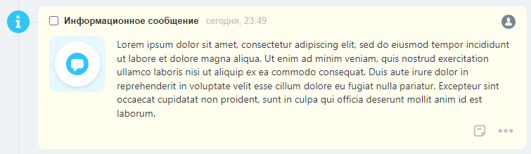
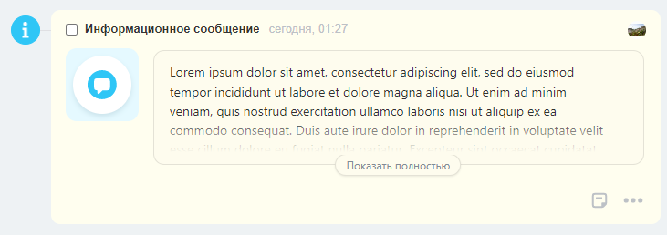
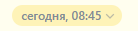

# Контентный блок конфигурируемого дела

Контентные блоки `ContentBlockDto` — основа контентной области записи таймлайна. Сочетая эти блоки можно гибко собирать различные интерфейсы.

Данная структура используется при создании [конфигурируемых дел](../../layout-blocks/index.md) и при обогащении записей таймлайна [контентными блоками](../../../layout-blocks/index.md).

## Общая структура блока:

```json
{
    "type": "Тип блока",
    "properties": {
        ... какие-то свойства, различные для каждого конкрентого блока
    }
}
```

## Типы контентных блоков:

### Текст

Самый простой блок `type = text`, который выводит некоторый форматированный текст.

#### Параметры



#|
|| **Поле** | **Описание** ||
|| **value^*^**
[`textWithTranslation`](./field-types.md) | Текст, который будет показан ||
|| **multiline**
[`boolean`](../../../../data-types.md) | Обработка переносов строк. Если true, то символы `\n` будут заменены на `<br>`. По-умолчанию `false` ||
|| **title**
[`textWithTranslation`](./field-types.md#textwithtranslation) | Аттрибут title ||
|| **bold**
[`boolean`](../../../../data-types.md) | Жирный текст. По-умолчанию `false` ||
|| **size**
[`string`](../../../../data-types.md) | Размер текста. Может принимать значения `xs`, `sm`, `md` (по-умолчанию `md`) ||
|| **color**
[`string`](../../../../data-types.md) | Цвет текста. Может принимать значения `base_50`, `base_60`, `base_70`, `base_90` ||
|| **scope**
[`string`](../../../../data-types.md) | [Область видимости](./field-types.md#scope), например `web` ||
|#

#### Пример

```json
{
    "icon": {
        "code": "info"
    },
    "header": {
        "title": "Информационное сообщение"
    },
    "body": {
        "logo": {
            "code": "notification"
        },
        "blocks": {
            "text": {
                "type": "text",
                "properties": {
                    "value": "Lorem ipsum dolor sit amet, consectetur adipiscing elit, sed do eiusmod tempor incididunt ut labore et dolore magna aliqua. Ut enim ad minim veniam, quis nostrud exercitation ullamco laboris nisi ut aliquip ex ea commodo consequat. Duis aute irure dolor in reprehenderit in voluptate velit esse cillum dolore eu fugiat nulla pariatur. Excepteur sint occaecat cupidatat non proident, sunt in culpa qui officia deserunt mollit anim id est laborum."
                }
            }
        }
    }
}
```



### Длинный многострочный текст

Блок `type = largeText` позволяет отображать длинные многострочные тексты, которые будут автоматически свернуты до превью.

#### Параметры



#|
|| **Поле** | **Описание** ||
|| **value^*^**
[`textWithTranslation`](./field-types.md#textwithtranslation) | Текст, который будет показан ||
|| **scope**
[`string`](../../../../data-types.md) | [Область видимости](./field-types.md#scope), например `web` ||
|#

#### Пример

Длинный текст, убранный под "Показать полностью".

```json
{
    "icon": {
        "code": "info"
    },
    "header": {
        "title": "Информационное сообщение"
    },
    "body": {
        "logo": {
            "code": "notification"
        },
        "blocks": {
            "text": {
                "type": "largeText",
                "properties": {
                    "value": "Lorem ipsum dolor sit amet, consectetur adipiscing elit, sed do eiusmod tempor incididunt ut labore et dolore magna aliqua. Ut enim ad minim veniam, quis nostrud exercitation ullamco laboris nisi ut aliquip ex ea commodo consequat. Duis aute irure dolor in reprehenderit in voluptate velit esse cillum dolore eu fugiat nulla pariatur. Excepteur sint occaecat cupidatat non proident, sunt in culpa qui officia deserunt mollit anim id est laborum. Lorem ipsum dolor sit amet, consectetur adipiscing elit, sed do eiusmod tempor incididunt ut labore et dolore magna aliqua. Ut enim ad minim veniam, quis nostrud exercitation ullamco laboris nisi ut aliquip ex ea commodo consequat."
                }
            }
        }
    }
}
```



### Ссылка

Блок `type = link` выводит ссылку.

#### Параметры



#|
|| **Поле** | **Описание** ||
|| **text^*^**
[`textWithTranslation`](./field-types.md#textwithtranslation) | Текст, который будет показан. HTML теги не поддерживаются ||
|| **action^*^**
[`ActionDto`](./action.md) | Действие по нажатию на ссылку ||
|| **bold**
[`boolean`](../../../../data-types.md) | Жирный текст. По-умолчанию `false` ||
|| **scope**
[`string`](../../../../data-types.md) | [Область видимости](./field-types.md#scope), например `web` ||
|#

#### Пример

```json
{
    "type": "link",
    "properties": {
     "text": "Открыть сделку",
     "action": {
        "type": "redirect",
        "uri": "/crm/deal/details/123/"
     },
     "bold": true
    }
}
```


### Блок с заголовком

Блок `type = withTitle` выводит пару название-значение. В качестве значения может быть использован другой контент-блок.

#### Параметры



#|
|| **Поле** | **Описание** ||
|| **title^*^**
[`textWithTranslation`](./field-types.md#textwithtranslation) | Текст заголовка ||
|| **block^*^**
[`ContentBlockDto`](content-block.md) | Контент-блок, являющийся значением. Поддерживаются блоки с типами `text`, `link`, `deadline` ||
|| **inline**
[`boolean`](../../../../data-types.md) | Показ названия и значения в одну строку. По-умолчанию `false` ||
|| **scope**
[`string`](../../../../data-types.md) | [Область видимости](./field-types.md#scope), например `web` ||
|#

#### Примеры

```json
{
    "type": "withTitle",
    "properties": {
        "title": "Заголовок",
        "block": {
            "type": "text",
            "properties": {
                "value": "Какое-то значение"
            }
        }
    }
}
```


```json
{
    "type": "withTitle",
    "properties": {
        "title": "Заголовок 2",
        "block": {
            "type": "link",
            "properties": {
                "text": "Открыть сделку",
                "action": {
                    "type": "redirect",
                    "uri": "/crm/deal/details/123/"
                }
            }
        },
        "inline": true
    }
}
```


### Несколько контент-блоков в одну строку

Блок `type = lineOfBlocks` выводит в одну строку несколько контент-блоков типа текст или ссылка. Это позволяет выводить текст с разным форматированием, смешанный с ссылками, в одной строке.

#### Параметры



#|
|| **Поле** | **Описание** ||
|| **blocks^*^**
[`ContentBlockDto[]`](content-block.md) | Ассоциативный массив контент-блоков. Поддерживаются блоки с типами `text`, `link`, `deadline` ||
|| **scope**
[`string`](../../../../data-types.md) | [Область видимости](./field-types.md#scope), например `web` ||
|#

#### Примеры

```json
{
    "type": "lineOfBlocks",
    "properties": {
        "blocks": {
            "text": {
                "type": "text",
                "properties": {
                    "value": "Какой-то текст"
                }
            },
            "link": {
                "type": "link",
                "properties": {
                    "text": "ссылка",
                    "action": {
                        "type": "redirect",
                        "uri": "/crm/deal/details/123/"
                    }
                }
            },
            "boldText": {
                "type": "text",
                "properties": {
                    "value": "жирный текст",
                    "bold": true
                }
            }
        }
    }
}
```


### Выбор крайнего срока

Блок `type = deadline` отображает текущее значение дедлайна с возможностью его быстро изменить. Блок не будет показан, если его добавить во входящее дело или в дело без дедлайна.

#### Параметры



#|
|| **Поле** | **Описание** ||
|| **readonly**
[`boolean`](../../../../data-types.md) | Разрешение изменять крайний срок. По умолчанию `false`. Если у пользователя нет доступа на изменение сущности, к которой относится дело, или если дело выполнено, то `readonly = true` вне зависимости от переданных настроек ||
|| **scope**
[`string`](../../../../data-types.md) | [Область видимости](./field-types.md#scope), например `web` ||
|#

#### Примеры

```json
{
    "type": "deadline",
    "properties": {
        "readonly": false
    }
}
```



## Продолжите изучение

- [{#T}](../../layout-blocks/index.md)
- [{#T}](../../../layout-blocks/index.md)
- [{#T}](./layout.md)
- [{#T}](./icon.md)
- [{#T}](./header.md)
- [{#T}](./body.md)
- [{#T}](./footer.md)
- [{#T}](./menu-item.md)
- [{#T}](./action.md)
- [{#T}](./field-types.md)
- [{#T}](./rest-app-layout-dto.md)
- [{#T}](./examples.md)