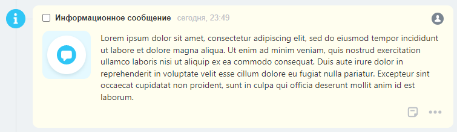
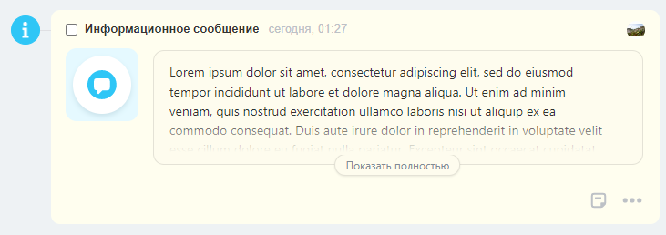
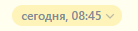

# Контентный блок конфигурируемого дела



Выберите инструмент для разработки с AI-агентом:

- используйте [Битрикс24 Вайбкод](../../../../../../ai-tools/vibecode.md), чтобы создать приложение для Битрикс24 по описанию задачи без знания языков программирования. Агент напишет код и разместит приложение на сервере без ручной настройки хостинга
- используйте [MCP-сервер](../../../../../../ai-tools/mcp.md), чтобы разрабатывать интеграцию через REST API в своем проекте. Агент будет обращаться к официальной REST-документации



Контентные блоки `ContentBlockDto` — основа контентной области записи таймлайна. Из этих блоков приложение собирает содержимое записи: текст, ссылки, пары название-значение и крайний срок.

Блоки передают ассоциативным массивом в поле `blocks`: ключ — идентификатор блока, который приложение задает само, значение — объект блока. Массив `blocks` есть у двух объектов:

- [`BodyDto`](./body.md) — контентная область [конфигурируемого дела](../index.md), структуру передают в параметре `layout` методов [crm.activity.configurable.add](../crm-activity-configurable-add.md) и [crm.activity.configurable.update](../crm-activity-configurable-update.md)
- [`RestAppLayoutDto`](./rest-app-layout-dto.md) — набор дополнительных блоков, которыми приложение обогащает чужую запись таймлайна методами [crm.activity.layout.blocks.set](../../layout-blocks/crm-activity-layout-blocks-set.md) и [crm.timeline.layout.blocks.set](../../../layout-blocks/crm-timeline-layout-blocks-set.md)

Типы блоков и их свойства одинаковы в обоих случаях. Блоки выводятся в том порядке, в котором они перечислены в `blocks`.

## Общая структура блока

У каждого блока два поля: `type` — тип блока, `properties` — его свойства. У каждого типа свой набор свойств, он описан ниже.

```json
{
    "type": "text",
    "properties": {
        "value": "Клиент подтвердил встречу"
    }
}
```

## Как выбрать тип блока

#|
|| **Тип** | **Что выводит** | **Когда использовать** ||
|| [`text`](#tekst) | Строку текста с форматированием | Короткое значение, подпись, комментарий ||
|| [`largeText`](#dlinnyj-mnogostrochnyj-tekst) | Длинный текст, свернутый до превью | Письмо, расшифровка разговора, описание ||
|| [`link`](#ssylka) | Ссылку с действием по нажатию | Переход к объекту CRM, внешнему сервису или в приложение ||
|| [`withTitle`](#blok-s-zagolovkom) | Пару название-значение | Запись с набором полей ||
|| [`lineOfBlocks`](#neskolko-kontent-blokov-v-odnu-stroku) | Несколько блоков в одну строку | Имя и телефон рядом, текст вперемешку со ссылками ||
|| [`deadline`](#vybor-krajnego-sroka) | Текущий крайний срок дела с возможностью изменить его | Дело со сроком, который пользователь должен видеть и править ||
|#

## Ограничения и ошибки

В блоки `withTitle` и `lineOfBlocks` вкладывают только блоки `text`, `link` и `deadline`.

Остальные ограничения зависят от того, куда попадают блоки, и права на вызов тоже:

- в составе [конфигурируемого дела](./layout.md) — раздел [Ограничения структуры](./layout.md#limits)
- в составе [набора дополнительных блоков](./rest-app-layout-dto.md) — раздел [Ограничения](./rest-app-layout-dto.md#limits)

## Типы контентных блоков

### Текст {#tekst}

Блок `type = text` выводит форматированную строку текста целиком, без сворачивания. Это базовый блок, с которого начинают сборку записи.

#### Параметры



#|
|| **Поле** | **Описание** ||
|| **value^*^**
[`textWithTranslation`](./field-types.md#textwithtranslation) | Текст, который увидит пользователь ||
|| **multiline**
[`boolean`](../../../../../data-types.md) | Обработка переносов строк. При `true` символы `\n` заменяются на `<br>`. По умолчанию `false` ||
|| **title**
[`textWithTranslation`](./field-types.md#textwithtranslation) | Текст всплывающей подсказки при наведении на блок ||
|| **bold**
[`boolean`](../../../../../data-types.md) | Жирный текст. По умолчанию `false` ||
|| **size**
[`string`](../../../../../data-types.md) | Размер текста. Может принимать значения `xs`, `sm`, `md`. По умолчанию `md` ||
|| **color**
[`string`](../../../../../data-types.md) | Цвет текста. Может принимать значения `base_50`, `base_60`, `base_70`, `base_90`. Другое значение метод отклонит с ошибкой `ENUM_FIELD` ||
|| **scope**
[`string`](../../../../../data-types.md) | [Область видимости](./field-types.md#scope), например `web` ||
|#

#### Пример

Текст в две строки, выделенный жирным, с подсказкой при наведении:

```json
{
    "type": "text",
    "properties": {
        "value": "Клиент подтвердил встречу.\nВстреча в офисе на Тверской.",
        "multiline": true,
        "bold": true,
        "size": "md",
        "color": "base_90",
        "title": "Комментарий менеджера"
    }
}
```

Так блок `text` выглядит в записи таймлайна:



### Длинный многострочный текст {#dlinnyj-mnogostrochnyj-tekst}

Блок `type = largeText` выводит длинный многострочный текст и сворачивает его до превью.

#### Параметры



#|
|| **Поле** | **Описание** ||
|| **value^*^**
[`textWithTranslation`](./field-types.md#textwithtranslation) | Текст, который увидит пользователь ||
|| **scope**
[`string`](../../../../../data-types.md) | [Область видимости](./field-types.md#scope), например `web` ||
|#

#### Пример

```json
{
    "type": "largeText",
    "properties": {
        "value": "Здравствуйте! Меня зовут Сергей, я звоню по заявке с сайта. Уточнил наличие на складе: обе позиции есть, отгрузка возможна в четверг. Клиент просит счет на юридическое лицо и доставку до подъезда. Договорились созвониться после согласования бюджета."
    }
}
```

Развернуть текст пользователь сможет кнопкой «Показать полностью»:



### Ссылка {#ssylka}

Блок `type = link` выводит ссылку.

#### Параметры



#|
|| **Поле** | **Описание** ||
|| **text^*^**
[`textWithTranslation`](./field-types.md#textwithtranslation) | Текст ссылки. HTML-теги не поддерживаются ||
|| **action^*^**
[`ActionDto`](./action.md) | Действие по нажатию на ссылку ||
|| **bold**
[`boolean`](../../../../../data-types.md) | Жирный текст. По умолчанию `false` ||
|| **scope**
[`string`](../../../../../data-types.md) | [Область видимости](./field-types.md#scope), например `web` ||
|#

#### Пример

```json
{
    "type": "link",
    "properties": {
     "text": "Открыть сделку",
     "action": {
        "type": "redirect",
        "uri": "/crm/deal/details/123/"
     },
     "bold": true
    }
}
```


### Блок с заголовком {#blok-s-zagolovkom}

Блок `type = withTitle` выводит пару название-значение. Значением может быть другой контентный блок.

#### Параметры



#|
|| **Поле** | **Описание** ||
|| **title^*^**
[`textWithTranslation`](./field-types.md#textwithtranslation) | Текст заголовка ||
|| **block^*^**
`ContentBlockDto` | Контентный блок, который выводится как значение. Поддерживаются блоки с типами `text`, `link`, `deadline` ||
|| **inline**
[`boolean`](../../../../../data-types.md) | Показ названия и значения в одну строку. По умолчанию `false` ||
|| **scope**
[`string`](../../../../../data-types.md) | [Область видимости](./field-types.md#scope), например `web` ||
|#

#### Примеры

```json
{
    "type": "withTitle",
    "properties": {
        "title": "Заголовок",
        "block": {
            "type": "text",
            "properties": {
                "value": "Какое-то значение"
            }
        }
    }
}
```


```json
{
    "type": "withTitle",
    "properties": {
        "title": "Заголовок 2",
        "block": {
            "type": "link",
            "properties": {
                "text": "Открыть сделку",
                "action": {
                    "type": "redirect",
                    "uri": "/crm/deal/details/123/"
                }
            }
        },
        "inline": true
    }
}
```


### Несколько контентных блоков в одну строку {#neskolko-kontent-blokov-v-odnu-stroku}

Блок `type = lineOfBlocks` выводит в одну строку несколько контентных блоков. Так в одной строке совмещают текст с разным форматированием и ссылки.

#### Параметры



#|
|| **Поле** | **Описание** ||
|| **blocks^*^**
[`object`](../../../../../data-types.md) | Вложенные блоки: ключ — идентификатор блока, значение — объект `ContentBlockDto`. Не более 20 блоков, поддерживаются типы `text`, `link`, `deadline` ||
|| **scope**
[`string`](../../../../../data-types.md) | [Область видимости](./field-types.md#scope), например `web` ||
|#

#### Примеры

```json
{
    "type": "lineOfBlocks",
    "properties": {
        "blocks": {
            "text": {
                "type": "text",
                "properties": {
                    "value": "Какой-то текст"
                }
            },
            "link": {
                "type": "link",
                "properties": {
                    "text": "ссылка",
                    "action": {
                        "type": "redirect",
                        "uri": "/crm/deal/details/123/"
                    }
                }
            },
            "boldText": {
                "type": "text",
                "properties": {
                    "value": "жирный текст",
                    "bold": true
                }
            }
        }
    }
}
```


### Выбор крайнего срока {#vybor-krajnego-sroka}

Блок `type = deadline` показывает крайний срок дела и позволяет изменить его прямо в записи. Блок не отображается во входящем деле и в деле без крайнего срока.

#### Параметры



#|
|| **Поле** | **Описание** ||
|| **readonly**
[`boolean`](../../../../../data-types.md) | Запрет на изменение крайнего срока. По умолчанию `false` — срок можно менять прямо в записи. Битрикс24 включает запрет сам, если дело выполнено или у пользователя нет доступа на изменение объекта, к которому относится дело ||
|| **scope**
[`string`](../../../../../data-types.md) | [Область видимости](./field-types.md#scope), например `web` ||
|#

#### Примеры

```json
{
    "type": "deadline",
    "properties": {
        "readonly": false
    }
}
```



## Продолжите изучение

- [{#T}](../../layout-blocks/index.md)
- [{#T}](../../../layout-blocks/index.md)
- [{#T}](./layout.md)
- [{#T}](./icon.md)
- [{#T}](./header.md)
- [{#T}](./body.md)
- [{#T}](./footer.md)
- [{#T}](./menu-item.md)
- [{#T}](./action.md)
- [{#T}](./field-types.md)
- [{#T}](./rest-app-layout-dto.md)
- [{#T}](./examples.md)
