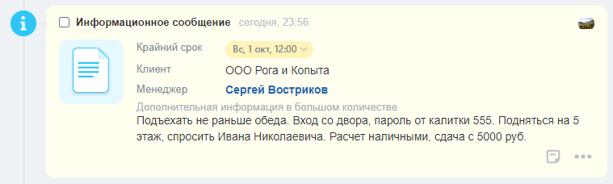
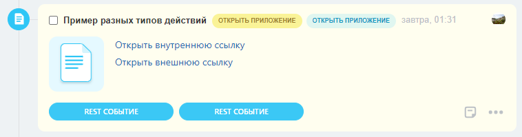
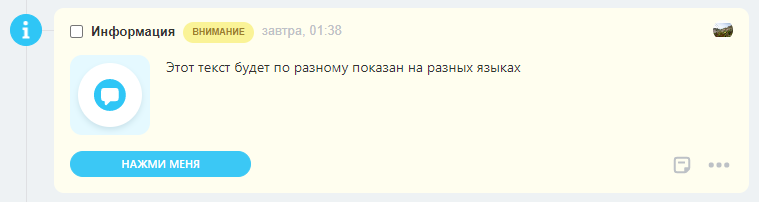
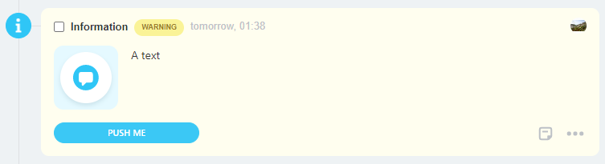

# Примеры конфигураций дела



Выберите инструмент для разработки с AI-агентом:

- используйте [Битрикс24 Вайбкод](../../../../../../ai-tools/vibecode.md), чтобы создать приложение для Битрикс24 по описанию задачи без знания языков программирования. Агент напишет код и разместит приложение на сервере без ручной настройки хостинга
- используйте [MCP-сервер](../../../../../../ai-tools/mcp.md), чтобы разрабатывать интеграцию через REST API в своем проекте. Агент будет обращаться к официальной REST-документации



Готовые примеры объекта [`LayoutDto`](./layout.md) — структуры, которая описывает внешний вид записи таймлайна. Такой объект передают в поле `layout` методов [crm.activity.configurable.add](../crm-activity-configurable-add.md) и [crm.activity.configurable.update](../crm-activity-configurable-update.md).

Каждый пример показывает готовую конфигурацию целиком и результат, который увидит пользователь в таймлайне. Примеры отдельных [контентных блоков](./content-block.md) собраны на странице их описания.

Коды иконок и логотипов в примерах — из общих списков таймлайна. Получить полные списки можно методами [crm.timeline.icon.list](../../../logmessage/icons/crm-timeline-icon-list.md) и [crm.timeline.logo.list](../../../logmessage/logo/crm-timeline-logo-list.md).

> Scope: [`crm`](../../../../../scopes/permissions.md)



Методы [crm.activity.configurable.add](../crm-activity-configurable-add.md) и [crm.activity.configurable.update](../crm-activity-configurable-update.md) работают только в контексте [приложения](../../../../../../settings/app-installation/index.md). Вызов через входящий вебхук вернет ошибку `ERROR_WRONG_CONTEXT`.



## Ограничения конфигурации

Примеры ниже составлены с учетом ограничений структуры:

- не более двух [тегов](./header.md) в заголовке записи
- не более двух [кнопок](./footer.md) в нижней части записи
- от одного до 20 [контентных блоков](./body.md) в основной области
- ключи в ассоциативных массивах структуры — `blocks`, `tags`, `buttons`, `items` — состоят только из латинских букв, цифр, дефиса и подчеркивания
- лишние поля, которых нет в описании объекта, приводят к ошибке

Нарушение любого из этих правил возвращает ошибку валидации. Коды ошибок перечислены на страницах методов [crm.activity.configurable.add](../crm-activity-configurable-add.md#errors) и [crm.activity.configurable.update](../crm-activity-configurable-update.md#errors).

## Карточка с набором полей

Карточка «Информационное сообщение» с четырьмя парами название-значение: крайний срок, клиент, менеджер и дополнительная информация. Каждая пара — блок `withTitle`, который выводит подпись и вложенный блок со значением. Вложенным может быть блок типа `text`, `link` или `deadline`.

Параметр `inline` управляет расположением: при `true` подпись и значение стоят в одной строке, при `false` значение переносится под подпись.

Блок `deadline` подставляет крайний срок дела и позволяет изменить его прямо в карточке. Он не отображается во входящем деле и в деле без крайнего срока. Условия, при которых срок изменить нельзя, перечислены в [описании блока](./content-block.md).

Ключи в массиве `blocks` приложение придумывает само — они не связаны с типами блоков. В примере ключ `deadline` совпал с именем типа, но это совпадение, а не требование.

```json
{
    "icon": {
        "code": "info"
    },
    "header": {
        "title": "Информационное сообщение"
    },
    "body": {
        "logo": {
            "code": "document"
        },
        "blocks": {
            "deadline": {
                "type": "withTitle",
                "properties": {
                    "title": "Крайний срок",
                    "inline": true,
                    "block": {
                        "type": "deadline"
                    }
                }
            },
            "client": {
                "type": "withTitle",
                "properties": {
                    "title": "Клиент",
                    "inline": true,
                    "block": {
                        "type": "text",
                        "properties": {
                            "value": "ООО Рога и Копыта"
                        }
                    }
                }
            },
            "manager": {
                "type": "withTitle",
                "properties": {
                    "title": "Менеджер",
                    "inline": true,
                    "block": {
                        "type": "link",
                        "properties": {
                            "text": "Сергей Востриков",
                            "bold": true,
                            "action": {
                                "type": "redirect",
                                "uri": "/company/personal/user/1/"
                            }
                        }
                    }
                }
            },
            "description": {
                "type": "withTitle",
                "properties": {
                    "title": "Дополнительная информация в большом количестве",
                    "inline": false,
                    "block": {
                        "type": "text",
                        "properties": {
                            "multiline": true,
                            "value": "Подъехать не раньше обеда. Вход со двора, пароль от калитки 555. Подняться на 5 этаж, спросить Ивана Николаевича. Расчет наличными, сдача с 5000 руб."
                        }
                    }
                }
            }
        }
    }
}
```



## Карточка с разными типами действий

Конфигурация, в которой собраны все типы [действий](./action.md): переход по внутренней и внешней ссылке, открытие приложения из тега и отправка события приложению по нажатию кнопки.

Оба блока `link` используют действие `redirect`, но ведут себя по-разному. Относительная ссылка на стандартный объект Битрикс24, который поддерживает открытие в слайдере, показывает его в слайдере. Внешняя ссылка с доменом открывается в новой вкладке браузера.

Оба тега открывают приложение и различаются оформлением: `warning` дает желтый фон, `primary` — голубой. Наборы `actionParams` у них тоже разные.

Обе кнопки отправляют одно и то же событие `confirm` и различаются только значением `animationType`, поэтому в таймлайне выглядят одинаково — разница видна при нажатии. Кнопка с `loader` блокирует всю запись и показывает поверх нее лоадер, кнопка с `disable` блокирует только саму себя. Блокировка не снимается сама: она держится, пока приложение не обновит дело методом [crm.activity.configurable.update](../crm-activity-configurable-update.md).

Содержимое `actionParams` приложение задает произвольно — Битрикс24 передает эти значения обратно в событие, не разбирая их. Ключ `blockId` в примере придуман приложением и ни на что в самой конфигурации не ссылается: приложение само решит, как его истолковать.



Действие `openRestApp` не поддерживается в мобильном приложении. Если сценарий должен работать на мобильных устройствах, используйте другой тип действия.



```json
{
    "icon": {
        "code": "document"
    },
    "header": {
        "title": "Пример разных типов действий",
        "tags": {
            "tag1": {
                "type": "warning",
                "title": "открыть приложение",
                "action": {
                    "type": "openRestApp",
                    "actionParams": {
                        "myId": 123
                    }
                }
            },
            "tag2": {
                "type": "primary",
                "title": "открыть приложение",
                "action": {
                    "type": "openRestApp",
                    "actionParams": {
                        "someImportant": "qwerty"
                    }
                }
            }
        }
    },
    "body": {
        "logo": {
            "code": "document"
        },
        "blocks": {
            "link1": {
                "type": "link",
                "properties": {
                    "text": "Открыть внутреннюю ссылку",
                    "action": {
                        "type": "redirect",
                        "uri": "/crm/deal/details/1/"
                    }
                }
            },
            "link2": {
                "type": "link",
                "properties": {
                    "text": "Открыть внешнюю ссылку",
                    "action": {
                        "type": "redirect",
                        "uri": "https://bitrix24.ru"
                    }
                }
            }
        }
    },
    "footer": {
        "buttons": {
            "button1": {
                "title": "rest событие",
                "action": {
                    "type": "restEvent",
                    "id": "confirm",
                    "animationType": "loader",
                    "actionParams": {
                        "blockId": "time"
                    }
                },
                "type": "primary"
            },
            "button2": {
                "title": "rest событие",
                "action": {
                    "type": "restEvent",
                    "id": "confirm",
                    "animationType": "disable",
                    "actionParams": {
                        "blockId": "time"
                    }
                },
                "type": "primary"
            }
        }
    }
}
```



## Карточка на нескольких языках

Конфигурация для приложения, которым пользуются на разных языках. В текстовое поле передают не строку, а ассоциативный массив переводов, где ключ это код языка, а значение — текст на этом языке. Поля, которые так умеют, имеют тип [`textWithTranslation`](./field-types.md#textwithtranslation): это заголовок записи, текст тега, содержимое блоков и подписи кнопок.

Ключами могут быть только языки, установленные на портале. Неизвестный код языка приведет к ошибке `WRONG_LANG`.

Битрикс24 подставляет вариант по языку интерфейса пользователя. Если перевода на этот язык нет, используется английский, а если нет и его — первое значение массива.

```json
{
    "icon": {
        "code": "info"
    },
    "header": {
        "title": {"ru": "Информация", "en": "Information"},
        "tags": {
            "tag": {
                "type": "warning",
                "title": {
                    "ru": "Внимание",
                    "en": "Warning"
                }
            }
        }
    },
    "body": {
        "logo": {
            "code": "notification"
        },
        "blocks": {
            "text": {
                "type": "text",
                "properties": {
                    "value": {"ru": "Этот текст будет по разному показан на разных языках", "en": "A text"}
                }
            }
        }
    },
    "footer": {
        "buttons": {
            "button1": {
                "title": {"ru": "Нажми меня", "en": "Push me"},
                "type": "primary",
                "action": {
                    "type": "redirect",
                    "uri": "https://bitrix24.ru"
                }
            }
        }
    }
}
```

Результат на русском:



Результат на английском:



## Продолжите изучение

- [{#T}](./layout.md)
- [{#T}](./icon.md)
- [{#T}](./header.md)
- [{#T}](./body.md)
- [{#T}](./content-block.md)
- [{#T}](./footer.md)
- [{#T}](./menu-item.md)
- [{#T}](./action.md)
- [{#T}](./field-types.md)
- [{#T}](./rest-app-layout-dto.md)
- [{#T}](../crm-activity-configurable-add.md)
- [{#T}](../crm-activity-configurable-update.md)
- [{#T}](../index.md)
