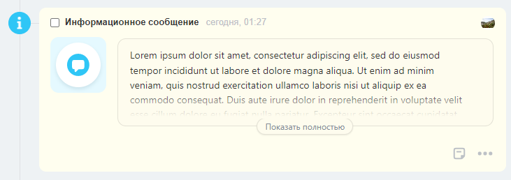

# Примеры конфигураций дел

Примеры кода для конфигураций [своих типов дел](../../types/index.md) и как они будут выглядить.

## Текст

```json
{
    "icon": {
        "code": "info"
    },
    "header": {
        "title": "Информационное сообщение"
    },
    "body": {
        "logo": {
            "code": "notification"
        },
        "blocks": {
            "text": {
                "type": "text",
                "properties": {
                    "value": "Lorem ipsum dolor sit amet, consectetur adipiscing elit, sed do eiusmod tempor incididunt ut labore et dolore magna aliqua. Ut enim ad minim veniam, quis nostrud exercitation ullamco laboris nisi ut aliquip ex ea commodo consequat. Duis aute irure dolor in reprehenderit in voluptate velit esse cillum dolore eu fugiat nulla pariatur. Excepteur sint occaecat cupidatat non proident, sunt in culpa qui officia deserunt mollit anim id est laborum."
                }
            }
        }
    }
}
```


## Длинный текст

Длинный текст, убранный под "Показать полностью".

```json
{
    "icon": {
        "code": "info"
    },
    "header": {
        "title": "Информационное сообщение"
    },
    "body": {
        "logo": {
            "code": "notification"
        },
        "blocks": {
            "text": {
                "type": "largeText",
                "properties": {
                    "value": "Lorem ipsum dolor sit amet, consectetur adipiscing elit, sed do eiusmod tempor incididunt ut labore et dolore magna aliqua. Ut enim ad minim veniam, quis nostrud exercitation ullamco laboris nisi ut aliquip ex ea commodo consequat. Duis aute irure dolor in reprehenderit in voluptate velit esse cillum dolore eu fugiat nulla pariatur. Excepteur sint occaecat cupidatat non proident, sunt in culpa qui officia deserunt mollit anim id est laborum. Lorem ipsum dolor sit amet, consectetur adipiscing elit, sed do eiusmod tempor incididunt ut labore et dolore magna aliqua. Ut enim ad minim veniam, quis nostrud exercitation ullamco laboris nisi ut aliquip ex ea commodo consequat."
                }
            }
        }
    }
}
```



## Поля

Поля название-значение, изменение крайнего срока.

```json
{
    "icon": {
        "code": "info"
    },
    "header": {
        "title": "Информационное сообщение"
    },
    "body": {
        "logo": {
            "code": "document"
        },
        "blocks": {
            "deadline": {
                "type": "withTitle",
                "properties": {
                    "title": "Крайний срок",
                    "inline": true,
                    "block": {
                        "type": "deadline"
                    }
                }
            },
            "client": {
                "type": "withTitle",
                "properties": {
                    "title": "Клиент",
                    "inline": true,
                    "block": {
                        "type": "text",
                        "properties": {
                            "value": "ООО Рога и Копыта"
                        }
                    }
                }
            },
            "manager": {
                "type": "withTitle",
                "properties": {
                    "title": "Менеджер",
                    "inline": true,
                    "block": {
                        "type": "link",
                        "properties": {
                            "text": "Сергей Востриков",
                            "bold": true,
                            "action": {
                                "type": "redirect",
                                "uri": "/company/personal/user/1/"
                            }
                        }
                    }
                }
            },
            "description": {
                "type": "withTitle",
                "properties": {
                    "title": "Дополнительная информация в большом количестве",
                    "inline": false,
                    "block": {
                        "type": "text",
                        "properties": {
                            "multiline": true,
                            "value": "Подъехать не раньше обеда. Вход со двора, пароль от калитки 555. Подняться на 5 этаж, спросить Ивана Николаевича. Расчет наличными, сдача с 5000 руб."
                        }
                    }
                }
            }
        }
    }
}
```


## Типы действий

Различные типы действий.

```json
{
    "icon": {
        "code": "document"
    },
    "header": {
        "title": "Пример разных типов действий",
        "tags": {
            "tag1": {
                "type": "warning",
                "title": "открыть приложение",
                "action": {
                    "type": "openRestApp",
                    "actionParams": {
                        "myId": 123
                    }
                }
            },
            "tag2": {
                "type": "primary",
                "title": "открыть приложение",
                "action": {
                    "type": "openRestApp",
                    "actionParams": {
                        "someImportant": "qwerty"
                    }
                }
            }
        }
    },
    "body": {
        "logo": {
            "code": "document"
        },
        "blocks": {
            "link1": {
                "type": "link",
                "properties": {
                    "text": "Открыть внутреннюю ссылку",
                    "action": {
                        "type": "redirect",
                        "uri": "/crm/deal/details/1/"
                    }
                }
            },
            "link2": {
                "type": "link",
                "properties": {
                    "text": "Открыть внешнюю ссылку",
                    "action": {
                        "type": "redirect",
                        "uri": "https://bitrix24.ru"
                    }
                }
            }
        }
    },
    "footer": {
        "buttons": {
            "button1": {
                "title": "rest событие",
                "action": {
                    "type": "restEvent",
                    "id": "confirm",
                    "animationType": "loader",
                    "actionParams": {
                        "blockId": "time"
                    }
                },
                "type": "primary"
            },
            "button2": {
                "title": "rest событие",
                "action": {
                    "type": "restEvent",
                    "id": "confirm",
                    "animationType": "disable",
                    "actionParams": {
                        "blockId": "time"
                    }
                },
                "type": "primary"
            }
        }
    }
}
```


## Мультиязычность

Поддержка мультиязычности.

```json
{
    "icon": {
        "code": "info"
    },
    "header": {
        "title": {"ru": "Информация", "en": "Information"},
        "tags": {
            "tag": {
                "type": "warning",
                "title": {
                    "ru": "Внимание",
                    "en": "Warning"
                }
            }
        }
    },
    "body": {
        "logo": {
            "code": "notification"
        },
        "blocks": {
            "text": {
                "type": "text",
                "properties": {
                    "value": {"ru": "Этот текст будет по разному показан на разных языках", "en": "A text"}
                }
            }
        }
    },
    "footer": {
        "buttons": {
            "button1": {
                "title": {"ru": "Нажми меня", "en": "Push me"},
                "type": "primary",
                "action": {
                    "type": "redirect",
                    "uri": "https://bitrix24.ru"
                }
            }
        }
    }
}
```

Результат на русском:


Результат на английском:

