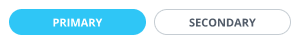

# Нижняя часть записи конфигурируемого дела



Выберите инструмент для разработки с AI-агентом:

- используйте [Битрикс24 Вайбкод](../../../../../../ai-tools/vibecode.md), чтобы создать приложение для Битрикс24 по описанию задачи без знания языков программирования. Агент напишет код и разместит приложение на сервере без ручной настройки хостинга
- используйте [MCP-сервер](../../../../../../ai-tools/mcp.md), чтобы разрабатывать интеграцию через REST API в своем проекте. Агент будет обращаться к официальной REST-документации



Под записью конфигурируемого дела в таймлайне карточки CRM приложение показывает пользователю свои действия, например подтвердить заявку или открыть связанную сделку. Эти действия задает объект `FooterDto`. Он описывает нижнюю часть [записи таймлайна](../index.md): кнопки, значок «Заметка» и меню, которое открывается по значку с тремя точками.

Объект передают в поле `footer` [структуры конфигурируемого дела](./layout.md) при вызове методов [crm.activity.configurable.add](../crm-activity-configurable-add.md) и [crm.activity.configurable.update](../crm-activity-configurable-update.md). Путь в запросе — `layout.footer`: кнопки — в `layout.footer.buttons`, пункты меню — в `layout.footer.menu.items`.

Пункты меню описаны на странице [выпадающего меню](./menu-item.md). Готовые сочетания полей собраны в [примерах конфигураций дела](./examples.md).

## Кнопки или меню

Действия приложения выводят двумя способами:

- кнопки — до двух, видны под записью сразу, подходят для главных действий
- пункты меню — до десяти, открываются по значку с тремя точками, их можно разбить на разделы с заголовками

Часть элементов Битрикс24 добавляет сам: значок «Заметка» и системные пункты меню «Закрепить», «Отложить» и «Удалить». Поля объекта могут их отключить. Пункт «О приложении» в браузере есть всегда. Если `footer` не передать, под записью будут только эти системные элементы, без кнопок приложения.

## Параметры объекта `FooterDto`

#|
|| **Поле** | **Описание** ||
|| **buttons**
[`object`](../../../../../data-types.md) | Кнопки действий: ключ — идентификатор кнопки, который вы задаете сами, значение — объект [FooterButtonDto](#footerbuttondto). В ключе допустимы латинские буквы, цифры, дефис и подчеркивание. Передайте не более двух кнопок ||
|| **showNote**
[`boolean`](../../../../../data-types.md) | Если `false`, в записи не будет значка «Заметка». По умолчанию значок есть ||
|| **menu**
[`FooterMenuDto`](#footermenudto) | Меню, которое открывается по значку с тремя точками ||
|#

Если структура нарушает эти ограничения, метод вернет ошибку валидации. Общие коды перечислены на страницах [crm.activity.configurable.add](../crm-activity-configurable-add.md#errors) и [crm.activity.configurable.update](../crm-activity-configurable-update.md#errors), коды для разделов меню — в [описании FooterMenuDto](#footermenudto).



Передавайте `buttons` объектом с ключами. Массив без ключей метод примет без ошибки, но кнопки в записи не появятся.



## Объект `FooterButtonDto` {#footerbuttondto}

Кнопка в нижней части записи таймлайна.

### Параметры объекта `FooterButtonDto`



#|
|| **Поле** | **Описание** ||
|| **title^*^**
[`textWithTranslation`](./field-types.md#textwithtranslation) | Текст кнопки ||
|| **type^*^**
[`string`](../../../../../data-types.md) | Вид кнопки: `primary` — основная, `secondary` — дополнительная. Как они выглядят, показано на рисунке ниже ||
|| **action^*^**
[`ActionDto`](./action.md) | Действие по нажатию на кнопку ||
|| **scope**
[`string`](../../../../../data-types.md) | [Область видимости](./field-types.md#scope), например `web` ||
|| **hideIfReadonly**
[`boolean`](../../../../../data-types.md) | Если `true`, кнопка не покажется пользователю, у которого нет права редактировать элемент CRM. По умолчанию `false` ||
|#



## Объект `FooterMenuDto` {#footermenudto}

Меню, которое открывается по значку с тремя точками. Флаги `showPinItem`, `showPostponeItem` и `showDeleteItem` отключают системные пункты, поля `items` и `sections` задают пункты приложения.

### Параметры объекта `FooterMenuDto`

#|
|| **Поле** | **Описание** ||
|| **showPinItem**
[`boolean`](../../../../../data-types.md) | Если `false`, пункта «Закрепить» в меню не будет. При `true` Битрикс24 показывает пункт только у выполненного дела. По умолчанию `true` ||
|| **showPostponeItem**
[`boolean`](../../../../../data-types.md) | Если `false`, пункта «Отложить» в меню не будет. При `true` Битрикс24 показывает пункт только у невыполненного дела со сроком. У входящего дела срока не бывает, поэтому и пункта нет. По умолчанию `true` ||
|| **showDeleteItem**
[`boolean`](../../../../../data-types.md) | Если `false`, пункта «Удалить» в меню не будет. По умолчанию `true` ||
|| **items**
[`object`](../../../../../data-types.md) | Пункты приложения: ключ — идентификатор пункта, значение — объект [MenuItemDto](./menu-item.md). Не более десяти пунктов ||
|| **sections**
[`array`](../../../../../data-types.md) | Разделы меню с заголовками — массив объектов `MenuSectionDto`, не более десяти. Если разделы переданы, у каждого пункта должен быть `sectionCode`. Поля раздела и правила описаны в блоке [Разделы меню](./menu-item.md#sections) ||
|#

Если разделы меню заданы с ошибкой, метод вернет один из кодов:

#|
|| **Код** | **Причина** ||
|| `MENU_RESERVED_SECTION_CODE` | Код раздела совпадает с зарезервированным: `system`, `about`, `base` или `extensions` ||
|| `MENU_DUPLICATE_SECTION_CODE` | Два раздела с одинаковым кодом ||
|| `MENU_MISSING_SECTION_CODE` | Разделы переданы, а у пункта нет `sectionCode` ||
|| `MENU_UNKNOWN_SECTION_CODE` | `sectionCode` пункта не совпадает с кодом ни одного раздела ||
|#

## Пример объекта

Значение поля `footer` с двумя кнопками. Кнопку «Подтвердить заявку» видят только пользователи с правом редактировать сделку. Кнопка «Открыть сделку» показывается только в браузере. Значка «Заметка» нет. В меню — пункт приложения «Отклонить заявку», системные пункты «Отложить» и «Удалить» отключены.

```json
{
    "buttons": {
        "confirm": {
            "title": "Подтвердить заявку",
            "type": "primary",
            "action": {
                "type": "restEvent",
                "id": "confirm",
                "animationType": "loader"
            },
            "hideIfReadonly": true
        },
        "open": {
            "title": "Открыть сделку",
            "type": "secondary",
            "action": {
                "type": "redirect",
                "uri": "/crm/deal/details/123/"
            },
            "scope": "web"
        }
    },
    "showNote": false,
    "menu": {
        "showPostponeItem": false,
        "showDeleteItem": false,
        "items": {
            "decline": {
                "title": "Отклонить заявку",
                "action": {
                    "type": "restEvent",
                    "id": "decline",
                    "animationType": "loader"
                }
            }
        }
    }
}
```

## Права и ограничения

> Scope: [`crm`](../../../../../scopes/permissions.md)
>
> Кто может выполнять метод: любой пользователь

Ограничения:

- методы [crm.activity.configurable.add](../crm-activity-configurable-add.md) и [crm.activity.configurable.update](../crm-activity-configurable-update.md) работают только в контексте [приложения](../../../../../../settings/app-installation/index.md): при вызове через вебхук Битрикс24 вернет ошибку `ERROR_WRONG_CONTEXT`
- изменить дело методом [crm.activity.configurable.update](../crm-activity-configurable-update.md) может только приложение, которое его создало

## Продолжите изучение

- [{#T}](./layout.md)
- [{#T}](./icon.md)
- [{#T}](./body.md)
- [{#T}](./content-block.md)
- [{#T}](./header.md)
- [{#T}](./menu-item.md)
- [{#T}](./action.md)
- [{#T}](./field-types.md)
- [{#T}](./rest-app-layout-dto.md)
- [{#T}](./examples.md)
