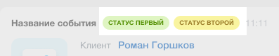
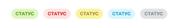

# Заголовок записи

Заголовок [записи таймлайна](../index.md) `HeaderDto`.

## Параметры объекта `HeaderDto`



#|
|| **Поле** | **Описание** ||
|| **title^*^**
[`textWithTranslation`](./field-types.md#textwithtranslation) | Заголовок записи ||
|| **titleAction**
[`ActionDto`](./action.md) | Действие по нажатию на заголовок записи ||
|| **tags**
[`TagDto[]`](#obuekt) | Ассоциативный массив объектов, описывающих теги ||
|#

## Объект `TagDto`

Тег в заголовке записи таймлайна.



Допускается не более двух тегов.





### Параметры объекта `TagDto`



#|
|| **Поле** | **Описание** ||
|| **title^*^**
[`textWithTranslation`](./field-types.md#textwithtranslation) | Текст тега ||
|| **type^*^**
[`string`](../../../../data-types.md) | Тип тега, например `warning`. Определяет его внешний вид ||
|| **action**
[`ActionDto`](./action.md) | Действие по нажатию на тег ||
|| **scope**
[`string`](../../../../data-types.md) | [Область видимости](./field-types.md#scope), например `web` ||
|| **hideIfReadonly**
[`boolean`](../../../../data-types.md) | Флаг. Скрывает тег, если у пользователя нет доступа на редактирование (по умолчанию `false`) ||
|#

Возможные значения поля **type**:

- **warning** - Желтый фон
- **success** - Зеленый фон
- **failure** - Красный фон
- **primary** - Голубой фон
- **secondary** - Серый фон
- **lavender** - Бледно-лиловый



## Пример объекта

```json
    "header": {
        "title": "Входящий звонок",
        "titleAction": {
            "type": "redirect",
            "uri": "some.url"
        },
        "tags": {
            "status2": {
                "type": "warning",
                "title": "не расшифрован"
            }
        }
    },
```

## Продолжите изучение

- [{#T}](./layout.md)
- [{#T}](./icon.md)
- [{#T}](./body.md)
- [{#T}](./content-block.md)
- [{#T}](./footer.md)
- [{#T}](./menu-item.md)
- [{#T}](./action.md)
- [{#T}](./field-types.md)
- [{#T}](./rest-app-layout-dto.md)
- [{#T}](./examples.md)