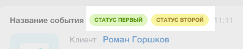
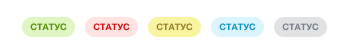

# Заголовок записи



Выберите инструмент для разработки с AI-агентом:

- используйте [Битрикс24 Вайбкод](../../../../../../ai-tools/vibecode.md), чтобы создать приложение для Битрикс24 по описанию задачи без знания языков программирования. Агент напишет код и разместит приложение на сервере без ручной настройки хостинга
- используйте [MCP-сервер](../../../../../../ai-tools/mcp.md), чтобы разрабатывать интеграцию через REST API в своем проекте. Агент будет обращаться к официальной REST-документации



`HeaderDto` — верхняя строка [записи таймлайна](../index.md): название записи и теги-подписи рядом с ним. Заголовок отвечает на вопрос «что это за запись», а теги показывают ее состояние — например, что звонок не расшифрован или заявка уже подтверждена.

Объект передают в поле `header` [структуры конфигурируемого дела](./layout.md), а саму структуру — в параметре `layout` методов [crm.activity.configurable.add](../crm-activity-configurable-add.md) и [crm.activity.configurable.update](../crm-activity-configurable-update.md). Поле `header` обязательное, внутри него обязателен только `title`. Условия вызова методов описаны [на странице структуры](./layout.md).

Заголовок и текст тегов принимают тип [`textWithTranslation`](./field-types.md#textwithtranslation): вместо строки можно передать ассоциативный массив переводов.

## Параметры объекта `HeaderDto`



#|
|| **Поле** | **Описание** ||
|| **title^*^**
[`textWithTranslation`](./field-types.md#textwithtranslation) | Заголовок записи ||
|| **titleAction**
[`ActionDto`](./action.md) | Действие по нажатию на заголовок записи ||
|| **tags**
[`object`](../../../../../data-types.md) | Теги заголовка: ключ — идентификатор тега, который приложение задает само, значение — объект [TagDto](#tagdto) ||
|#

## Объект `TagDto` {#tagdto}

Каждый тег описывают объектом `TagDto`. В ключе тега допустимы латинские буквы, цифры, дефис и подчеркивание, иначе метод вернет ошибку `KEY_CONTAIN_WRONG_SYMBOLS`.



Допускается не более двух тегов. Третий тег метод отклонит с ошибкой `TOO_MANY_ITEMS`.





### Параметры объекта `TagDto`



#|
|| **Поле** | **Описание** ||
|| **title^*^**
[`textWithTranslation`](./field-types.md#textwithtranslation) | Текст тега ||
|| **type^*^**
[`string`](../../../../../data-types.md) | Тип тега, например `warning`. Определяет цвет и оформление ||
|| **action**
[`ActionDto`](./action.md) | Действие по нажатию на тег ||
|#

Других полей у тега нет. Тег не принимает поля `scope` и `hideIfReadonly`, которые есть у кнопок и пунктов меню: метод отклонит их с ошибкой `FIELD_IS_REDUNDANT`.

Возможные значения поля **type**:

#|
|| **Значение** | **Оформление** | **Для какого состояния** ||
|| `success` | Зеленый фон | Успешный итог: заявка подтверждена, оплата прошла ||
|| `failure` | Красный фон | Неуспешный итог: звонок пропущен, оплата отклонена ||
|| `warning` | Желтый фон | Требует внимания: звонок не расшифрован, ждем ответа клиента ||
|| `primary` | Голубой фон | Акцент на нейтральном статусе: новое, в работе ||
|| `secondary` | Серый фон | Второстепенная пометка: источник, канал, номер обращения ||
|#

Другое значение метод отклонит с ошибкой `ENUM_FIELD`.





На изображении показан также бледно-лиловый тег `lavender`. Он используется во внутренних записях таймлайна, но в конфигурируемых делах не поддерживается: при передаче через REST вернется ошибка `ENUM_FIELD`.



## Пример объекта

Значение поля `header`: заголовок со ссылкой на сделку и тег со статусом расшифровки звонка.

```json
{
    "title": "Входящий звонок",
    "titleAction": {
        "type": "redirect",
        "uri": "/crm/deal/details/123/"
    },
    "tags": {
        "status2": {
            "type": "warning",
            "title": "не расшифрован"
        }
    }
}
```

Заголовок и тег с переводами на два языка:

```json
{
    "title": {
        "ru": "Входящий звонок",
        "en": "Incoming call"
    },
    "tags": {
        "status2": {
            "type": "warning",
            "title": {
                "ru": "не расшифрован",
                "en": "not transcribed"
            }
        }
    }
}
```

Полные конфигурации с заголовком и тегами собраны в [примерах конфигураций дела](./examples.md).

## Продолжите изучение

- [{#T}](./layout.md)
- [{#T}](./icon.md)
- [{#T}](./body.md)
- [{#T}](./content-block.md)
- [{#T}](./footer.md)
- [{#T}](./menu-item.md)
- [{#T}](./action.md)
- [{#T}](./field-types.md)
- [{#T}](./rest-app-layout-dto.md)
- [{#T}](./examples.md)
