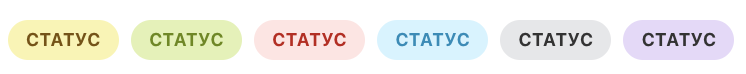

# Заголовок записи



Тут может не хватать некоторых данных — дополним в ближайшее время







- нужны правки под стандарт написания
- верно ли указаны типы, отличные от стандартных?





## HeaderDto

Заголовок записи таймлайна.

#|
|| **Поле** | **Описание** ||
|| **title^*^**
[textWithTranslation](./field-types.md) | Заголовок записи ||
|| **titleAction**
[ActionDto](./action.md) | Действие по нажатию на заголовок записи ||
|| **tags**
[TagDto](#tagdto) | Допускается не более двух тегов ||
|#



## TagDto

Тег в заголовке записи таймлайна.


#|
|| **Поле** | **Описание** ||
|| **title^*^**
[textWithTranslation](./field-types.md) | Текст тега ||
|| **type^*^**
[`string`](../../../../data-types.md) | Тип тега. Определяет его внешний вид. ||
|| **action**
[ActionDto](./action.md) | Действие по нажатию на тег ||
|| **scope**
[`string`](../../../../data-types.md) | Где показывать. ||
|| **hideIfReadonly**
[`boolean`](../../../../data-types.md) | Скрывать тег, если у пользователя нет доступа на редактирование. По-умолчанию `=false`. ||
|#



Возможные значения поля **type**:



- **success** - Зеленый фон
- **failure** - Красный фон
- **warning** - Желтый фон
- **primary** - Голубой фон
- **secondary** - Серый фон

### Пример

```json
{
    "title": "Внимание! Важно!",
    "type": "warning"
}
```