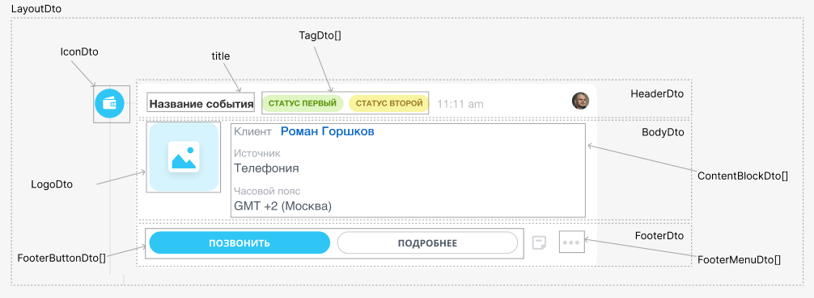

# Структура конфигурируемого дела



Выберите инструмент для разработки с AI-агентом:

- используйте [Битрикс24 Вайбкод](../../../../../../ai-tools/vibecode.md), чтобы создать приложение для Битрикс24 по описанию задачи без знания языков программирования. Агент напишет код и разместит приложение на сервере без ручной настройки хостинга
- используйте [MCP-сервер](../../../../../../ai-tools/mcp.md), чтобы разрабатывать интеграцию через REST API в своем проекте. Агент будет обращаться к официальной REST-документации



`LayoutDto` — верхнеуровневый объект, который описывает внешний вид [записи таймлайна](../index.md). Приложение собирает из него всю запись: иконку, заголовок с тегами, контентную область и нижнюю часть с кнопками и меню.

Объект передают в параметре `layout` методов [crm.activity.configurable.add](../crm-activity-configurable-add.md) и [crm.activity.configurable.update](../crm-activity-configurable-update.md). Метод [crm.activity.configurable.get](../crm-activity-configurable-get.md) возвращает ту же структуру в поле `layout` ответа.

При обновлении структура заменяется целиком, поля не объединяются. Передавайте `layout` полностью, даже если поменялся один блок.

Структура иерархическая: каждое поле `LayoutDto` — самостоятельный объект со своим набором полей, описанный на отдельной странице. Такие объекты называют DTO, Data Transfer Object.

`LayoutDto` описывает запись целиком и работает только для дел, которые создало само приложение. Чтобы добавить свои блоки к чужой записи таймлайна, используют другой объект — [`RestAppLayoutDto`](./rest-app-layout-dto.md).



> Scope: [`crm`](../../../../../scopes/permissions.md)
>
> Кто может выполнять метод: пользователь с доступом на изменение элемента CRM, к которому привязано дело. Без такого доступа метод вернет ошибку `ACCESS_DENIED`



Методы, которые принимают `LayoutDto`, работают только в контексте [приложения](../../../../../../settings/app-installation/index.md). Вызов через входящий вебхук вернет ошибку `ERROR_WRONG_CONTEXT`.



## Параметры объекта `LayoutDto`



#|
|| **Поле** | **Описание** ||
|| **icon^*^**
[`IconDto`](./icon.md) | Иконка слева от записи ||
|| **header^*^**
[`HeaderDto`](./header.md) | Заголовок записи ||
|| **body^*^**
[`BodyDto`](./body.md) | Основная контентная область записи ||
|| **footer**
[`FooterDto`](./footer.md) | Нижняя часть записи с блоком действий ||
|#

## Как собрать структуру

1. Заполните обязательные поля `icon`, `header` и `body`, а если у записи есть действия — необязательный `footer` с кнопками и [пунктами меню](./menu-item.md).
2. Содержимое записи соберите из [контентных блоков](./content-block.md) — они лежат в `body.blocks`.
3. Опишите реакцию на нажатия — [`ActionDto`](./action.md). Этот объект принимают заголовок, теги, логотип, ссылки, кнопки и пункты меню.
4. Передайте готовую структуру в параметр `layout` метода [crm.activity.configurable.add](../crm-activity-configurable-add.md).

Тексты, которые видит пользователь, принимают тип [`textWithTranslation`](./field-types.md#textwithtranslation) — их можно сразу передать на нескольких языках.

Поле [`scope`](./field-types.md#scope) у блоков, кнопок и пунктов меню скрывает элемент в браузере или в мобильном приложении. Со scope приложения оно не связано.

## Ограничения структуры {#limits}

#|
|| **Ограничение** | **Код ошибки** ||
|| Не более двух [тегов](./header.md#obuekt) в заголовке | `TOO_MANY_ITEMS` ||
|| Не более двух [кнопок](./footer.md) в нижней части | `TOO_MANY_ITEMS` ||
|| Не более 20 [контентных блоков](./content-block.md) в основной области | `TOO_MANY_ITEMS` ||
|| Не более десяти [пунктов меню](./menu-item.md) и не более десяти разделов меню | `TOO_MANY_ITEMS` ||
|| Ключи ассоциативных массивов `blocks`, `tags`, `buttons`, `items`, `sections` и `actionParams` — только латинские буквы, цифры, дефис и подчеркивание | `KEY_CONTAIN_WRONG_SYMBOLS` ||
|| Обязательное поле объекта не передано | `FIELD_IS_REQUIRED` ||
|| Передано поле, которого нет в описании объекта | `FIELD_IS_REDUNDANT` ||
|| Значение поля не входит в список допустимых, например неизвестный тип тега | `ENUM_FIELD` ||
|| В мультиязычном значении передан код языка, не установленного в Битрикс24 | `WRONG_LANG` ||
|#

Полный перечень ошибок — на страницах [crm.activity.configurable.add](../crm-activity-configurable-add.md#errors) и [crm.activity.configurable.update](../crm-activity-configurable-update.md#errors).

## Пример объекта {#primer}

Запись о входящем звонке: иконка, заголовок с тегом, клиент и ответственный в контентной области, кнопка открытия приложения и два пункта меню.

```json
{
    "icon": {
        "code": "call-completed"
    },
    "header": {
        "title": "Входящий звонок",
        "tags": {
            "status2": {
                "type": "warning",
                "title": "не расшифрован"
            }
        }
    },
    "body": {
        "logo": {
            "code": "call-incoming",
            "action": {
                "type": "redirect",
                "uri": "/crm/deal/details/123/"
            }
        },
        "blocks": {
            "client": {
                "type": "withTitle",
                "properties": {
                    "title": "Клиент",
                    "inline": true,
                    "block": {
                        "type": "text",
                        "properties": {
                            "value": "ООО Рога и Копыта"
                        }
                    }
                }
            },
            "responsible": {
                "type": "lineOfBlocks",
                "properties": {
                    "blocks": {
                        "name": {
                            "type": "link",
                            "properties": {
                                "text": "Сергей Востриков",
                                "bold": true,
                                "action": {
                                    "type": "redirect",
                                    "uri": "/crm/lead/details/789/"
                                }
                            }
                        },
                        "phone": {
                            "type": "text",
                            "properties": {
                                "value": "+7 999 888 7777"
                            }
                        }
                    }
                }
            }
        }
    },
    "footer": {
        "buttons": {
            "aboutClient": {
                "title": "О клиенте",
                "action": {
                    "type": "openRestApp",
                    "actionParams": {
                        "clientId": 456
                    }
                },
                "type": "primary"
            }
        },
        "menu": {
            "showPostponeItem": false,
            "items": {
                "confirm": {
                    "title": "Подтвердить заявку",
                    "action": {
                        "type": "restEvent",
                        "id": "confirm",
                        "animationType": "loader"
                    }
                },
                "decline": {
                    "title": "Отклонить заявку",
                    "action": {
                        "type": "restEvent",
                        "id": "decline",
                        "animationType": "loader"
                    }
                }
            }
        }
    }
}
```

## Продолжите изучение

- [{#T}](./icon.md)
- [{#T}](./header.md)
- [{#T}](./body.md)
- [{#T}](./content-block.md)
- [{#T}](./footer.md)
- [{#T}](./menu-item.md)
- [{#T}](./action.md)
- [{#T}](./field-types.md)
- [{#T}](./rest-app-layout-dto.md)
- [{#T}](./examples.md)
