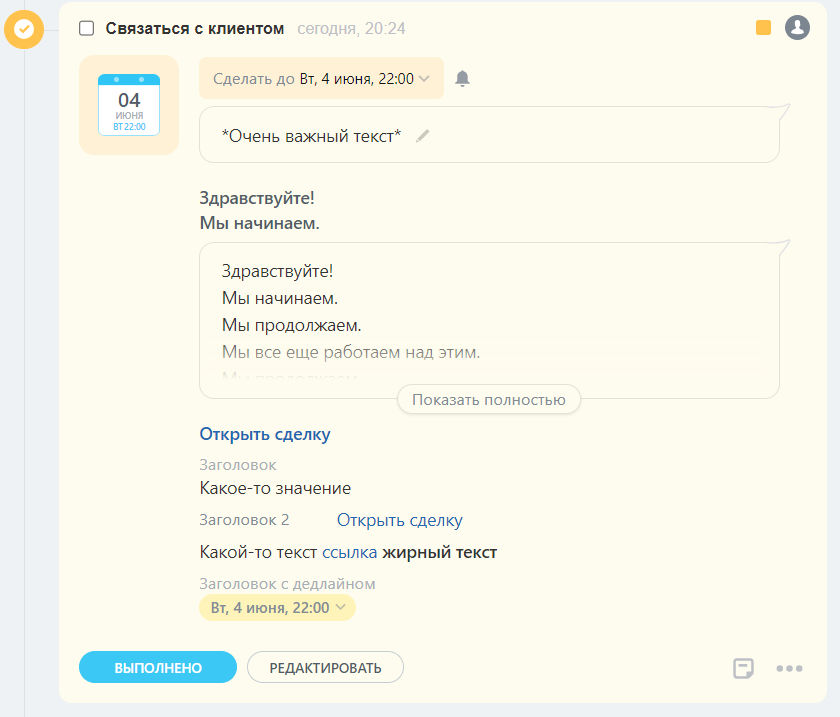

# Набор дополнительных контентных блоков

Структура `RestAppLayoutDto` описывает набор дополнительных контентных блоков для [записи таймлайна](../index.md).

## Параметры объекта `RestAppLayoutDto`



#|
|| **Название**
`тип` | **Описание** ||
|| **blocks***
[`ContentBlockDto`](./content-block.md) | Массив дополнительных контентных блоков ||
|#

На `blocks` действуют количественные ограничения:
- Минимальное количество — `1`
- Максимальное количество — `20`

## Пример объекта

```js
{
    "blocks": {
        "block_1": {
            "type": "text",
            "properties": {
                "value": "Здравствуйте!\nМы начинаем.",
                "multiline": true,
                "bold": true,
                "color": "base_90"
            }
        },
        "block_2": {
            "type": "largeText",
            "properties": {
                "value": "Здравствуйте!\nМы начинаем.\nМы продолжаем.\nМы все еще работаем над этим.\nМы продолжаем.\nМы близки к результату.\nДо свидания."
            }
        },
        "block_3": {
            "type": "link",
            "properties": {
                "text": "Открыть сделку",
                "action": {
                    "type": "redirect",
                    "uri": "/crm/deal/details/123/"
                },
                "bold": true
            }
        },
        "block_4": {
            "type": "withTitle",
            "properties": {
                "title": "Заголовок",
                "block": {
                    "type": "text",
                    "properties": {
                        "value": "Какое-то значение"
                    }
                }
            }
        },
        "block_5": {
            "type": "withTitle",
            "properties": {
                "title": "Заголовок 2",
                "block": {
                    "type": "link",
                    "properties": {
                        "text": "Открыть сделку",
                        "action": {
                            "type": "redirect",
                            "uri": "/crm/deal/details/123/"
                        }
                    }
                },
                "inline": true
            }
        },
        "block_6": {
            "type": "lineOfBlocks",
            "properties": {
                "blocks": {
                    "text": {
                        "type": "text",
                        "properties": {
                            "value": "Какой-то текст"
                        }
                    },
                    "link": {
                        "type": "link",
                        "properties": {
                            "text": "ссылка",
                            "action": {
                                "type": "redirect",
                                "uri": "/crm/deal/details/123/"
                            }
                        }
                    },
                    "boldText": {
                        "type": "text",
                        "properties": {
                            "value": "жирный текст",
                            "bold": true
                        }
                    }
                }
            }
        },
        "block_7": {
            "type": "withTitle",
            "properties": {
                "title": "Заголовок с дедлайном",
                "block": {
                    "type": "deadline",
                    "properties": {
                        "readonly": false
                    }
                }
            }
        }
    }
}
```



## Продолжите изучение

- [{#T}](./layout.md)
- [{#T}](./icon.md)
- [{#T}](./header.md)
- [{#T}](./body.md)
- [{#T}](./content-block.md)
- [{#T}](./footer.md)
- [{#T}](./menu-item.md)
- [{#T}](./action.md)
- [{#T}](./field-types.md)
- [{#T}](./examples.md)