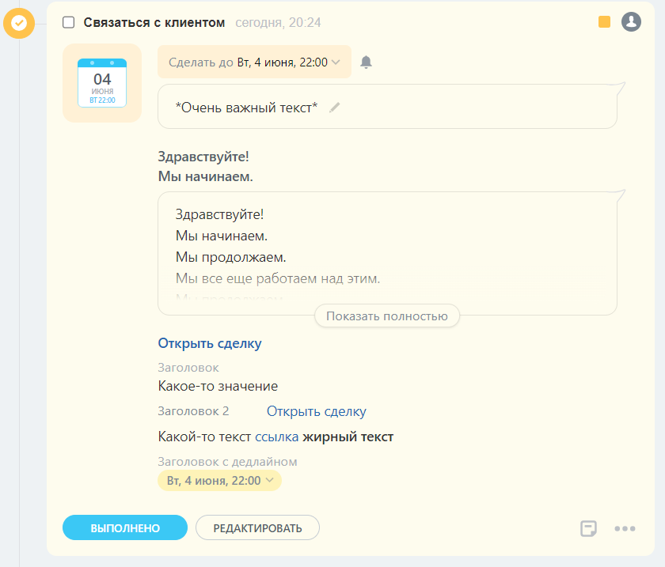

# Набор дополнительных контентных блоков



Выберите инструмент для разработки с AI-агентом:

- используйте [Битрикс24 Вайбкод](../../../../../../ai-tools/vibecode.md), чтобы создать приложение для Битрикс24 по описанию задачи без знания языков программирования. Агент напишет код и разместит приложение на сервере без ручной настройки хостинга
- используйте [MCP-сервер](../../../../../../ai-tools/mcp.md), чтобы разрабатывать интеграцию через REST API в своем проекте. Агент будет обращаться к официальной REST-документации



`RestAppLayoutDto` — набор дополнительных [контентных блоков](./content-block.md), которыми приложение дополняет чужую запись таймлайна.

Типовой сценарий: приложение доставки показывает номер накладной и ссылку на трек прямо в записи о звонке клиенту, а приложение телефонии добавляет к чужому делу ссылку на запись разговора. Собственная запись для этого не нужна — достаточно нескольких блоков в уже существующей. Если же приложение создает запись целиком и управляет ее иконкой, заголовком и кнопками, нужен [`LayoutDto`](./layout.md) и конфигурируемое дело.

Объект передают в параметре `layout`. Куда именно добавятся блоки, задают остальные параметры метода:

#|
|| **Метод** | **Что делает** | **Чем задают привязку** ||
|| [crm.activity.layout.blocks.set](../../layout-blocks/crm-activity-layout-blocks-set.md) | Добавляет блоки к делу CRM | `entityTypeId`, `entityId`, `activityId` ||
|| [crm.timeline.layout.blocks.set](../../../layout-blocks/crm-timeline-layout-blocks-set.md) | Добавляет блоки к записи таймлайна | `entityTypeId`, `entityId`, `timelineId` ||
|| [crm.activity.layout.blocks.get](../../layout-blocks/crm-activity-layout-blocks-get.md) | Возвращает набор, установленный в деле | `entityTypeId`, `entityId`, `activityId` ||
|| [crm.timeline.layout.blocks.get](../../../layout-blocks/crm-timeline-layout-blocks-get.md) | Возвращает набор, установленный в записи | `entityTypeId`, `entityId`, `timelineId` ||
|| [crm.activity.layout.blocks.delete](../../layout-blocks/crm-activity-layout-blocks-delete.md) | Удаляет набор из дела | `entityTypeId`, `entityId`, `activityId` ||
|| [crm.timeline.layout.blocks.delete](../../../layout-blocks/crm-timeline-layout-blocks-delete.md) | Удаляет набор из записи | `entityTypeId`, `entityId`, `timelineId` ||
|#

Блоки выводятся под основным содержимым записи. Если наборы установили несколько приложений, они показываются в порядке добавления.

> Scope: [`crm`](../../../../../scopes/permissions.md)
>
> Кто может выполнять метод: для `set` и `delete` — пользователь с доступом на изменение элемента CRM, к которому привязано дело или запись таймлайна, для `get` достаточно доступа на чтение



Методы, которые принимают `RestAppLayoutDto`, работают только в контексте [приложения](../../../../../../settings/app-installation/index.md). Вызов через входящий вебхук вернет ошибку `ERROR_WRONG_CONTEXT`.



## Параметры объекта `RestAppLayoutDto`



#|
|| **Поле** | **Описание** ||
|| **blocks^*^**
[`object`](../../../../../data-types.md) | Дополнительные контентные блоки: ключ — идентификатор блока, который приложение задает само, значение — объект [ContentBlockDto](./content-block.md) ||
|#

## Ограничения {#limits}

- Не более 20 блоков, иначе метод вернет ошибку `TOO_MANY_ITEMS`.
- Ключи блоков состоят только из латинских букв, цифр, дефиса и подчеркивания, иначе метод вернет ошибку `KEY_CONTAIN_WRONG_SYMBOLS`.
- Поле `blocks` обязательное: без него метод вернет ошибку `FIELD_IS_REQUIRED`. Пустой объект проверку пройдет, но набор блоков окажется пустым.
- Новый набор заменяет предыдущий целиком в рамках одного приложения, объединения по блокам не происходит.
- Набор нельзя установить в [конфигурируемое дело](../index.md), у которого внешний вид целиком задает `LayoutDto`, и в дело устаревшего типа. Для такого дела [crm.activity.layout.blocks.set](../../layout-blocks/crm-activity-layout-blocks-set.md) вернет ошибку `UNSUITABLE_ACTIVITY_TYPE_ERROR`, а для неподходящей записи таймлайна [crm.timeline.layout.blocks.set](../../../layout-blocks/crm-timeline-layout-blocks-set.md) вернет `UNAVAILABLE_TIMELINE_ITEM`.
- Заранее определить, подходит ли объект, нельзя — это показывает только пробный вызов.

## Пример объекта

Набор из семи блоков: текст, длинный текст, ссылка, две пары название-значение, строка из нескольких блоков и крайний срок.

```json
{
    "blocks": {
        "block_1": {
            "type": "text",
            "properties": {
                "value": "Здравствуйте!\nМы начинаем.",
                "multiline": true,
                "bold": true,
                "color": "base_90"
            }
        },
        "block_2": {
            "type": "largeText",
            "properties": {
                "value": "Здравствуйте!\nМы начинаем.\nМы продолжаем.\nМы все еще работаем над этим.\nМы продолжаем.\nМы близки к результату.\nДо свидания."
            }
        },
        "block_3": {
            "type": "link",
            "properties": {
                "text": "Открыть сделку",
                "action": {
                    "type": "redirect",
                    "uri": "/crm/deal/details/123/"
                },
                "bold": true
            }
        },
        "block_4": {
            "type": "withTitle",
            "properties": {
                "title": "Заголовок",
                "block": {
                    "type": "text",
                    "properties": {
                        "value": "Какое-то значение"
                    }
                }
            }
        },
        "block_5": {
            "type": "withTitle",
            "properties": {
                "title": "Заголовок 2",
                "block": {
                    "type": "link",
                    "properties": {
                        "text": "Открыть сделку",
                        "action": {
                            "type": "redirect",
                            "uri": "/crm/deal/details/123/"
                        }
                    }
                },
                "inline": true
            }
        },
        "block_6": {
            "type": "lineOfBlocks",
            "properties": {
                "blocks": {
                    "text": {
                        "type": "text",
                        "properties": {
                            "value": "Какой-то текст"
                        }
                    },
                    "link": {
                        "type": "link",
                        "properties": {
                            "text": "ссылка",
                            "action": {
                                "type": "redirect",
                                "uri": "/crm/deal/details/123/"
                            }
                        }
                    },
                    "boldText": {
                        "type": "text",
                        "properties": {
                            "value": "жирный текст",
                            "bold": true
                        }
                    }
                }
            }
        },
        "block_7": {
            "type": "withTitle",
            "properties": {
                "title": "Заголовок с дедлайном",
                "block": {
                    "type": "deadline",
                    "properties": {
                        "readonly": false
                    }
                }
            }
        }
    }
}
```



## Продолжите изучение

- [{#T}](../../layout-blocks/index.md)
- [{#T}](../../../layout-blocks/index.md)
- [{#T}](../../../layout-blocks/content-blocks-test-app.md)
- [{#T}](./layout.md)
- [{#T}](./icon.md)
- [{#T}](./header.md)
- [{#T}](./body.md)
- [{#T}](./content-block.md)
- [{#T}](./footer.md)
- [{#T}](./menu-item.md)
- [{#T}](./action.md)
- [{#T}](./field-types.md)
- [{#T}](./examples.md)
