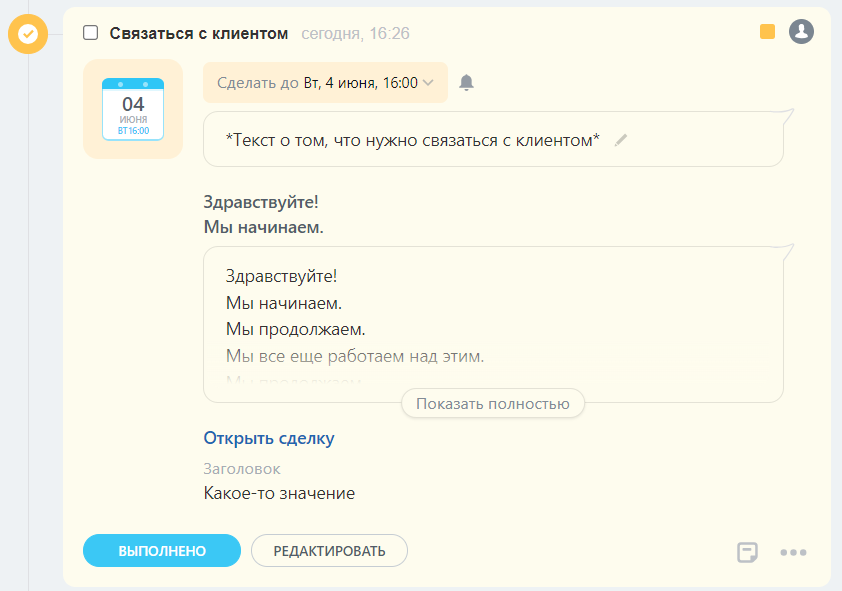

# Установить набор дополнительных контентных блоков в дело crm.activity.layout.blocks.set

> Scope: [`crm`](../../../../scopes/permissions.md)
>
> Кто может выполнять метод: администратор

Метод `crm.activity.layout.blocks.set` устанавливает набор дополнительных контентных блоков для дела.

Установка нового набора дополнительных контентных блоков в дело будет стирать ранее добавленный набор в рамках одного приложения.

Установка набора дополнительных контентных блоков не может быть применена к:
- [конфигурируемому делу](../configurable/index.md),
- делу, тип которого является устаревшим.

## Параметры метода



#|
|| **Название**
`тип` | **Описание** ||
|| **entityTypeId***
[`integer`](../../../../data-types.md) | Идентификатор типа объекта CRM, к которому привязано дело ||
|| **entityId***
[`integer`](../../../../data-types.md) | Идентификатор объекта CRM, к которому привязано дело ||
|| **activityId***
[`integer`](../../../../data-types.md) | Идентификатор дела ||
|| **layout***
[`RestAppLayoutDto`](../configurable/structure/rest-app-layout-dto.md) | Объект, описывающий набор дополнительных контентных блоков ||
|#

## Примеры кода

В дело с `id = 8`, привязанного к сделке с `id = 4` установим следующий набор дополнительных контентных блоков:

1. Текст
2. Длинный многострочный текст
3. Ссылка
4. Блок с заголовком





- cURL (Webhook)

    ```bash
    curl -X POST \
    -H "Content-Type: application/json" \
    -H "Accept: application/json" \
    -d '{"entityTypeId":2,"entityId":4,"activityId":8,"layout":{"blocks":{"block_1":{"type":"text","properties":{"value":"Здравствуйте!\nМы начинаем.","multiline":true,"bold":true,"color":"base_90"}},"block_2":{"type":"largeText","properties":{"value":"Здравствуйте!\nМы начинаем.\nМы продолжаем.\nМы все еще работаем над этим.\nМы продолжаем.\nМы близки к результату.\nДо свидания."}},"block_3":{"type":"link","properties":{"text":"Открыть сделку","bold":true,"action":{"type":"redirect","uri":"/crm/deal/details/123/"}}},"block_4":{"type":"withTitle","properties":{"title":"Заголовок","block":{"type":"text","properties":{"value":"Какое-то значение"}}}}}}' \
    https://**put_your_bitrix24_address**/rest/**put_your_user_id_here**/**put_your_webbhook_here**/crm.activity.layout.blocks.set
    ```

- cURL (OAuth)

    ```bash
    curl -X POST \
    -H "Content-Type: application/json" \
    -H "Accept: application/json" \
    -d '{"entityTypeId":2,"entityId":4,"activityId":8,"layout":{"blocks":{"block_1":{"type":"text","properties":{"value":"Здравствуйте!\nМы начинаем.","multiline":true,"bold":true,"color":"base_90"}},"block_2":{"type":"largeText","properties":{"value":"Здравствуйте!\nМы начинаем.\nМы продолжаем.\nМы все еще работаем над этим.\nМы продолжаем.\nМы близки к результату.\nДо свидания."}},"block_3":{"type":"link","properties":{"text":"Открыть сделку","bold":true,"action":{"type":"redirect","uri":"/crm/deal/details/123/"}}},"block_4":{"type":"withTitle","properties":{"title":"Заголовок","block":{"type":"text","properties":{"value":"Какое-то значение"}}}}}},"auth":"**put_access_token_here**"}' \
    https://**put_your_bitrix24_address**/rest/crm.activity.layout.blocks.set
    ```

- JS


    ```js
    try
    {
    	const response = await $b24.callMethod(
    		'crm.activity.layout.blocks.set',
    		{
    			entityTypeId: 2, // Сделка
    			entityId: 4,     // ID Сделки
    			activityId: 8,   // ID Дела привязанного к данной сделке
    			layout: layout,  // Объект, описывающий набор дополнительных контентных блоков
    		}
    	);
    	
    	const result = response.getData().result;
    	console.info(result);
    }
    catch( error )
    {
    	console.error(error);
    }
    ```

- PHP


    ```php
    try {
        $response = $b24Service
            ->core
            ->call(
                'crm.activity.layout.blocks.set',
                [
                    'entityTypeId' => 2, // Сделка
                    'entityId'     => 4, // ID Сделки
                    'activityId'   => 8, // ID Дела привязанного к данной сделке
                    'layout'       => [
                        'blocks' => [
                            'block_1' => [
                                'type'       => "text",
                                'properties' => [
                                    'value'     => "Здравствуйте!\nМы начинаем.",
                                    'multiline' => true,
                                    'bold'      => true,
                                    'color'     => "base_90",
                                ],
                            ],
                            'block_2' => [
                                'type'       => "largeText",
                                'properties' => [
                                    'value' => "Здравствуйте!\nМы начинаем.\nМы продолжаем.\nМы все еще работаем над этим.\nМы продолжаем.\nМы близки к результату.\nДо свидания.",
                                ],
                            ],
                            'block_3' => [
                                'type'       => "link",
                                'properties' => [
                                    'text'     => "Открыть сделку",
                                    'bold'     => true,
                                    'action'   => [
                                        'type' => "redirect",
                                        'uri'  => "/crm/deal/details/123/",
                                    ],
                                ],
                            ],
                            'block_4' => [
                                'type'       => "withTitle",
                                'properties' => [
                                    'title'  => "Заголовок",
                                    'block'  => [
                                        'type'       => "text",
                                        'properties' => [
                                            'value' => "Какое-то значение",
                                        ],
                                    ],
                                ],
                            ],
                        ],
                    ],
                ]
            );
    
        $result = $response
            ->getResponseData()
            ->getResult();
    
        echo 'Success: ' . print_r($result, true);
        
    } catch (Throwable $e) {
        error_log($e->getMessage());
        echo 'Error setting activity layout blocks: ' . $e->getMessage();
    }
    ```

- BX24.js

    ```js
    const layout = {
        blocks: {
            'block_1': {
                type: "text",
                properties: {
                    value: "Здравствуйте!\nМы начинаем.",
                    multiline: true,
                    bold: true,
                    color: "base_90"
                }
            },
            'block_2': {
                type: "largeText",
                properties: {
                    value: "Здравствуйте!\nМы начинаем.\nМы продолжаем.\nМы все еще работаем над этим.\nМы продолжаем.\nМы близки к результату.\nДо свидания."
                }
            },
            'block_3': {
                type: "link",
                properties: {
                    text: "Открыть сделку",
                    bold: true,
                    action: {
                        type: "redirect",
                        uri: "/crm/deal/details/123/"
                    }
                }
            },
            'block_4': {
                type: "withTitle",
                properties: {
                    title: "Заголовок",
                    block: {
                        type: "text",
                        properties: {
                            value: "Какое-то значение"
                        }
                    }
                }
            }
        }
    };
    BX24.callMethod(
        'crm.activity.layout.blocks.set',
        {
            entityTypeId: 2, // Сделка
            entityId: 4,     // ID Сделки
            activityId: 8,   // ID Дела привязанного к данной сделке
            layout: layout,  // Объект, описывающий набор дополнительных контентных блоков
        },
        (result) => {
            if (result.error()) {
                console.error(result.error());
            } else {
                console.info(result.data());
            }
        },
    );
    ```

- PHP CRest

    ```php
    require_once('crest.php');
    $result = CRest::call(
        'crm.activity.layout.blocks.set',
        [
            'entityTypeId' => 2,
            'entityId' => 4,
            'activityId' => 8,
            'layout' => [
                'blocks' => [
                    'block_1' => [
                        'type' => "text",
                        'properties' => [
                            'value' => "Здравствуйте!\nМы начинаем.",
                            'multiline' => true,
                            'bold' => true,
                            'color' => "base_90"
                        ]
                    ],
                    'block_2' => [
                        'type' => "largeText",
                        'properties' => [
                            'value' => "Здравствуйте!\nМы начинаем.\nМы продолжаем.\nМы все еще работаем над этим.\nМы продолжаем.\nМы близки к результату.\nДо свидания."
                        ]
                    ],
                    'block_3' => [
                        'type' => "link",
                        'properties' => [
                            'text' => "Открыть сделку",
                            'bold' => true,
                            'action' => [
                                'type' => "redirect",
                                'uri' => "/crm/deal/details/123/"
                            ]
                        ]
                    ],
                    'block_4' => [
                        'type' => "withTitle",
                        'properties' => [
                            'title' => "Заголовок",
                            'block' => [
                                'type' => "text",
                                'properties' => [
                                    'value' => "Какое-то значение"
                                ]
                            ]
                        ]
                    ]
                ]
            ]
        ]
    );
    echo '';
    print_r($result);
    echo '';
    ```



## Внешний вид

Результатом примера выше будет дело:



Если дело содержит более одного набора дополнительных контентных блоков, то они будут выводиться в порядке их добавления.

В html верстке с помощью data-атрибутов явно выделено то, каким приложением был добавлен набор дополнительных контентных блоков:
- `data-app-name`: название приложения,
- `data-rest-client-id`: идентификатор приложения.

## Обработка ответа

HTTP-статус: **200**

Возвращает `{ success: true }` в случае успешной записи набора дополнительных контентных блоков, иначе `null`.

```json
{
    "success": true
}
```

## Обработка ошибок

HTTP-статус: **400**

```json
{
    "error": "ERROR_WRONG_CONTEXT",
    "error_description": "Вызов метода возможен только в контексте rest приложения"
}
```



### Возможные коды ошибок

#|
|| **Код** | **Описание** ||
|| `ERROR_WRONG_CONTEXT` | Вызов метода возможен только в контексте rest приложения ||
|| `OWNER_NOT_FOUND` | Элемент, к которому привязано дело, не найден ||
|| `NOT_FOUND` | Дело не найдено ||
|| `ACCESS_DENIED` | Доступ запрещен ||
|| `UNSUITABLE_ACTIVITY_TYPE_ERROR` | Тип данного дела не подходит для добавления набора дополнительных контентных блоков ||
|| `FIELD_IS_REQUIRED` | Поле `blocks` в `RestAppLayoutDto` должно быть заполнено. ||
|#

Также метод отдает ошибки, связанные с неправильной структурой набора контентных блоков. Подробности можно узнать в тексте ошибки.



## Продолжите изучение 

- [{#T}](./index.md)
- [{#T}](./crm-activity-layout-blocks-get.md)
- [{#T}](./crm-activity-layout-blocks-delete.md)