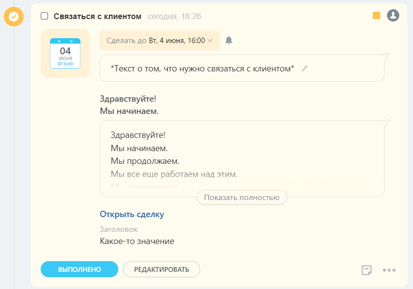

# Установить набор дополнительных контентных блоков в дело crm.activity.layout.blocks.set



Выберите инструмент для разработки с AI-агентом:

- используйте [Битрикс24 Вайбкод](../../../../../ai-tools/vibecode.md), чтобы создать приложение для Битрикс24 по описанию задачи без знания языков программирования. Агент напишет код и разместит приложение на сервере без ручной настройки хостинга
- используйте [MCP-сервер](../../../../../ai-tools/mcp.md), чтобы разрабатывать интеграцию через REST API в своем проекте. Агент будет обращаться к официальной REST-документации



> Scope: [`crm`](../../../../scopes/permissions.md)
>
> Кто может выполнять метод: любой пользователь с правом на изменение элемента CRM, к которому привязано дело

Метод `crm.activity.layout.blocks.set` устанавливает набор дополнительных контентных блоков в дело.

Метод работает только в контексте [приложения](../../../../../settings/app-installation/index.md): при вызове через вебхук он вернет ошибку `ERROR_WRONG_CONTEXT`. Приложение изменяет только тот набор блоков, который установило само. Повторный вызов заменяет этот набор целиком.

Метод работает только с делами. Чтобы установить набор блоков в комментарий или другую запись таймлайна, используйте [crm.timeline.layout.blocks.set](../../layout-blocks/crm-timeline-layout-blocks-set.md).

Набор блоков нельзя установить в [конфигурируемое дело](../configurable/index.md) и в дело устаревшего типа — такое дело таймлайн выводит не как конфигурируемую запись. В этих случаях метод вернет ошибку `UNSUITABLE_ACTIVITY_TYPE_ERROR`. Определить пригодность дела заранее по данным REST нельзя, проверить можно только пробным вызовом.

Если дело привязано сразу к нескольким элементам CRM, набор блоков остается один и выводится в таймлайне каждого связанного элемента. Связями управляют методы [crm.activity.binding.*](../binding/index.md).

Порядок вызова методов и общие правила работы с наборами блоков описаны в [обзоре раздела](./index.md).

## Параметры метода



#|
|| **Название**
`тип` | **Описание** ||
|| **entityTypeId***
[`integer`](../../../../data-types.md) | [Идентификатор типа объекта CRM](../../../data-types.md#object_type), к которому привязано дело, например `2` для сделки ||
|| **entityId***
[`integer`](../../../../data-types.md) | Идентификатор объекта CRM, к которому привязано дело, например идентификатор сделки ||
|| **activityId***
[`integer`](../../../../data-types.md) | Идентификатор дела. Возвращают методы [crm.activity.add](../activity-base/crm-activity-add.md) и [crm.activity.list](../activity-base/crm-activity-list.md) ||
|| **layout***
[`RestAppLayoutDto`](../configurable/structure/rest-app-layout-dto.md) | Объект, описывающий набор дополнительных контентных блоков [(подробное описание)](#layout) ||
|#

### Параметр layout {#layout}

#|
|| **Название**
`тип` | **Описание** ||
|| **blocks***
[`object`](../../../../data-types.md) | Ассоциативный массив [контентных блоков](../configurable/structure/content-block.md). Ключ — идентификатор блока, значение — описание блока ||
|#

Ограничения на `blocks`:

- поле `blocks` обязательно, иначе метод вернет ошибку `FIELD_IS_REQUIRED`
- в наборе может быть не больше 20 блоков, иначе метод вернет ошибку `TOO_MANY_ITEMS`
- ключ блока может содержать только латинские буквы, цифры, дефис и знак подчеркивания, иначе метод вернет ошибку `KEY_CONTAIN_WRONG_SYMBOLS`
- тип блока должен входить в список допустимых типов, иначе метод вернет ошибку `ENUM_FIELD`

Каждый блок описывается полями `type` и `properties`. Состав `properties` зависит от типа блока:

#|
|| **type** | **Что выводит** | **Обязательные поля `properties`** ||
|| `text` | Строку форматированного текста | `value` ||
|| `largeText` | Длинный текст, свернутый до превью | `value` ||
|| `link` | Ссылку с действием по нажатию | `text`, `action` ||
|| `deadline` | Крайний срок дела, который можно изменить прямо в блоке | Обязательных полей нет ||
|| `withTitle` | Пару заголовок — значение, где значение — вложенный блок типа `text`, `link` или `deadline` | `title`, `block` ||
|| `lineOfBlocks` | Несколько блоков типа `text`, `link` или `deadline` в одну строку | `blocks` ||
|#

Полный список полей каждого типа, включая необязательные, приведен в описании структуры [ContentBlockDto](../configurable/structure/content-block.md).

## Особенности отображения

Если разные приложения добавили в дело свои наборы дополнительных контентных блоков, наборы выводятся в порядке добавления.

В HTML-верстке data-атрибуты показывают, каким приложением добавлен набор дополнительных контентных блоков:

- `data-app-name` — название приложения
- `data-rest-client-id` — идентификатор приложения

## Примеры кода

Установить набор из четырех дополнительных контентных блоков в дело с `id = 8`, привязанное к сделке с `id = 4`:

1. текст
2. длинный многострочный текст
3. ссылка
4. блок с заголовком





- cURL (OAuth)

    ```bash
    curl -X POST \
    -H "Content-Type: application/json" \
    -H "Accept: application/json" \
    -d '{"entityTypeId":2,"entityId":4,"activityId":8,"layout":{"blocks":{"block_1":{"type":"text","properties":{"value":"Здравствуйте!\nМы начинаем.","multiline":true,"bold":true,"color":"base_90"}},"block_2":{"type":"largeText","properties":{"value":"Здравствуйте!\nМы начинаем.\nМы продолжаем.\nМы все еще работаем над этим.\nМы продолжаем.\nМы близки к результату.\nДо свидания."}},"block_3":{"type":"link","properties":{"text":"Открыть сделку","bold":true,"action":{"type":"redirect","uri":"/crm/deal/details/123/"}}},"block_4":{"type":"withTitle","properties":{"title":"Заголовок","block":{"type":"text","properties":{"value":"Какое-то значение"}}}}}},"auth":"**put_access_token_here**"}' \
    https://**put_your_bitrix24_address**/rest/crm.activity.layout.blocks.set
    ```

- JS (TS)

    ```ts
    // This snippet is an ES module: top-level await requires type="module" or a bundler.
    // $b24 is an already-initialized SDK instance (see the SDK "Get started" guide).
    import { Text } from '@bitrix24/b24jssdk'
    import type { B24Frame } from '@bitrix24/b24jssdk'

    declare const $b24: B24Frame

    // Shape of the payload returned in result (match the "response handling" section of the page)
    type SetLayoutBlocksResult = {
      success: boolean
    }

    try {
      const response = await $b24.actions.v2.call.make<SetLayoutBlocksResult>({
        method: 'crm.activity.layout.blocks.set',
        params: {
          entityTypeId: 2, // Deal
          entityId: 4,     // Deal ID
          activityId: 8,   // Activity ID linked to the deal
          layout: {
            blocks: {
              block_1: {
                type: 'text',
                properties: {
                  value: 'Hello!\nWe are starting.',
                  multiline: true,
                  bold: true,
                  color: 'base_90',
                },
              },
              block_2: {
                type: 'largeText',
                properties: {
                  value: 'Hello!\nWe are starting.\nWe are continuing.\nWe are still working on this.\nWe are continuing.\nWe are close to the result.\nGoodbye.',
                },
              },
              block_3: {
                type: 'link',
                properties: {
                  text: 'Open deal',
                  bold: true,
                  action: {
                    type: 'redirect',
                    uri: '/crm/deal/details/123/',
                  },
                },
              },
              block_4: {
                type: 'withTitle',
                properties: {
                  title: 'Header',
                  block: {
                    type: 'text',
                    properties: {
                      value: 'Some value',
                    },
                  },
                },
              },
            },
          },
        },
        requestId: Text.getUuidRfc4122()
      })

      // The payload is available only on a successful response
      if (!response.isSuccess) {
        console.error(response.getErrorMessages().join('; '))
      } else {
        const result = response.getData()!.result
        console.info('Layout blocks set successfully:', result.success)
      }
    } catch (error) {
      // Thrown on transport or SDK failures (AjaxError, SdkError, etc.)
      console.error(error)
    }
    ```

- JS (UMD)

    ```html
    <!-- Load the SDK (UMD build); it is exposed as the global B24Js -->
    <script src="https://unpkg.com/@bitrix24/b24jssdk@1/dist/umd/index.min.js"></script>
    <script>
      async function setActivityLayoutBlocks() {
        try {
          // Initialize the SDK inside a Bitrix24 frame
          const $b24 = await B24Js.initializeB24Frame()

          const response = await $b24.actions.v2.call.make({
            method: 'crm.activity.layout.blocks.set',
            params: {
              entityTypeId: 2, // Deal
              entityId: 4,     // Deal ID
              activityId: 8,   // Activity ID linked to the deal
              layout: {
                blocks: {
                  block_1: {
                    type: 'text',
                    properties: {
                      value: 'Hello!\nWe are starting.',
                      multiline: true,
                      bold: true,
                      color: 'base_90',
                    },
                  },
                  block_2: {
                    type: 'largeText',
                    properties: {
                      value: 'Hello!\nWe are starting.\nWe are continuing.\nWe are still working on this.\nWe are continuing.\nWe are close to the result.\nGoodbye.',
                    },
                  },
                  block_3: {
                    type: 'link',
                    properties: {
                      text: 'Open deal',
                      bold: true,
                      action: {
                        type: 'redirect',
                        uri: '/crm/deal/details/123/',
                      },
                    },
                  },
                  block_4: {
                    type: 'withTitle',
                    properties: {
                      title: 'Header',
                      block: {
                        type: 'text',
                        properties: {
                          value: 'Some value',
                        },
                      },
                    },
                  },
                },
              },
            },
            requestId: B24Js.Text.getUuidRfc4122()
          })

          // The payload is available only on a successful response
          if (!response.isSuccess) {
            console.error(response.getErrorMessages().join('; '))
            return
          }

          const result = response.getData().result
          console.info('Layout blocks set successfully:', result.success)
        } catch (error) {
          // Thrown on transport or SDK failures (AjaxError, SdkError, etc.)
          console.error(error)
        }
      }

      document.addEventListener('DOMContentLoaded', setActivityLayoutBlocks)
    </script>
    ```

- Python

    ```python
    from b24pysdk.errors import BitrixAPIError, BitrixSDKException
    try:
        bitrix_response = client.crm.activity.layout.blocks.set(entity_type_id=2, entity_id=4, activity_id=8, layout={
            "blocks": {
                "block_1": {
                    "type": "text",
                    "properties": {
                        "value": "Здравствуйте!\nМы начинаем.",
                        "multiline": True,
                        "bold": True,
                        "color": "base_90",
                    },
                },
                "block_2": {
                    "type": "largeText",
                    "properties": {
                        "value": "Здравствуйте!\nМы начинаем.\nМы продолжаем.\nМы все еще работаем над этим.\nМы продолжаем.\nМы близки к результату.\nДо свидания.",
                    },
                },
                "block_3": {
                    "type": "link",
                    "properties": {
                        "text": "Открыть сделку",
                        "bold": True,
                        "action": {
                            "type": "redirect",
                            "uri": "/crm/deal/details/123/",
                        },
                    },
                },
                "block_4": {
                    "type": "withTitle",
                    "properties": {
                        "title": "Заголовок",
                        "block": {
                            "type": "text",
                            "properties": {
                                "value": "Какое-то значение",
                            },
                        },
                    },
                },
            },
        }).response
        result = bitrix_response.result
        print(result)
    except BitrixAPIError as error:
        print('Ошибка Bitrix API', f'error: {error.error}', f'error_description: {error.error_description}', sep='\n')
    except BitrixSDKException as error:
        print(f"Ошибка Bitrix SDK: {error.message}")
    except Exception as error:
        print(f"Непредвиденная ошибка: {error}")
    ```

- PHP

    ```php
    try {
        $response = $b24Service
            ->core
            ->call(
                'crm.activity.layout.blocks.set',
                [
                    'entityTypeId' => 2, // Сделка
                    'entityId'     => 4, // ID Сделки
                    'activityId'   => 8, // ID Дела привязанного к данной сделке
                    'layout'       => [
                        'blocks' => [
                            'block_1' => [
                                'type'       => "text",
                                'properties' => [
                                    'value'     => "Здравствуйте!\nМы начинаем.",
                                    'multiline' => true,
                                    'bold'      => true,
                                    'color'     => "base_90",
                                ],
                            ],
                            'block_2' => [
                                'type'       => "largeText",
                                'properties' => [
                                    'value' => "Здравствуйте!\nМы начинаем.\nМы продолжаем.\nМы все еще работаем над этим.\nМы продолжаем.\nМы близки к результату.\nДо свидания.",
                                ],
                            ],
                            'block_3' => [
                                'type'       => "link",
                                'properties' => [
                                    'text'     => "Открыть сделку",
                                    'bold'     => true,
                                    'action'   => [
                                        'type' => "redirect",
                                        'uri'  => "/crm/deal/details/123/",
                                    ],
                                ],
                            ],
                            'block_4' => [
                                'type'       => "withTitle",
                                'properties' => [
                                    'title'  => "Заголовок",
                                    'block'  => [
                                        'type'       => "text",
                                        'properties' => [
                                            'value' => "Какое-то значение",
                                        ],
                                    ],
                                ],
                            ],
                        ],
                    ],
                ]
            );

        $result = $response
            ->getResponseData()
            ->getResult();

        echo 'Success: ' . print_r($result, true);

    } catch (Throwable $e) {
        error_log($e->getMessage());
        echo 'Error setting activity layout blocks: ' . $e->getMessage();
    }
    ```

- BX24.js

    ```js
    const layout = {
        blocks: {
            'block_1': {
                type: "text",
                properties: {
                    value: "Здравствуйте!\nМы начинаем.",
                    multiline: true,
                    bold: true,
                    color: "base_90"
                }
            },
            'block_2': {
                type: "largeText",
                properties: {
                    value: "Здравствуйте!\nМы начинаем.\nМы продолжаем.\nМы все еще работаем над этим.\nМы продолжаем.\nМы близки к результату.\nДо свидания."
                }
            },
            'block_3': {
                type: "link",
                properties: {
                    text: "Открыть сделку",
                    bold: true,
                    action: {
                        type: "redirect",
                        uri: "/crm/deal/details/123/"
                    }
                }
            },
            'block_4': {
                type: "withTitle",
                properties: {
                    title: "Заголовок",
                    block: {
                        type: "text",
                        properties: {
                            value: "Какое-то значение"
                        }
                    }
                }
            }
        }
    };
    BX24.callMethod(
        'crm.activity.layout.blocks.set',
        {
            entityTypeId: 2, // Сделка
            entityId: 4,     // ID Сделки
            activityId: 8,   // ID Дела привязанного к данной сделке
            layout: layout,  // Объект, описывающий набор дополнительных контентных блоков
        },
        (result) => {
            if (result.error()) {
                console.error(result.error());
            } else {
                console.info(result.data());
            }
        },
    );
    ```

- PHP CRest

    ```php
    require_once('crest.php');
    $result = CRest::call(
        'crm.activity.layout.blocks.set',
        [
            'entityTypeId' => 2,
            'entityId' => 4,
            'activityId' => 8,
            'layout' => [
                'blocks' => [
                    'block_1' => [
                        'type' => "text",
                        'properties' => [
                            'value' => "Здравствуйте!\nМы начинаем.",
                            'multiline' => true,
                            'bold' => true,
                            'color' => "base_90"
                        ]
                    ],
                    'block_2' => [
                        'type' => "largeText",
                        'properties' => [
                            'value' => "Здравствуйте!\nМы начинаем.\nМы продолжаем.\nМы все еще работаем над этим.\nМы продолжаем.\nМы близки к результату.\nДо свидания."
                        ]
                    ],
                    'block_3' => [
                        'type' => "link",
                        'properties' => [
                            'text' => "Открыть сделку",
                            'bold' => true,
                            'action' => [
                                'type' => "redirect",
                                'uri' => "/crm/deal/details/123/"
                            ]
                        ]
                    ],
                    'block_4' => [
                        'type' => "withTitle",
                        'properties' => [
                            'title' => "Заголовок",
                            'block' => [
                                'type' => "text",
                                'properties' => [
                                    'value' => "Какое-то значение"
                                ]
                            ]
                        ]
                    ]
                ]
            ]
        ]
    );
    echo '';
    print_r($result);
    echo '';
    ```

- Go

    ```go
    // client и ctx уже созданы — см. раздел «SDK для Go»
    res, err := client.Core().Call(ctx, "crm.activity.layout.blocks.set", b24.Params{
    	"entityTypeId": 2,
    	"entityId":     4,
    	"activityId":   8,
    	"layout": b24.Params{
    		"blocks": b24.Params{
    			"block_1": b24.Params{
    				"type": "text",
    				"properties": b24.Params{
    					"value":     "Здравствуйте!\nМы начинаем.",
    					"multiline": true,
    					"bold":      true,
    					"color":     "base_90",
    				},
    			},
    			"block_2": b24.Params{
    				"type": "largeText",
    				"properties": b24.Params{
    					"value": "Здравствуйте!\nМы начинаем.\nМы продолжаем.\nМы все еще работаем над этим.\nМы продолжаем.\nМы близки к результату.\nДо свидания.",
    				},
    			},
    			"block_3": b24.Params{
    				"type": "link",
    				"properties": b24.Params{
    					"text": "Открыть сделку",
    					"bold": true,
    					"action": b24.Params{
    						"type": "redirect",
    						"uri":  "/crm/deal/details/123/",
    					},
    				},
    			},
    			"block_4": b24.Params{
    				"type": "withTitle",
    				"properties": b24.Params{
    					"title": "Заголовок",
    					"block": b24.Params{
    						"type": "text",
    						"properties": b24.Params{
    							"value": "Какое-то значение",
    						},
    					},
    				},
    			},
    		},
    	},
    })
    if err != nil {
    	return fmt.Errorf("crm.activity.layout.blocks.set: %w", err)
    }

    // Ответ приходит как json.RawMessage — разберите его
    // в структуру под форму ответа, показанную ниже на этой странице.
    fmt.Printf("%s\n", res.Result)
    ```



## Обработка ответа

HTTP-статус: **200**

```json
{
    "result": {
        "success": true
    },
    "time": {
        "start": 1753341040.475739,
        "finish": 1753341040.582705,
        "duration": 0.10696601867675781,
        "processing": 0.04708504676818848,
        "date_start": "2025-07-24T17:57:20+00:00",
        "date_finish": "2025-07-24T17:57:20+00:00",
        "operating": 0
    }
}
```

### Возвращаемые данные

#|
|| **Название**
`тип` | **Описание** ||
|| **result**
[`object`](../../../../data-types.md) | Корневой элемент ответа [(подробное описание)](#result). Если набор блоков установить не удалось, метод возвращает не `result`, а объект `error` — смотрите раздел «Обработка ошибок» ||
|| **time**
[`time`](../../../../data-types.md#time) | Информация о времени выполнения запроса ||
|#

#### Объект result {#result}

#|
|| **Название**
`тип` | **Описание** ||
|| **success**
[`boolean`](../../../../data-types.md) | Результат установки набора дополнительных контентных блоков. Поле возвращается при успешном выполнении метода и имеет значение `true` ||
|#

Метод не возвращает в ответе сам установленный набор блоков. Чтобы прочитать сохраненный набор, вызовите [crm.activity.layout.blocks.get](./crm-activity-layout-blocks-get.md).

После вызова из примера выше дело выглядит так:



## Обработка ошибок

HTTP-статус: **400**

```json
{
    "error": "ERROR_WRONG_CONTEXT",
    "error_description": "Вызов метода возможен только в контексте rest приложения"
}
```



### Возможные коды ошибок

#|
|| **Код** | **Описание** ||
|| `ERROR_WRONG_CONTEXT` | Вызов метода возможен только в контексте rest приложения. Метод вызван через вебхук ||
|| `OWNER_NOT_FOUND` | Элемент, к которому привязано дело, не найден. Передан неизвестный `entityTypeId` или дело не привязано к элементу с указанным `entityId` ||
|| `NOT_FOUND` | Дело с указанным `activityId` не найдено ||
|| `ACCESS_DENIED` | У пользователя нет права на изменение элемента CRM, к которому привязано дело ||
|| `UNSUITABLE_ACTIVITY_TYPE_ERROR` | Тип дела не подходит для добавления набора дополнительных контентных блоков ||
|| `FIELD_IS_REQUIRED` | Не передано обязательное поле структуры: `blocks` в `RestAppLayoutDto` или поле `properties` блока, например `value` у блока типа `text` ||
|| `FIELD_IS_REDUNDANT` | В объекте структуры передано поле, которого нет в его описании ||
|| `TOO_MANY_ITEMS` | В `blocks` передано больше 20 блоков ||
|| `KEY_CONTAIN_WRONG_SYMBOLS` | Ключ блока в `blocks` содержит недопустимые символы ||
|| `WRONG_FIELD_VALUE` | Значение поля не соответствует ожидаемому типу, например блок передан не объектом ||
|| `ENUM_FIELD` | Поле `type` блока содержит значение вне списка допустимых типов ||
|#

Текст ошибки уточняет, какое поле и какой объект структуры ее вызвали.



## Продолжите изучение

- [{#T}](./index.md)
- [{#T}](./crm-activity-layout-blocks-get.md)
- [{#T}](./crm-activity-layout-blocks-delete.md)
- [{#T}](../configurable/structure/content-block.md)
- [{#T}](../../layout-blocks/content-blocks-test-app.md)
