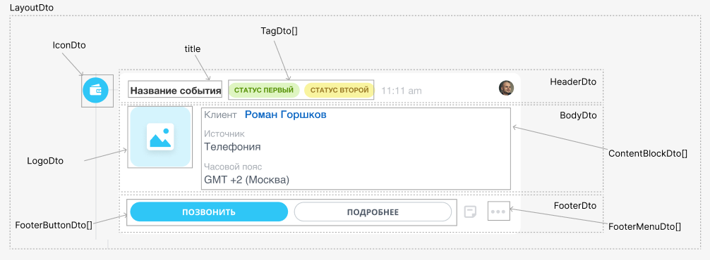

# Верхнеуровневый объект и Иконка



Тут может не хватать некоторых данных — дополним в ближайшее время







- нужны правки под стандарт написания
- верно ли указаны типы, отличные от стандартных?





## Верхнеуровневый объект

Верхнеуровневый объект `LayoutDto` записи таймлайна.



#|
|| **Поле** | **Описание** ||
|| **icon^*^**
[`IconDto`](#иконка) |  | Иконка слева от записи ||
|| **header^*^**
[HeaderDto](./header.md) |  | Заголовок записи ||
|| **body^*^**
[BodyDto](./body.md) |  | Основная контентная область записи ||
|| **footer**
[FooterDto](./footer.md) |  | Нижняя часть записи с блоком действий | ||
|#



### Пример

```json
{
    "icon": {
        "code": "call-completed"
    },
    "header": {
        "title": "Входящий звонок",
        "tags": {
            "status2": {
                "type": "warning",
                "title": "не расшифрован"
            }
        }
    },
    "body": {
        "logo": {
            "code": "call-incoming",
            "action": {
                "type": "redirect",
                "uri": "/crm/deal/details/123/"
            }
        },
        "blocks": {
            "client": {
                "type": "withTitle",
                "properties": {
                    "title": "Клиент",
                    "inline": true,
                    "block": {
                        "type": "text",
                        "properties": {
                            "value": "ООО Рога и Копыта"
                        }
                    }
                }
            },
            "responsible": {
                "type": "lineOfBlocks",
                "properties": {
                    "blocks": {
                        "client": {
                            "type": "link",
                            "properties": {
                                "text": "Сергей Востриков",
                                "bold": true,
                                "action": {
                                    "type": "redirect",
                                    "uri": "/crm/lead/details/789/"
                                }
                            }
                        },
                        "phone": {
                            "type": "text",
                            "properties": {
                                "value": "+7 999 888 7777"
                            }
                        }
                    }
                }
            }
        }
    },
    "footer": {
        "buttons": {
            "startCall": {
                "title": "О клиенте",
                "action": {
                    "type": "openRestApp",
                    "actionParams": {
                        "clientId": 456
                    }
                },
                "type": "primary"
            }
        },
        "menu": {
            "showPostponeItem": "false",
            "items": {
                "confirm": {
                    "title": "Подтвердить заявку",
                    "action": {
                        "type": "restEvent",
                        "id": "confirm",
                        "animationType": "loader"
                    }
                },
                "decline": {
                    "title": "Отклонить заявку",
                    "action": {
                        "type": "restEvent",
                        "id": "decline",
                        "animationType": "loader"
                    }
                }
            }
        }
    }
}
```

## Иконка

Иконка `IconDto` записи таймлайна

#|
|| **Поле** | **Описание** | **Дополнительно** ||
|| **code^*^**
[`string`](../../../../data-types.md) | Код иконки | Список доступных кодов можно получить методом [crm.timeline.icon.list](.) ||
|#

