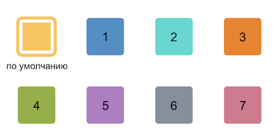

# Добавить универсальное дело crm.activity.todo.add

> Scope: [`crm`](../../../../scopes/permissions.md)
>
> Кто может выполнять метод: пользователь с правом на редактирование элемента CRM, для которого дабавляется дело

Метод `crm.activity.todo.add` добавляет универсальное дело в таймлайн. 

## Параметры метода



#|
|| **Название**
`тип` | **Описание** ||
|| **ownerTypeId***
[`integer`](../../../../data-types.md) | [Идентификатор типа объекта CRM](../../../data-types.md#object_type), к которому привязано дело, например `2` для сделки ||
|| **ownerId***
[`integer`](../../../../data-types.md) | Идентификатор элемента CRM, к которому привязано дело, например, `1` ||
|| **deadline***
[`datetime`](../../../../data-types.md) | Крайний срок дела, например  `2025-02-03T15:00:00` ||
|| **title**
[`string`](../../../../data-types.md) | Название дела, по умолчанию пустая строка ||
|| **description**
[`string`](../../../../data-types.md) | Описание дела, по умолчанию пустая строка ||
|| **responsibleId**
[`integer`](../../../../data-types.md) | Идентификатор пользователя, ответственного за дело, например `1` ||
|| **parentActivityId**
[`integer`](../../../../data-types.md) | Идентификатор дела в таймлайне, с которым можно связать создаваемое дело, например `888` ||
|| **pingOffsets**
[`array`](../../../../data-types.md) | Массив, который содержит целочисленные значения в минутах, позволяющие настроить время напоминания о деле. Например `[0, 15]` означает, что будет создано 2 напоминания, которые придут за 15 минут до крайнего срока и в момент, когда крайний срок наступит. По умолчанию пустой массив, без напоминаний ||
|| **colorId**
[`string`](../../../../data-types.md) | Идентификатор цвета дела в таймлайне, например `1`. Для выбора доступно 8 цветов, значения от 1 до 7 и цвет по умолчанию, если ничего не указано:



||
|#

## Примеры кода





- cURL (Webhook)

    ```bash
    curl -X POST \
    -H "Content-Type: application/json" \
    -H "Accept: application/json" \
    -d '{"ownerTypeId":2,"ownerId":1,"deadline":"'"$(date -Iseconds)"'","title":"Заголовок дела","description":"Описание дела","responsibleId":5,"pingOffsets":[0,15],"colorId":"2"}' \
    https://**put_your_bitrix24_address**/rest/**put_your_user_id_here**/**put_your_webbhook_here**/crm.activity.todo.add
    ```

- cURL (OAuth)

    ```bash
    curl -X POST \
    -H "Content-Type: application/json" \
    -H "Accept: application/json" \
    -d '{"ownerTypeId":2,"ownerId":1,"deadline":"'"$(date -Iseconds)"'","title":"Заголовок дела","description":"Описание дела","responsibleId":5,"pingOffsets":[0,15],"colorId":"2","auth":"**put_access_token_here**"}' \
    https://**put_your_bitrix24_address**/rest/crm.activity.todo.add
    ```

- JS


    ```js
    try
    {
    	const response = await $b24.callMethod(
    		'crm.activity.todo.add',
    		{
    			ownerTypeId: 2,
    			ownerId: 1,
    			deadline: (new Date()),
    			title: 'Заголовок дела',
    			description: 'Описание дела',
    			responsibleId: 5,
    			pingOffsets: [0, 15],
    			colorId: '2'
    		}
    	);
    	
    	const result = response.getData().result;
    	if (result.error())
    	{
    		console.error(result.error());
    	}
    	else
    	{
    		console.dir(result);
    	}
    }
    catch( error )
    {
    	console.error('Error:', error);
    }
    ```

- PHP


    ```php
    try {
        $response = $b24Service
            ->core
            ->call(
                'crm.activity.todo.add',
                [
                    'ownerTypeId'   => 2,
                    'ownerId'       => 1,
                    'deadline'      => (new DateTime()),
                    'title'         => 'Заголовок дела',
                    'description'   => 'Описание дела',
                    'responsibleId' => 5,
                    'pingOffsets'   => [0, 15],
                    'colorId'       => '2'
                ]
            );
    
        $result = $response
            ->getResponseData()
            ->getResult();
    
        echo 'Success: ' . print_r($result, true);
        // Нужная вам логика обработки данных
        processData($result);
    
    } catch (Throwable $e) {
        error_log($e->getMessage());
        echo 'Error adding todo activity: ' . $e->getMessage();
    }
    ```

- BX24.js

    ```js
    BX24.callMethod(
        "crm.activity.todo.add",
        {
            ownerTypeId: 2,
            ownerId: 1,
            deadline: (new Date()),
            title: 'Заголовок дела',
            description: 'Описание дела',
            responsibleId: 5,
            pingOffsets: [0, 15],
            colorId: '2'
        }, 
        result => {
            if (result.error())
                console.error(result.error());
            else
                console.dir(result.data());
        }
    );
    ```

- PHP CRest

    ```php
    require_once('crest.php');

    $result = CRest::call(
        'crm.activity.todo.add',
        [
            'ownerTypeId' => 2,
            'ownerId' => 1,
            'deadline' => date('c'), // Текущие дата и время в формате ISO 8601
            'title' => 'Заголовок дела',
            'description' => 'Описание дела',
            'responsibleId' => 5,
            'pingOffsets' => [0, 15],
            'colorId' => '2'
        ]
    );

    echo '<PRE>';
    print_r($result);
    echo '</PRE>';
    ```



## Обработка ответа

HTTP-статус: **200**

```json
{
    "result": {
        "id": 999
    },
    "time": {
       "start": 1724068028.331234,
        "finish": 1724068028.726591,
        "duration": 0.3953571319580078,
        "processing": 0.13033390045166016,
        "date_start": "2025-01-21T13:47:08+02:00",
        "date_finish": "2025-01-21T13:47:08+02:00",
        "operating": 0
    }
}
```

### Возвращаемые данные

#|
|| **Название**
`тип` | **Описание** ||
|| **result**
[`object`](../../../../data-types.md) | В случае успеха возвращает объект, содержащий идентификатор добавленного дела `id`, в случае ошибки = `null` ||
|| **time**
[`time`](../../../../data-types.md#time) | Информация о времени выполнения запроса ||
|#

## Обработка ошибок

HTTP-статус: **400**

```json
{
    "error": "NOT_FOUND",
    "error_description": "Not found."
}
```



### Возможные коды ошибок

#|
|| **Код** | **Описание** ||
|| `100` | Не переданы обязательные поля ||
|| `NOT_FOUND` | Элемент CRM не найден ||
|| `ACCESS_DENIED` | Недостаточно прав для выполнения операции ||
|| `OWNER_NOT_FOUND` | Владелец элемента не найден ||
|| `WRONG_DATETIME_FORMAT` | Некорректный формат даты ||
|#



## Продолжите изучение

- [{#T}](./crm-activity-todo-update.md)
- [{#T}](./crm-activity-todo-update-deadline.md)
- [{#T}](./crm-activity-todo-update-description.md)
- [{#T}](./crm-activity-todo-update-color.md)
- [{#T}](./crm-activity-todo-update-responsible-user.md)
- [{#T}](../../../../../tutorials/crm/how-to-add-crm-objects/how-to-add-objects-with-crm-mode.md)
