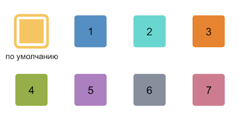

# Обновить цвет универсального дела crm.activity.todo.updateColor

> Scope: [`crm`](../../../../scopes/permissions.md)
>
> Кто может выполнять метод: `любой пользователь с правом на редактирование элемента CRM, для которого обновляется дело`

Метод обновляет цвет универсального дела.

## Параметры метода



#|
|| **Название**
`тип` | **Описание** ||
|| **id***
[`integer`](../../../../data-types.md) | Целочисленный идентификатор обновляемого дела, например  `999` ||
|| **ownerTypeId***
[`integer`](../../../../data-types.md) | [Целочисленный идентификатор типа сущности CRM](../../../data-types.md#object_type), к которому привязано дело (например, `2` для сделки) ||
|| **ownerId***
[`integer`](../../../../data-types.md) | Целочисленный идентификатор элемента CRM, к которому привязано дело (например, `1`) ||
|| **colorId***
[`integer`](../../../../data-types.md) | Целочисленный идентификатор цвета дела в таймлайне, например `1`. Для выбора доступно 8 цветов, значения от 1 до 7 и цвет по умолчанию, если ничего не указано:



||
|#

## Примеры кода





- cURL (Webhook)

    ```bash
    ```

- cURL (OAuth)

    ```bash

    ```

- JS

    ```js
    BX24.callMethod(
        "crm.activity.todo.updateColor",
        {
            id: 999,
            ownerTypeId: 2,
            ownerId: 1,
            colorId: 3
        }, result => {
            if (result.error())
                console.error(result.error());
            else
                console.dir(result.data());
        }
    );
    ```

- PHP

    ```php
    require_once('crest.php');

    ```



## Обработка ответа

HTTP-статус: **200**

```json
{
    "result": {
        "id": 999
    },
    "time": {
       "start": 1724068028.331234,
        "finish": 1724068028.726591,
        "duration": 0.3953571319580078,
        "processing": 0.13033390045166016,
        "date_start": "2025-01-21T13:47:08+02:00",
        "date_finish": "2025-01-21T13:47:08+02:00",
        "operating": 0
    }
}
```

### Возвращаемые данные

#|
|| **Название**
`тип` | **Описание** ||
|| **result**
[`object`](../../../../data-types.md) | В случае успеха возвращает объект, содержащий целочисленный идентификатор обновлённого дела `id`, в случае ошибки = `null` ||
|| **time**
[`time`](../../../../data-types.md) | Информация о времени выполнения запроса ||
|#

## Обработка ошибок

HTTP-статус: **400**

```json
{
    "error": "NOT_FOUND",
    "error_description": "Not found."
}
```



### Возможные коды ошибок

#|
|| **Код** | **Описание** ||
|| `100` | Не переданы обязательные поля ||
|| `NOT_FOUND` | Элемент CRM не найден ||
|| `ACCESS_DENIED` | Недостаточно прав для выполнения операции ||
|| `OWNER_NOT_FOUND` | Владелец элемента не найден ||
|| `CAN_NOT_UPDATE_COLOR_COMPLETED_TODO` |Невозможно изменить цвет в закрытом деле ||
|| `CAN_NOT_UPDATE_WRONG_COLOR_TODO` | Некорректное значение цвета ||
|#



## Продолжите изучение

- [{#T}](./crm-activity-todo-add.md)
- [{#T}](./crm-activity-todo-update.md)
- [{#T}](./crm-activity-todo-update-deadline.md)
- [{#T}](./crm-activity-todo-update-description.md)
- [{#T}](./crm-activity-todo-update-responsible-user.md)
