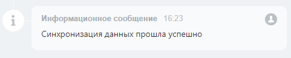

# Журнал лог-записей

Журнал лог-записей — особый вид записей таймлайна. Они содержат менее важные данные, чем остальные записи таймлайна, и отличаются серым приглушенным фоном, привлекая меньше внимания.

> Scope: [`crm`](../../../scopes/permissions.md)
>
> Кто может выполнять метод: `зависит от метода`

Список методов для управления журналом лог-записей.



Важно: методы [`crm.timeline.logmessage.get`](./crm-timeline-logmessage-get.md) и [`crm.timeline.logmessage.list`](./crm-timeline-logmessage-list.md) возвращают только записи, ранее созданные с помощью [`crm.timeline.logmessage.add`](./crm-timeline-logmessage-add.md). Системные записи с помощью этих методов получить невозможно.



#|
|| **Метод** | **Описание** ||
|| [crm.timeline.logmessage.add](./crm-timeline-logmessage-add.md) | Добавляет новую лог-запись в таймлайн ||
|| [crm.timeline.logmessage.get](./crm-timeline-logmessage-get.md) | Получает информацию о лог-записи ||
|| [crm.timeline.logmessage.list](./crm-timeline-logmessage-list.md) | Получает список всех лог-записей для определенного элемента ||
|| [crm.timeline.logmessage.delete](./crm-timeline-logmessage-delete.md) | Удаляет лог-запись ||
|| [crm.timeline.icon.*](./icons/index.md) | Методы для работы с иконками записей ||
|| [crm.timeline.logo.*](./logo/index.md) | Методы для работы с логотипами записей ||
|#
