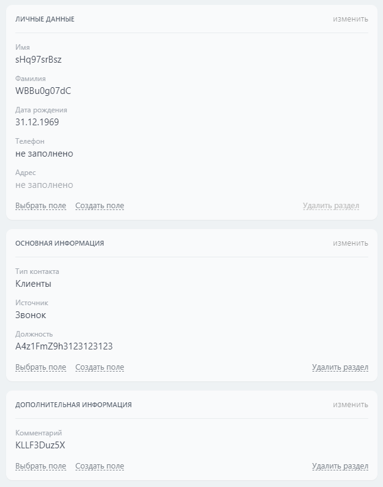

# Установить параметры карточки элементов crm.item.details.configuration.set

> Название метода: **crm.item.details.configuration.set**
>
> Scope: [`crm`](../../../scopes/permissions.md)
>
> Кто может выполнять метод: проверка прав при выполнении метода зависит от переданных данных:
>   - Любой пользователь имеет право установить свои личные настройки
>   - Пользователь имеет право устанавливать общие и чужие настройки только если он является администратором


Метод устанавливает настройки карточки определенного объекта CRM. Записывает личные настройки карточки указанного пользователя или общие настройки для всех пользователей.



## Параметры метода



#|
|| **Название**
`тип` | **Описание** ||
|| **entityTypeId***
[`integer`][1] | Идентификатор [системного](./../../index.md) или [пользовательского типа](./../user-defined-object-types/index.md) объектов CRM ||
|| **data***
[`section[]`](#section)| Список `section` описывающий конфигурацию разделов полей в карточке элемента. Структура `section` описана ниже ||
|| **userId**
[`user`][1] | Идентификатор пользователя, для которого вы хотите установить конфигурацию.

Если параметр не передан, то будет взят `userId` пользователя, вызывающего этот метод.

Нужен только при запросе личных настроек
||
|| **scope**
[`string`][1] | Область применения настроек. Допустимые значения:
- `'P'` — личные настройки
- `'C'` — общие настройки

По умолчанию значение равно `'P'`

||
|| **extras**
[`object`][1] | Дополнительные параметры. Возможные значения и их структура описана [ниже](#extras) ||
|#

### section

Описывает отдельно взятый раздел с полями внутри карточки элемента.



#|
|| **Название**
`тип` | **Описание** ||
|| **name***
[`string`][1] | Уникальное название раздела ||
|| **title***
[`string`][1] | Название раздела. Отображается в карточке элемента ||
|| **type***
[`string`][1] | Тип раздела. 

На данный момент доступно только значение `'section'` ||
|| **elements**
[`section_element[]`](#section_element) | Массив `section_element`, описывающий конфигурацию полей в разделе ||
|#

#### section_element

Конфигурация отдельно взятого поля внутри раздела.



#|
|| **Название**
`тип` | **Описание** ||
|| **name***
[`string`][1] | Идентификатор поля. Список доступных полей можно узнать с помощью [`crm.item.fields`](../crm-item-fields.md) ||
|| **optionFlags**
[`integer`][1] | Нужно ли показывать поле всегда:
- `1` — да
- `0` — нет

По умолчанию значение равно `0` ||
|| **options**
[`object`][1] | Дополнительный [список опций](#section_elementoptions) для поля ||
|#

#### section_element.options

#|
|| **Название**
`тип` | **Поля, где доступна опция** | **Описание** | **По умолчанию** ||
|| **defaultAddressType**
[`integer`][1] | `ADDRESS` | Идентификатор типа адреса по умолчанию. Чтобы узнать возможные типы адресов, используйте [`crm.enum.addresstype`][2] | `Вычисляемое` ||
|| **defaultCountry** 
[`string`][1] | `PHONE`
`CLIENT`
`COMPANY`
`CONTACT`
`MYCOMPANY_ID` | Код страны для формата телефонного номера по умолчанию — строка из двух латинских букв. Например `"RU"`              | `Вычисляемое` ||
|| **isPayButtonVisible**
[`boolean`][1] | `OPPORTUNITY_WITH_CURRENCY` | Показана ли кнопка принятия оплаты.

Возможные значения:
- `'true'` — показана
- `'false'` — скрыта 
| `'true'` ||
|| **isPaymentDocumentsVisible**
[`boolean`][1] | `OPPORTUNITY_WITH_CURRENCY` | Показан ли блок «Оплата и доставка».

Возможные значения: 
- `'true'` — показан
- `'false'` — скрыт 
| `'true'` ||
|#

### extras

Параметр в `extras` зависит от объекта CRM.

#|
|| **Объект CRM** | **Название** | **Описание** ||
|| **Смарт-процесс** | `categoryId` | Идентификатор воронки смарт-процессов. Можно получить с помощью [`crm.category.list`](./../category/crm-category-list.md).

Если не указано, то берется идентификатор воронки по умолчанию для данного смарт-процесса ||
|| **Сделка** | `dealCategoryId` | Идентификатор воронки сделок. Можно получить с помощью [`crm.category.list`](./../category/crm-category-list.md).

Если не указан, то берется идентификатор воронки по умолчанию для сделок ||
|| **Лид** | `leadCustomerType` | Тип лидов. 

озможные значения:
- `1` — простые лиды
- `2` — повторные лиды
||
|#

## Примеры кода



Для пользователя с `id = 1` в контактах установить следующую конфигурацию карточки элементов

- Раздел 1 - **Личные данные**
    - **Имя**
        - Показывать всегда
    - **Фамилия**
        - Показывать всегда
    - **Отчество**
    - **Дата рождения**
    - **Телефон**
        - Показывать всегда
        - Страна по умолчанию: **Великобритания(+44)**
    - **Адрес**
        - Показывать всегда
        - Тип адреса по умолчанию: **Адрес регистрации** (см. [`crm.enum.addresstype`][2])
- Раздел 2 - **Основная информация**
    - **Тип контакта**
    - **Источник**
    - **Должность**
- Раздел 3 - **Дополнительная информация**
    - **Фотография**
    - **Комментарий**
    - **Пользовательское поле #1**



- cURL (Webhook)

    ```bash
    curl -X POST \
    -H "Content-Type: application/json" \
    -H "Accept: application/json" \
    -d '{"entityTypeId":3,"userId":1,"data":[{"name":"section_1","title":"Личные данные","type":"section","elements":[{"name":"NAME","optionFlags":1},{"name":"LAST_NAME","optionFlags":1},{"name":"SECOND_NAME"},{"name":"BIRTHDATE"},{"name":"PHONE","optionFlags":1,"options":{"defaultCountry":"GB"}},{"name":"ADDRESS","optionFlags":1,"options":{"defaultAddressType":4}}]},{"name":"section_2","title":"Основная информация","type":"section","elements":[{"name":"TYPE_ID"},{"name":"SOURCE_ID"},{"name":"POST"}]},{"name":"section_3","title":"Дополнительная информация","type":"section","elements":[{"name":"PHOTO"},{"name":"COMMENTS"},{"name":"UF_CRM_1720697698689"}]}]}' \
    https://**put_your_bitrix24_address**/rest/**put_your_user_id_here**/**put_your_webbhook_here**/crm.item.details.configuration.set
    ```

- cURL (OAuth)

    ```bash
    curl -X POST \
    -H "Content-Type: application/json" \
    -H "Accept: application/json" \
    -d '{"entityTypeId":3,"userId":1,"data":[{"name":"section_1","title":"Личные данные","type":"section","elements":[{"name":"NAME","optionFlags":1},{"name":"LAST_NAME","optionFlags":1},{"name":"SECOND_NAME"},{"name":"BIRTHDATE"},{"name":"PHONE","optionFlags":1,"options":{"defaultCountry":"GB"}},{"name":"ADDRESS","optionFlags":1,"options":{"defaultAddressType":4}}]},{"name":"section_2","title":"Основная информация","type":"section","elements":[{"name":"TYPE_ID"},{"name":"SOURCE_ID"},{"name":"POST"}]},{"name":"section_3","title":"Дополнительная информация","type":"section","elements":[{"name":"PHOTO"},{"name":"COMMENTS"},{"name":"UF_CRM_1720697698689"}]}],"auth":"**put_access_token_here**"}' \
    https://**put_your_bitrix24_address**/rest/crm.item.details.configuration.set
    ```

- JS


    ```js
    try
    {
    	const response = await $b24.callMethod(
    		'crm.item.details.configuration.set',
    		{
    			entityTypeId: 3,
    			userId: 1,
    			data: [
    				{
    					name: "section_1",
    					title: "Личные данные",
    					type: "section",
    					elements: [
    						{
    							name: "NAME",
    							optionFlags: 1,
    						},
    						{
    							name: "LAST_NAME",
    							optionFlags: 1,
    						},
    						{
    							name: "SECOND_NAME",
    						},
    						{
    							name: "BIRTHDATE",
    						},
    						{
    							name: "PHONE",
    							optionFlags: 1,
    							options: {
    								defaultCountry: "GB",
    							},
    						},
    						{
    							name: "ADDRESS",
    							optionFlags: 1,
    							options: {
    								defaultAddressType: 4,
    							},
    						},
    					],
    				},
    				{
    					name: "section_2",
    					title: "Основная информация",
    					type: "section",
    					elements: [
    						{ name: "TYPE_ID" },
    						{ name: "SOURCE_ID" },
    						{ name: "POST" },
    					],
    				},
    				{
    					name: "section_3",
    					title: "Дополнительная информация",
    					type: "section",
    					elements: [
    						{ name: "PHOTO" },
    						{ name: "COMMENTS" },
    						{ name: "UF_CRM_1720697698689" },
    					],
    				},
    			],
    		}
    	);
    	
    	const result = response.getData().result;
    	console.info(result);
    }
    catch( error )
    {
    	console.error(error);
    }
    ```

- PHP


    ```php
    try {
        $response = $b24Service
            ->core
            ->call(
                'crm.item.details.configuration.set',
                [
                    'entityTypeId' => 3,
                    'userId'       => 1,
                    'data'         => [
                        [
                            'name'     => "section_1",
                            'title'    => "Личные данные",
                            'type'     => "section",
                            'elements' => [
                                [
                                    'name'        => "NAME",
                                    'optionFlags' => 1,
                                ],
                                [
                                    'name'        => "LAST_NAME",
                                    'optionFlags' => 1,
                                ],
                                [
                                    'name' => "SECOND_NAME",
                                ],
                                [
                                    'name' => "BIRTHDATE",
                                ],
                                [
                                    'name'     => "PHONE",
                                    'optionFlags' => 1,
                                    'options'  => [
                                        'defaultCountry' => "GB",
                                    ],
                                ],
                                [
                                    'name'     => "ADDRESS",
                                    'optionFlags' => 1,
                                    'options'  => [
                                        'defaultAddressType' => 4,
                                    ],
                                ],
                            ],
                        ],
                        [
                            'name'     => "section_2",
                            'title'    => "Основная информация",
                            'type'     => "section",
                            'elements' => [
                                ['name' => "TYPE_ID"],
                                ['name' => "SOURCE_ID"],
                                ['name' => "POST"],
                            ],
                        ],
                        [
                            'name'     => "section_3",
                            'title'    => "Дополнительная информация",
                            'type'     => "section",
                            'elements' => [
                                ['name' => "PHOTO"],
                                ['name' => "COMMENTS"],
                                ['name' => "UF_CRM_1720697698689"],
                            ],
                        ],
                    ],
                ]
            );
    
        $result = $response
            ->getResponseData()
            ->getResult();
    
        echo 'Success: ' . print_r($result, true);
    
    } catch (Throwable $e) {
        error_log($e->getMessage());
        echo 'Error setting details configuration: ' . $e->getMessage();
    }
    ```

- BX24.js

    ```javascript
        BX24.callMethod(
            'crm.item.details.configuration.set',
            {
                entityTypeId: 3,
                userId: 1,
                data: [
                    {
                        name: "section_1",
                        title: "Личные данные",
                        type: "section",
                        elements: [
                            {
                                name: "NAME",
                                optionFlags: 1,
                            },
                            {
                                name: "LAST_NAME",
                                optionFlags: 1,
                            },
                            {
                                name: "SECOND_NAME",
                            },
                            {
                                name: "BIRTHDATE",
                            },
                            {
                                name: "PHONE",
                                optionFlags: 1,
                                options: {
                                    defaultCountry: "GB",
                                },
                            },
                            {
                                name: "ADDRESS",
                                optionFlags: 1,
                                options: {
                                    defaultAddressType: 4,
                                },
                            },
                        ],
                    },
                    {
                        name: "section_2",
                        title: "Основная информация",
                        type: "section",
                        elements: [
                            { name: "TYPE_ID" },
                            { name: "SOURCE_ID" },
                            { name: "POST" },
                        ],
                    },
                    {
                        name: "section_3",
                        title: "Дополнительная информация",
                        type: "section",
                        elements: [
                            { name: "PHOTO" },
                            { name: "COMMENTS" },
                            { name: "UF_CRM_1720697698689" },
                        ],
                    },
                ],
            },
            (result) => {
                if (result.error())
                {
                    console.error(result.error());

                    return;
                }

                console.info(result.data());
            },
        );
    ```

- PHP CRest

    ```php
    require_once('crest.php');

    $result = CRest::call(
        'crm.item.details.configuration.set',
        [
            'entityTypeId' => 3,
            'userId' => 1,
            'data' => [
                [
                    'name' => "section_1",
                    'title' => "Личные данные",
                    'type' => "section",
                    'elements' => [
                        [
                            'name' => "NAME",
                            'optionFlags' => 1,
                        ],
                        [
                            'name' => "LAST_NAME",
                            'optionFlags' => 1,
                        ],
                        [
                            'name' => "SECOND_NAME",
                        ],
                        [
                            'name' => "BIRTHDATE",
                        ],
                        [
                            'name' => "PHONE",
                            'optionFlags' => 1,
                            'options' => [
                                'defaultCountry' => "GB",
                            ],
                        ],
                        [
                            'name' => "ADDRESS",
                            'optionFlags' => 1,
                            'options' => [
                                'defaultAddressType' => 4,
                            ],
                        ],
                    ],
                ],
                [
                    'name' => "section_2",
                    'title' => "Основная информация",
                    'type' => "section",
                    'elements' => [
                        ['name' => "TYPE_ID"],
                        ['name' => "SOURCE_ID"],
                        ['name' => "POST"],
                    ],
                ],
                [
                    'name' => "section_3",
                    'title' => "Дополнительная информация",
                    'type' => "section",
                    'elements' => [
                        ['name' => "PHOTO"],
                        ['name' => "COMMENTS"],
                        ['name' => "UF_CRM_1720697698689"],
                    ],
                ],
            ],
        ]
    );

    echo '<PRE>';
    print_r($result);
    echo '</PRE>';
    ```



### Результат



## Обработка ответа

HTTP-статус: **200**

```json
{
    "result": true,
    "time": {
        "start": 1720699969.76157,
        "finish": 1720699970.153406,
        "duration": 0.39183592796325684,
        "processing": 0.02178215980529785,
        "date_start": "2024-07-11T14:12:49+02:00",
        "date_finish": "2024-07-11T14:12:50+02:00",
        "operating": 0
    }
}
```

### Возвращаемые данные

#|
|| **Название**
`тип` | **Описание** ||
|| **result**
[`boolean`][1] | Корневой элемент ответа. Возвращает `true` в случае успеха ||
|| **time**
[`time`][1] | Информация о времени выполнения запроса ||
|#

## Обработка ошибок

HTTP-статус: **400**

```json
{
    "error": "",
    "error_description": "Element at index 0 in section at index 1 does not have name."
}
```



### Возможные коды ошибок

#|
|| **Код** | **Описание** | **Значение** ||
|| Пустое значение | Parameter 'entityTypeId' is not defined | Не передан обязательный параметр `entityTypeId` ||
|| Пустое значение | The entity type '`entityTypeName`' is not supported in current context. | Метод не поддерживает данный тип сущности ||
|| Пустое значение | Access denied. | У пользователя нет административных прав ||
|| Пустое значение | Parameter 'data' must be array. | В `data` передан не массив ||
|| Пустое значение | The data must be indexed array. | В `data` передан не индексированный массив ||
|| Пустое значение | There are no data to write. | В `data` передан пустой массив ||
|| Пустое значение | Section at index `i` have type `data[i].type`. The expected type is 'section'. | В `data[i].type` находится значение отличное от `'section'` || 
|| Пустое значение | Section at index `i` does not have name. | В `data[i].name` передано пустое значение ||
|| Пустое значение | Section at index `i` does not have title. | В `data[i].title` передано пустое значение ||
|| Пустое значение | Element at index `j` in section at index `i` does not have name. | В `data[i].elements[j].name` передано пустое значение ||
|#



## Продолжите изучение

- [{#T}](./index.md)
- [{#T}](./crm-item-details-configuration-get.md)
- [{#T}](./crm-item-details-configuration-reset.md)
- [{#T}](./crm-item-details-configuration-forceCommonScopeForAll.md)

[1]: ../../../data-types.md
[2]: ../../auxiliary/enum/crm-enum-address-type.md
